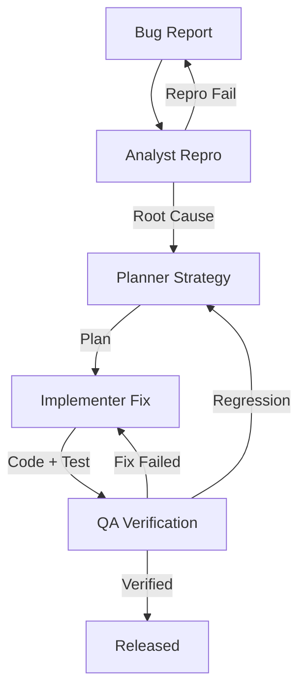

# Bug Fix & Incident Response Workflow

This workflow provides a standardized process for reproducible bug fixes, ensuring root cause analysis and non-regression.

## Workflow Overview

"Quick fixes" often cause regressions. This workflow enforces **Reproduction -> Root Cause -> Fix -> Verify**.

## Workflow Steps

### 1. Reproduction & Analysis (Analyst Agent)
- **Agent**: Analyst
- **Input**: Bug Report (User feedback, Sentry issue, etc.).
- **Action**:
  1.  Create a minimal reproduction case.
  2.  Identify the Root Cause (Code, Config, or Data?).
- **Mandatory MCP Usage**:
  - Use `grep_search` to trace the error log.
  - Use `view_file` to find the buggy logic.
- **Output**: Root Cause Analysis in `agent-output/analysis/`.
- **Handoff**: Passed to Planner.

### 2. Fix Planning (Planner Agent)
- **Agent**: Planner
- **Input**: Root Cause Analysis.
- **Action**: Plan the fix + determine the Regression Test strategy.
- **Output**: Fix Plan.
- **Handoff**: Passed to Implementer.

### 3. Implementation (Implementer Agent)
- **Agent**: Implementer
- **Input**: Fix Plan.
- **Action**:
  1.  Write a failing test (reproduction).
  2.  Fix the code.
  3.  Verify the test passes.
- **Output**: Code changes + New Test.
- **Handoff**: Passed to QA.

### 4. Verification (QA Agent)
- **Agent**: QA
- **Input**: Code changes.
- **Action**: Verify the fix and run regression suite.
- **Mandatory MCP Usage**:
  - Use `playwright` to verify web bug fixes.
  - Use `ios-simulator` to verify mobile bug fixes. **(Always check [Troubleshooting Guide](https://github.com/joshuayoes/ios-simulator-mcp/blob/main/TROUBLESHOOTING.md) / [LLM Guide](https://raw.githubusercontent.com/joshuayoes/ios-simulator-mcp/refs/heads/main/TROUBLESHOOTING.md) first)**
- **Iteration Loop**:
  - **FAIL**: Bug persists or regression found. Return to **Analyst** (if reproduction was wrong) or **Implementer**.
  - **PASS**: Bug Squashed.

## Agent Roles Summary

| Agent | Role | Output Location |
| :--- | :--- | :--- |
| **Analyst** | Repro & Root Cause | `agent-output/analysis/` |
| **Planner** | Fix Strategy | `agent-output/planning/` |
| **Implementer** | Fix & Test | Codebase |
| **QA** | Verify | `agent-output/qa/` |

## Workflow Diagram

