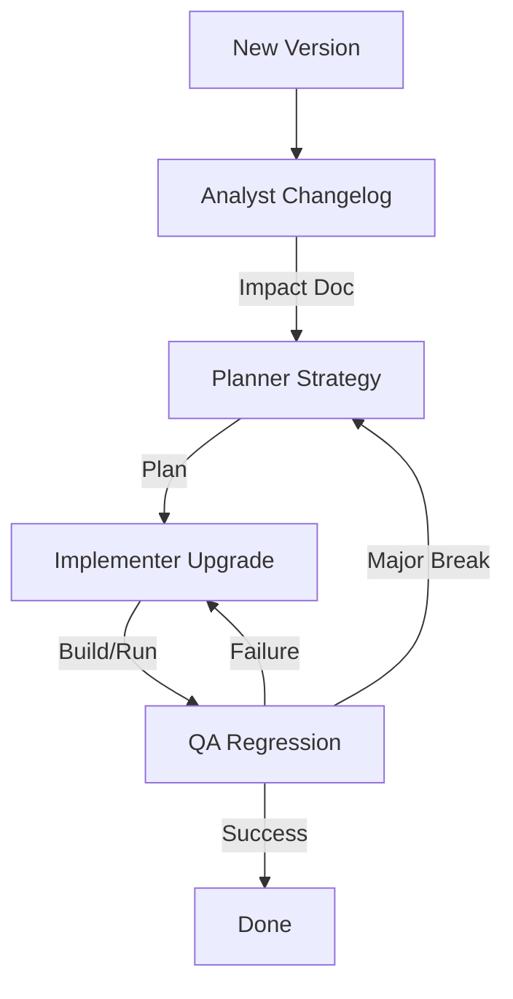

# Dependency Upgrade Workflow

This workflow ensures that upgrading dependencies (frameworks, libraries) is safe and controlled.

## Workflow Overview

Upgrading dependencies is a common source of regressions. This workflow de-risks upgrades through analysis and planned regression testing.

## Workflow Steps

### 1. Changelog Analysis (Analyst Agent)
- **Agent**: Analyst
- **Input**: Target package name and version.
- **Action**: Read changelogs, migration guides, and release notes. Identify Breaking Changes.
- **Output**: Upgrade Impact Assessment in `agent-output/analysis/`.
- **Handoff**: Passed to Planner.

### 2. Upgrade Strategy (Planner Agent)
- **Agent**: Planner
- **Input**: Upgrade Impact Assessment.
- **Action**: Plan the upgrade.
- **Decisions**:
  - "Big Bang" vs Incremental?
  - Which code paths need modification?
  - What is the rollback plan?
- **Output**: Upgrade Plan.
- **Handoff**: Passed to Implementer.

### 3. Execution (Implementer Agent)
- **Agent**: Implementer
- **Input**: Upgrade Plan.
- **Action**: Update `package.json` (or equivalent), install, and fix build errors.
- **Output**: Code changes.
- **Handoff**: Passed to QA.

### 4. Regression Testing (QA Agent)
- **Agent**: QA
- **Input**: Code changes.
- **Action**: Run the full regression suite.
- **Mandatory MCP Usage**:
  - Use `run_command` to execute tests.
  - Use `playwright` or `ios-simulator` for UI/mobile verification. **(For ios-simulator: check [Troubleshooting Guide](https://github.com/joshuayoes/ios-simulator-mcp/blob/main/TROUBLESHOOTING.md) / [LLM Guide](https://raw.githubusercontent.com/joshuayoes/ios-simulator-mcp/refs/heads/main/TROUBLESHOOTING.md))**
- **Iteration Loop**:
  - **FAIL**: Tests fail or build breaks. Return to **Implementer** (for fixes) or **Planner** (if strategy needs rethinking).
  - **PASS**: Upgrade successful.

## Agent Roles Summary

| Agent | Role | Output Location |
| :--- | :--- | :--- |
| **Analyst** | Risk Assessment | `agent-output/analysis/` |
| **Planner** | Strategy | `agent-output/planning/` |
| **Implementer** | Execute Upgrade | Codebase |
| **QA** | Regression | `agent-output/qa/` |

## Workflow Diagram

