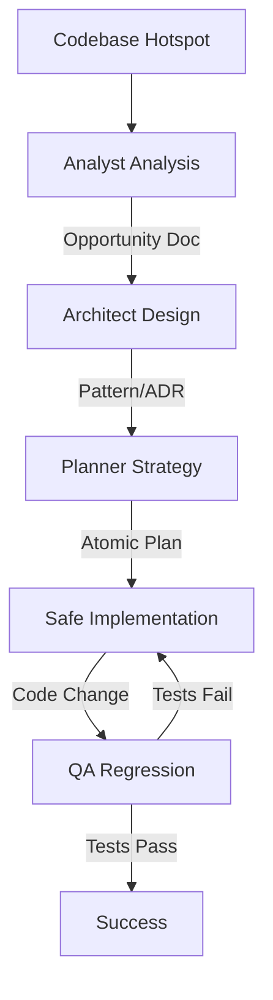

# Refactoring & Tech Debt Paydown Workflow

This workflow defines a systematic, safe approach to addressing technical debt. It prioritizes stability and regression testing over speed.

## Workflow Overview

Refactoring is high-risk if done ad-hoc. This workflow enforces a cycle of **Analysis -> Design -> Implementation -> Verification**, ensuring that structure changes without altering behavior.

## Workflow Steps

### 1. Hotspot Identification (Analyst Agent)
- **Agent**: Analyst
- **Input**: Codebase, complexity metrics, or "gut feel" from developers.
- **Action**: Identify specific areas of high complexity, cyclical dependencies, or legacy patterns.
- **Mandatory MCP Usage**:
  - Use `find_by_name` and `grep_search` to map dependencies.
  - Use `view_file` to assess code readability and cyclomatic complexity.
- **Output**: A Refactoring Opportunity Doc in `agent-output/analysis/` defining *what* to refactor and *why*.
- **Handoff**: Passed to Architect.

### 2. Pattern Selection (Architect Agent)
- **Agent**: Architect
- **Input**: Refactoring Opportunity Doc.
- **Action**: Propose the new structure or design pattern (e.g., "Extract Strategy Pattern", "Replace Conditional with Polymorphism").
- **Output**: An Architecture Decision Record (ADR) or Design Sketch in `agent-output/architecture/`.
- **Handoff**: Passed to Planner.

### 3. Step-by-Step Planning (Planner Agent)
- **Agent**: Planner
- **Input**: ADR/Design Sketch.
- **Action**: Break the refactoring into atomic, safe steps.
- **Constraint**: Each step must leave the system in a compiling, passing state.
- **Output**: A Refactoring Plan in `agent-output/planning/`.
- **Handoff**: Passed to Implementer.

### 4. Safe Implementation (Implementer Agent)
- **Agent**: Implementer
- **Input**: Refactoring Plan.
- **Action**: detailed execution of the plan.
- **Process**:
  1.  Ensure existing tests pass (Gold Master).
  2.  Apply refactoring for one step.
  3.  Run tests.
  4.  Commit.
- **Output**: Code changes.
- **Handoff**: Passed to QA.

### 5. Regression Verification (QA Agent)
- **Agent**: QA
- **Input**: Changed code, Refactoring Plan.
- **Action**: Run the full regression suite. Verify no behavior changes.
- **Mandatory MCP Usage**:
  - Use `run_command` to execute test suites.
  - Use `playwright` (Web) or `ios-simulator` (Mobile) to verify UI behavior if applicable. **(For ios-simulator: check [Troubleshooting Guide](https://github.com/joshuayoes/ios-simulator-mcp/blob/main/TROUBLESHOOTING.md) / [LLM Guide](https://raw.githubusercontent.com/joshuayoes/ios-simulator-mcp/refs/heads/main/TROUBLESHOOTING.md))**
  - Use `view_code_item` to manually verify signatures if needed.
- **Iteration Loop**:
  - **FAIL**: Return to **Implementer**. The refactoring broke something. Revert or Fix.
  - **PASS**: Refactor successful.

## Agent Roles Summary

| Agent | Role | Output Location |
| :--- | :--- | :--- |
| **Analyst** | Identify Debt | `agent-output/analysis/` |
| **Architect** | Define Target State | `agent-output/architecture/` |
| **Planner** | Atomic Steps | `agent-output/planning/` |
| **Implementer** | Execute Refactor | Codebase |
| **QA** | Regression Test | `agent-output/qa/` |

## Workflow Diagram

