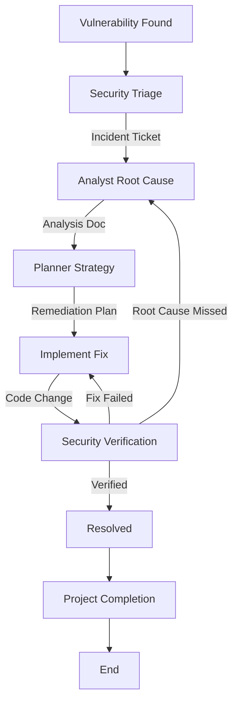

# Security Remediation Workflow

This workflow defines the standard process for addressing security vulnerabilities. It emphasizes root cause analysis and comprehensive verification.

## Workflow Overview

Security fixes must be precise. This workflow ensures we don't just "patch" the symptom but understand and fix the root cause, verifying it with the same rigor used to find it.

## Workflow Steps

### 1. Triage & Assessment (Security Agent)
- **Agent**: Security
- **Input**: Vulnerability report (from tool or external source).
- **Action**: Assess severity (CVSS), impact, and risk.
- **Output**: Security Incident Ticket in `agent-output/security/` (e.g., `SEC-001-sql-injection.md`).
- **Handoff**: Passed to Analyst.

### 2. Root Cause Analysis (Analyst Agent)
- **Agent**: Analyst
- **Input**: Security Incident Ticket.
- **Action**: Locate the vulnerability in code and uncovers the root cause.
- **Mandatory MCP Usage**:
  - Use `grep_search` to find all occurrences of the pattern.
  - User `view_file` to trace the data flow from sink to source.
- **Output**: Analysis Report detailing the "Sink", "Source", and "Data Flow".
- **Handoff**: Passed to Planner.

### 3. Remediation Planning (Planner Agent)
- **Agent**: Planner
- **Input**: Analysis Report.
- **Action**: Plan the fix.
- **Considerations**: patches, library upgrades, or code rewrites. Must consider side effects.
- **Output**: Remediation Plan.
- **Handoff**: Passed to Critic.

### 3a. Plan Critique (Critic Agent)
- **Agent**: Critic
- **Input**: Remediation Plan.
- **Action**: Verify the plan addresses the root cause without introducing new vulnerabilities.
- **Iteration**: Return to **Planner** if insufficient.

### 3b. Documentation Detail Verification (Critic Agent)
- **Agent**: Critic
- **Input**: Remediation Plan.
- **Action**: **CRITICAL**: Review specifically for "lack of detail". Security fixes cannot be ambiguous.
- **Iteration Link**: Return to **Planner** if vague.
- **Handoff**: Passed to Implementer.

### 4. Application of Fix (Implementer Agent)
- **Agent**: Implementer
- **Input**: Remediation Plan.
- **Action**: Apply the fix.
- **Output**: Code changes.
- **Handoff**: Passed to Security.

- **Handoff**: Passed to Critic.

### 4b. Code Review & Refinement (Critic Agent)
- **Agent**: Critic
- **Input**: Security Fix Code.
- **Action**: Ensure the fix is secure and follows standards.
- **Checks**:
  - Secure Coding Patterns.
  - Maintainability.
- **Iteration**: Any findings must be addressed by **Implementer** before Verification.
- **Handoff**: Passed to Security.

### 5. Verification (Security Agent)
- **Agent**: Security
- **Input**: Code changes.
- **Action**: Verify the fix *specifically* addresses the vulnerability.
- **Mandatory MCP Usage**:
  - Use `view_file` to inspect the diff.
  - Use `run_command` to run security scanners if available.
- **Iteration Loop**:
  - **FAIL**: Fix is ineffective or incomplete. Return to **Analyst** (if root cause wrong) or **Implementer** (if implementation flawed).
  - **PASS**: Issue Resolved.

### 6. Project Completion (Orchestrator)
- **Agent**: Orchestrator
- **Action**: Archive artifacts and generate final report.
- **Output**:
  - Move terminal artifacts to `agent-output/closed/`
  - Generate **Single** Project Completion Report: `agent-output/completion/[ID]-completion-report.md`
  - **STOP** (End of Workflow)

## Agent Roles Summary

| Agent | Role | Output Location |
| :--- | :--- | :--- |
| **Security** | Triage & Verify | `agent-output/security/` |
| **Analyst** | Root Cause | `agent-output/analysis/` |
| **Planner** | Plan Fix | `agent-output/planning/` |
| **Implementer** | Apply Fix | Codebase |
| **Orchestrator** | Final Report | `agent-output/completion/` |

## Workflow Diagram

