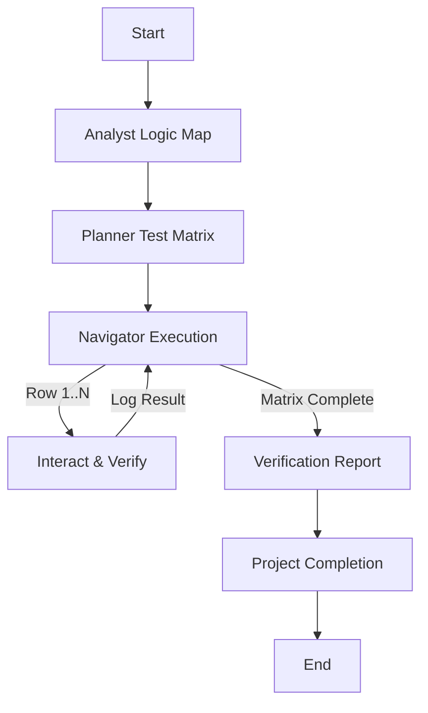

# Experience Builder Widget Testing Workflow

This workflow is specialized for testing ArcGIS Experience Builder custom widgets. It focuses on deep interactivity, combinatorial testing of form inputs, and robust verification of widget functionality within a contained context.

## Workflow Overview

Widgets are high-density interaction zones. Unlike full app navigation, this workflow emphasizes **state permutations**.
Cycle: **Analysis (What is this?) -> Design (Combinatorial Matrix) -> Execution (Playwright Interactions) -> Verification**.

## Workflow Steps

### 1. Widget Analysis (Analyst Agent)
- **Agent**: Analyst
- **Input**: Widget Source Code (`tsx`, `config.json`, `setting.tsx`).
- **Action**: Deep dive into the widget's logic.
- **Identify**:
  - **Inputs**: Settings, Config properties, User inputs (text fields, toggles, dropdowns).
  - **Outputs**: Map updates, Selection changes, Data source mutations.
  - **States**: Loading, Empty, Error, Active.
- **Output**: Widget Logic Map in `agent-output/analysis/`.
- **Handoff**: Passed to Planner.

### 2. Test Matrix Design (Planner Agent)
- **Agent**: Planner
- **Input**: Widget Logic Map.
- **Action**: Design a **Robost Verification Matrix**.
- **Requirement**: Cover "All Combinations" of critical variables.
  - Example: `[Toggle A: On/Off] x [Dropdown B: Option 1/2] x [Map Selection: Yes/No]`
- **Output**: Combinatorial Test Matrix (Markdown / JSON table).
- **Handoff**: Passed to Navigator.

### 3. Interactive Verification (Navigator Agent)
- **Agent**: Navigator
- **Input**: Combinatorial Test Matrix.
- **Action**: Execute the matrix using `playwright` (preferred for ExB widgets) or `ios-simulator`.
- **Loop**: For each row in the matrix:
  1.  Configure Widget State (via Setting or Input).
  2.  Interact (Click, Type, Select).
  3.  Verify Output (Screenshot + Log).
  4.  Reset.
- **Constraint**: **Safe Command Execution** (WaitMsBeforeAsync: 2000, 200s Timeout) for any build/serve steps.
- **Output**:
  - `verification-logs.md`: Pass/Fail per matrix row.
  - Screenshots of each state.
- **Handoff**: Passed to Orchestrator.

### 4. Project Completion (Orchestrator)
- **Agent**: Orchestrator
- **Action**: Archive artifacts and generate final report.
- **Output**:
  - Move terminal artifacts to `agent-output/closed/`
  - Generate **Single** Project Completion Report: `agent-output/completion/[ID]-completion-report.md`
  - **STOP** (End of Workflow)

## Agent Roles Summary

| Agent | Role | Output Location |
| :--- | :--- | :--- |
| **Analyst** | Logic Mapping | `agent-output/analysis/` |
| **Planner** | Matrix Design | `agent-output/planning/` |
| **Navigator** | Matrix Execution | `agent-output/navigation/` |
| **Orchestrator** | Final Report | `agent-output/completion/` |

## Workflow Diagram

