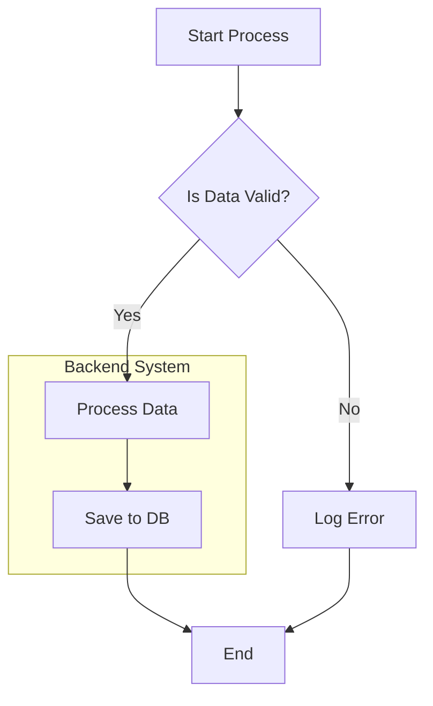

# Mermaid Diagramming Skill

This skill provides mandatory guidelines for creating Mermaid diagrams. ALL agents must follow these rules to ensure diagrams render correctly.

## 1. Syntax Enforcement

### Use `flowchart`
- **ALWAYS** use `flowchart TD` (Top-Down) or `flowchart LR` (Left-Right).
- **NEVER** use `graph` (deprecated).
- **NEVER** use `sequenceDiagram`, `classDiagram`, `stateDiagram`, or `erDiagram` unless explicitly requested by the user and supported by the rendering environment. The safe default is always `flowchart`.

### Node Definitions
- **IDs**: Use simple alphanumeric IDs for nodes (e.g., `A`, `Node1`, `ProcessA`).
- **Labels**: **ALWAYS** wrap label text in double quotes `""`.
    - **Correct**: `A["User clicks 'Process'"]`
    - **Incorrect**: `A[User clicks 'Process']` (This will fail on quotes or parentheses)
- **Special Characters**: If a label contains `(`, `)`, `[`, `]`, `{`, `}`, `"`, or `'`, it **MUST** be double-quoted.

## 2. Structural Rules

### Decisions
- Use `{}` for decision nodes (`rhombus` shape).
- **Correct**: `D{"Is Valid?"}`
- **Incorrect**: `D["Is Valid?"]` (This is a rectangle, technically valid but wrong semantic)

### Connections
- Use `-->` for standard arrows.
- Use `-.->` for dotted links.
- Use `==>` for thick structural links.
- Labels on links: Place them after the arrow.
    - `A -->|Success| B`
    - `A -- Failure --> C`

### Subgraphs
- Use `subgraph` to group related nodes.
- ensure `end` closes the subgraph.
- Give the subgraph an ID and a Label.
    ```mermaid
    subgraph S1 ["Component A"]
        A["Start"]
    end
    ```

## 3. Common Errors to Avoid

- **Unescaped Quotes**: `A["Say "Hello""]` -> **Error**. Use single quotes inside or escape: `A["Say 'Hello'"]`.
- **Mixing Syntax**: Trying to use `alt` or `opt` (Sequence Diagram features) inside a `flowchart`.
- **Empty Nodes**: `A[]` -> **Error**.
- **Trailing Semicolons**: While allowed, they are unnecessary.

## 4. Examples

### ✅ Good Example



### ❌ Bad Example

```mermaid
graph TD                   %% Use flowchart, not graph
    Start[Start Process]   %% Missing quotes
    Check{Is Data Valid?}  %% Missing quotes
    
    Check --> Yes --> Process  %% Chained arrows can be fragile
    
    alt Yes                %% 'alt' is not for flowcharts
        Process["Do It"]
    end
```
