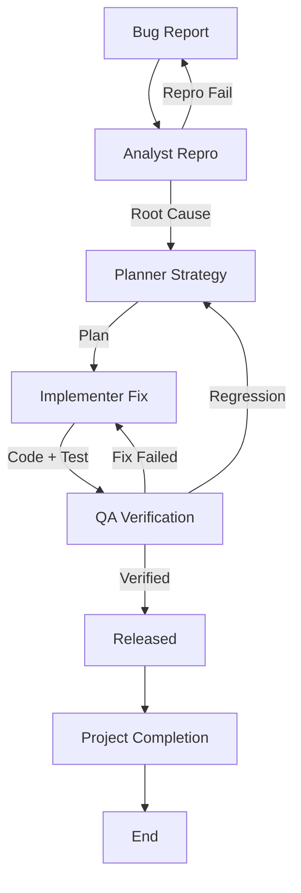

# Bug Fix & Incident Response Workflow

This workflow provides a standardized process for reproducible bug fixes, ensuring root cause analysis and non-regression.

## Workflow Overview

"Quick fixes" often cause regressions. This workflow enforces **Reproduction -> Root Cause -> Fix -> Verify**.

## Workflow Steps

### 1. Reproduction & Analysis (Analyst Agent)
- **Agent**: Analyst
- **Input**: Bug Report (User feedback, Sentry issue, etc.).
- **Execution**: Run the **Analyst** agent as a subagent.
    - **Task**: "Load Bug Report. Create minimal reproduction case. Identify Root Cause (Code/Config/Data) using `grep_search` and `view_file`. Output `Root-Cause-Analysis.md`."
- **Output**: `agent-output/analysis/Root-Cause-Analysis.md`
- **Handoff**: `agent-output/handoffs/BugFix-Phase1-Handoff.md` (Template: Data-Only, No Fluff)

### 2. Fix Planning (Planner Agent)
- **Agent**: Planner
- **Agent**: Planner
- **Input**: `agent-output/handoffs/BugFix-Phase1-Handoff.md` AND `agent-output/analysis/Root-Cause-Analysis.md`
- **Execution**: Run the **Planner** agent as a subagent.
    - **Task**: "Load Root Cause. Plan the fix and Regression Test strategy. Output `Fix-Plan.md`."
- **Output**: `agent-output/planning/Fix-Plan.md`
- **Handoff**: `agent-output/handoffs/BugFix-Phase2-Handoff.md` (Template: Data-Only, No Fluff)

### 2a. Plan Critique (Critic Agent)
- **Agent**: Critic
- **Input**: Fix Plan.
- **Action**: Run the Critic agent as a subagent to assess technical soundness, regression risks, and completeness.
- **Iteration Link**: If rejected, return to **Planner**.

### 2b. Documentation Detail Verification (Critic Agent)
- **Agent**: Critic
- **Input**: `agent-output/planning/Fix-Plan.md`
- **Action**: **CRITICAL**: Run the Critic agent as a subagent to review specifically for "lack of detail in the documentation". Ensure steps are explicit, context is clear, and no ambiguity exists.
- **Iteration Link**: If lacking detail, return to **Planner**.
- **Handoff**: To Implementer.

### 3. Implementation (Implementer Agent)
- **Agent**: Implementer
- **Input**: `agent-output/handoffs/BugFix-Phase2-Handoff.md` AND `agent-output/planning/Fix-Plan.md`
- **Execution**: Run the **Implementer** agent as a subagent.
    - **Task**: "Load Fix Plan. Write failing test (reproduction). Fix code. Verify test passes. Output Code changes and `Fix-Implementation.md`."
- **Output**: Code changes + New Test + `agent-output/implementation/Fix-Implementation.md`
- **Handoff**: `agent-output/handoffs/BugFix-Phase3-Handoff.md` (Template: Data-Only, No Fluff)

### 3b. Code Review & Refinement (Critic Agent)
- **Agent**: Critic
- **Input**: Code changes.
- **Action**: Run the Critic agent as a subagent to perform strict code review against standards (SOLID, DRY, etc.).
- **Checks**:
  - Code Style & Standards.
  - Potential performance issues.
  - Maintainability & Readability.
- **Iteration**: Any findings must be addressed by **Implementer** before QA.
- **Handoff**: To QA.

### 4. Verification (QA Agent)
- **Agent**: QA
- **Input**: `agent-output/handoffs/BugFix-Phase3-Handoff.md` AND `agent-output/implementation/Fix-Implementation.md`
- **Action**: Run the QA agent as a subagent to verify the fix and run regression suite.
- **Mandatory MCP Usage**:
  - Use `playwright` to verify web bug fixes.
  - Use `ios-simulator` to verify mobile bug fixes. **(Always check [Troubleshooting Guide](https://github.com/joshuayoes/ios-simulator-mcp/blob/main/TROUBLESHOOTING.md) / [LLM Guide](https://raw.githubusercontent.com/joshuayoes/ios-simulator-mcp/refs/heads/main/TROUBLESHOOTING.md) first)**
  - Use `context7` to verify fix implementation against library documentation.
- **Output**: `agent-output/qa/Fix-Verification.md`
- **Iteration Loop**:
  - **FAIL**: Return to **Analyst** (if reproduction was wrong) or **Implementer**.
  - **PASS**: Bug Squashed. Create `agent-output/handoffs/BugFix-Phase4-Handoff.md` (Template: Data-Only, No Fluff).

### 5. Project Completion (Orchestrator)
- **Agent**: Orchestrator
- **Action**: Archive artifacts and generate final report.
- **Output**:
  - Move terminal artifacts to `agent-output/closed/`
  - Generate **Single** Project Completion Report: `agent-output/reports/[ID]-completion-report.md`
  - **STOP** (End of Workflow)

## Agent Roles Summary

| Agent | Role | Output Location |
| :--- | :--- | :--- |
| **Analyst** | Repro & Root Cause | `agent-output/analysis/` |
| **Planner** | Fix Strategy | `agent-output/planning/` |
| **Implementer** | Fix & Test | Codebase |
| **QA** | Verify | `agent-output/qa/` |
| **Orchestrator** | Final Report | `agent-output/reports/` |

## Workflow Diagram

