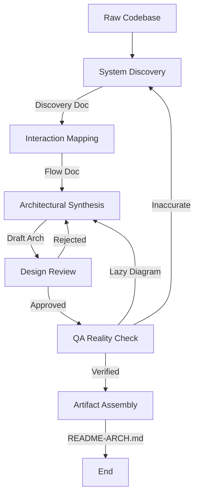

# Architecture Documentation Workflow

This workflow defines the process for reverse-engineering a codebase, documenting its architecture, and synthesizing high-fidelity visual diagrams.

## Workflow Overview

This workflow transforms a raw codebase into a high-quality `README-ARCH.md` and a set of detailed architectural diagrams. It enforces a strict **Verify-then-Synthesize** loop using MCP tools to prove every finding.

## Workflow Steps

### 1. System Discovery (Analyst Agent)
- **Agent**: Analyst
- **Input**: The raw codebase and repository root.
- **Action**: Run the Analyst agent as a subagent to perform a deep discovery pass to identify entry points, core layers, data sources, and infrastructure.
- **Mandatory MCP Usage**:
  - Use `find_by_name` to locate configuration files (`package.json`, `pom.xml`, `Dockerfile`).
  - Use `grep_search` to find application entry points (e.g., `grep_search "main("`).
  - Use `list_dir` to map the high-level directory structure.
- **Output**: An analysis document in `agent-output/analysis/` (e.g., `001-system-discovery.md`).
- **Handoff**: Passed to the Analyst for Phase 2.

### 2. Interaction Mapping (Analyst Agent)
- **Agent**: Analyst
- **Input**: The System Discovery document.
- **Action**: Run the Analyst agent as a subagent to trace specific user-facing flows to map the "behavioral" architecture.
- **Mandatory MCP Usage**:
  - Use `view_file` to read the actual code of entry points and controllers.
  - Use `view_code_item` to inspect key classes/functions involved in the flow.
  - Use `context7` to verify framework behavior (e.g., implicit lifecycle methods).
  - **Golden Rule**: If you didn't read the file, you cannot document it.
- **Output**: An interaction flow document in `agent-output/analysis/` (e.g., `002-interaction-flows.md`) containing step-by-step logic for:
  - Initialization/Startup
  - Core Features (Success & Error paths)
- **Handoff**: Passed to the Architect.

### 3. Architectural Synthesis (Architect Agent)
- **Agent**: Architect
- **Input**: Interaction Flow document.
- **Action**: Run the Architect agent as a subagent to transform text findings into **detailed** Mermaid.js diagrams. "High-level" boxes are not enough; diagrams must be useful for developers.
- **Visual Requirements**:
  - **UNIVERSAL DIAGRAM RULE**: **ALL** diagrams must use `flowchart` syntax (e.g., `flowchart TD` or `LR`).
  - **PROHIBITED SYNTAX**: Do NOT use `sequenceDiagram`, `classDiagram`, `stateDiagram`, `erDiagram`, or `gantt`.
  - **CRITICAL SYNTAX RULES**:
    - **Escape Everything**: Node labels containing `[]`, `()`, `{}`, quotes, or special chars MUST be double-quoted. Example: `id["List<String>"]`.
    - **No Mixing Syntax**: Never use `alt`, `opt`, `loop` (these are for sequence diagrams). Use Decision Nodes `{}`.
  - **Structural Flowcharts** (replacing Class Diagrams):
    - Use nodes for classes/components.
    - Use labeled arrows for relationships/cardinality (e.g., `ClassA -->|1..*| ClassB`).
  - **Sequence Flowcharts** (replacing Sequence Diagrams):
    - Use numbered edges to show order of operations (e.g., `Caller -->|1. Request| API`).
    - Use Decision Nodes `{}` for branching logic.
  - **State Flowcharts** (replacing State Diagrams):
    - Use nodes for states and arrows for transitions (e.g., `Idle -->|Start| Running`).
- **Output**: An architecture definition in `agent-output/architecture/` (e.g., `003-system-architecture.md`).
- **Handoff**: Passed to Critic for Review.

### 4. Design Review (Critic Agent)
- **Agent**: Critic
- **Input**: The System Architecture document and original Analysis docs.
- **Action**: Run the Critic agent as a subagent to perform rigorous peer review of the proposed architecture.
- **Checks**:
  - Do the diagrams match the standard patterns?
  - Are the Sequence Diagrams sufficiently detailed?
  - Are error paths represented?
- **Iteration Loop**:
  - **FAIL**: Return to **Architect** with specific change requests.
  - **PASS**: Detailed architecture is approved for QA verification.

### 5. Reality Check (QA Agent)
- **Agent**: QA
- **Input**: The System Architecture document.
- **Action**: Run the QA agent as a subagent to audit the proposed architecture against the actual code execution to ensure accuracy.
- **Mandatory MCP Usage**:
  - Use `view_code_item` to verify that methods listed in Class Diagrams actually exist.
  - Use `grep_search` to verify that calls listed in Sequence Diagrams actually happen.
- **Iteration Loop**:
  - **FAIL (Inaccurate)**: Return to **Analyst** to re-investigate the code (if the understanding was wrong) or **Architect** (if the diagram was lazy).
  - **PASS**: "Trust but Verify" sign-off.
- **Output**: A verification report in `agent-output/qa/`.
- **Handoff**: Passed to Critic.

### 5b. Documentation Detail Verification (Critic Agent)
- **Agent**: Critic
- **Input**: Verified Architecture Document.
- **Action**: **CRITICAL**: Run the Critic agent as a subagent to review specifically for "lack of detail in the documentation". Ensure diagrams are fully explained, decisions have rationale, and system context is rich.
- **Iteration Loop**:
- **FAIL (Too Vague)**: Return to **Architect** (for detail expansion).
- **PASS**: Approved for Final Assembly.
- **Handoff**: Passed to Implementer.

### 6. Artifact Assembly (Implementer Agent)
- **Agent**: Implementer
- **Input**: Verified Architecture document.
- **Action**: Run the Implementer agent as a subagent to compile the verified analysis and diagrams into a user-friendly `README-ARCH.md`.
- **Output**: `README-ARCH.md` at the repository root.
- **Validation**: Ensure all Mermaid diagrams render correctly.
- **Handoff**: Passed to Critic.

### 6b. Artifact Review (Critic Agent)
- **Agent**: Critic
- **Input**: Generated `README-ARCH.md`.
- **Action**: Run the Critic agent as a subagent to verify the final artifact styling and formatting.
- **Iteration**: Return to **Implementer** if issues found.
- **Handoff**: Passed to Orchestrator.

## Agent Roles Summary

| Agent | Role | Output Location |
| :--- | :--- | :--- |
| **Analyst** | Discover & Prove (via MCP) | `agent-output/analysis/` |
| **Architect** | Synthesize Detailed Diagrams | `agent-output/architecture/` |
| **Critic** | Design Review | `agent-output/critiques/` |
| **QA** | Verify against Code (via MCP) | `agent-output/qa/` |
| **Implementer** | Create final `README-ARCH.md` | Repository Root |

## Workflow Diagram

