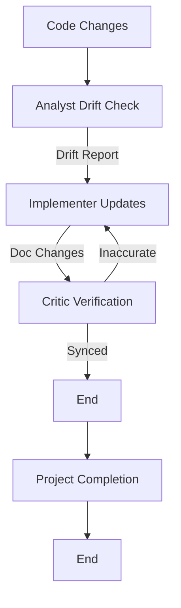

# Documentation Sync Workflow

This workflow ensures that documentation (READMEs, API docs, inline comments) stays synchronized with the actual code.

## Workflow Overview

Drift between code and documentation is a major source of confusion. This workflow treats documentation updates as a first-class citizen, requiring verification just like code.

## Workflow Steps

### 1. Drift Detection (Analyst Agent)
- **Agent**: Analyst
- **Input**: Codebase and existing documentation.
- **Execution**: Run the **Analyst** agent as a subagent.
    - **Task**: "Compare exported symbols/API against docs using `grep_search` and `view_file`. Output Drift Report."
- **Handoff**: Passed to Implementer.

### 2. Documentation Update (Implementer Agent)
- **Agent**: Implementer
- **Input**: Drift Report.
- **Execution**: Run the **Implementer** agent as a subagent.
    - **Task**: "Draft updated documentation based on Drift Report. Output `.md` changes."
- **Output**: Changes to `.md` files or inline comments.
- **Handoff**: Passed to Critic/QA.

### 3. Accuracy Verification (Critic Agent)
- **Agent**: Critic (or QA)
- **Input**: Documentation Diff, Drift Report.
- **Action**: Run the Critic agent as a subagent to verify that the new text accurately describes the code behavior.
- **Checks**:
  - No "hallucinated" parameters.
  - Examples actually run/compile.
  - Links are valid.
- **Iteration Loop**:
  - **FAIL**: Inaccurate or unclear. Return to **Implementer**.
  - **PASS**: Docs are synced.

### 3b. Documentation Detail Verification (Critic Agent)
- **Agent**: Critic
- **Input**: New Documentation.
- **Focus**: "Lack of detail".
- **Action**: Run the Critic agent as a subagent to ensure the documentation is not just accurate, but **comprehensive**. Check for missing context, vague descriptions, or assumed knowledge.
- **Iteration Loop**:
  - **FAIL**: Return to **Implementer**.
  - **PASS**: Approved.

### 4. Project Completion (Orchestrator)
- **Agent**: Orchestrator
- **Action**: Archive artifacts and generate final report.
- **Output**:
  - Move terminal artifacts to `agent-output/closed/`
  - Generate **Single** Project Completion Report: `agent-output/completion/[ID]-completion-report.md`
  - **STOP** (End of Workflow)

## Agent Roles Summary

| Agent | Role | Output Location |
| :--- | :--- | :--- |
| **Analyst** | Detect Drift | `agent-output/analysis/` |
| **Implementer** | Write Docs | Documentation Files |
| **Critic** | Verify Accuracy | `agent-output/critiques/` |
| **Orchestrator** | Final Report | `agent-output/completion/` |

## Workflow Diagram

