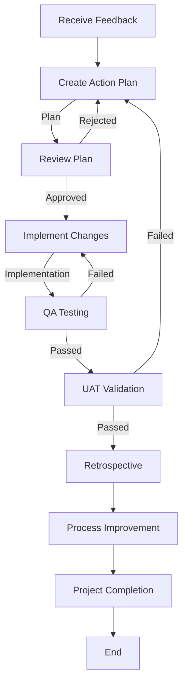

# Feedback Workflow

This workflow defines the process for handling feedback, implementing changes, and ensuring quality through agent collaboration.

## Workflow Overview

This workflow ensures that feedback is systematically analyzed, planned, implemented, tested, and validated before being released. It follows a structured approach to maintain quality and alignment with the project's objectives.

## Workflow Steps

### 1. Receive Feedback
- **Input**: A piece of feedback describing a desired change or improvement.
- **Action**: The user provides the feedback to the system.
- **Output**: Feedback is documented and assigned a unique identifier for tracking.

### 2. Create Action Plan (Planner Agent)
- **Agent**: Planner
- **Action**: Run the Planner agent as a subagent to create a detailed action plan based on the feedback.
- **Output**: A plan document in `agent-output/planning/` with:
  - Value Statement and Business Objective
  - Detailed steps for implementation
  - Acceptance criteria
  - Dependencies and risks
  - Target release version (aligned with roadmap)
- **Handoff**: The plan is submitted to the Critic agent for review.
- **Validation**: Planner ensures the plan aligns with the Master Product Objective and architectural guidelines.
- **Mandatory Tools**: Use `context7` to research capabilities if external libraries are involved.

### 3. Plan Review (Critic Agent)
- **Agent**: Critic
- **Action**: Run the Critic agent as a subagent to review the plan for clarity, completeness, and alignment with architectural guidelines.
- **Output**: A critique document in `agent-output/critiques/` with:
  - Findings (Critical/Medium/Low)
  - Questions or concerns
  - Recommendations for improvement
- **Handoff**: If the plan is approved, it is handed off to the Implementer agent. If not, it is sent back to the Planner for revisions.

### 4. Architectural Validation (Architect Agent)
- **Agent**: Architect
- **Action**: Run the Architect agent as a subagent to validate the plan's architectural alignment and identify potential risks or improvements.
- **Output**: Architectural review document with:
  - Alignment assessment
  - Potential risks or improvements
  - Recommendations for implementation
- **Handoff**: If approved, the plan is handed off to the Implementer agent. If not, it is sent back to the Planner for revisions.

### 4b. Documentation Detail Verification (Critic Agent)
- **Agent**: Critic
- **Input**: Approved Plan.
- **Action**: **CRITICAL**: Run the Critic agent as a subagent to review specifically for "lack of detail in the documentation". Ensure all acceptance criteria and implementation steps are exhaustive.
- **Iteration**: If lacking detail, return to **Planner**.

### 5. Implementation (Implementer Agent)
- **Agent**: Implementer
- **Action**: Run the Implementer agent as a subagent to implement the changes defined in the plan.
- **Output**: Code changes and tests.
- **Handoff**: Passed to QA.

- **Handoff**: Passed to Critic.

### 5b. Code Review & Refinement (Critic Agent)
- **Agent**: Critic
- **Input**: Code changes.
- **Action**: Run the Critic agent as a subagent to perform strict code review against standards.
- **Checks**:
  - Code Style & Standards.
  - Potential performance issues.
  - Maintainability & Readability.
- **Iteration**: Any findings must be addressed by **Implementer** before QA.
- **Handoff**: Passed to QA.

### 6. Quality Assurance (QA Agent)
- **Agent**: QA
- **Action**: Run the QA agent as a subagent to verify the implementation through testing and validation.
- **Output**: QA report in `agent-output/qa/`.
- **Handoff**: If QA passes, the implementation is handed off to the UAT agent. If not, it is sent back to the Implementer for fixes.

### 7. User Acceptance Testing (UAT Agent)
- **Agent**: UAT
- **Action**: Run the UAT agent as a subagent to validate that the implementation meets user expectations and delivers the intended value.
- **Output**: UAT report in `agent-output/uat/`.
- **Handoff**: If UAT passes, the workflow is complete (to Retrospective).

### 8. Retrospective (Retrospective Agent)
- **Agent**: Retrospective
- **Action**: Run the Retrospective agent as a subagent to capture lessons learned.
- **Output**: Retrospective document in `agent-output/retrospectives/`.

### 9. Process Improvement (PI Agent)
- **Agent**: PI
- **Action**: Run the PI agent as a subagent to update workflows or agent instructions.
- **Output**: Process improvement document.
- **Handoff**: Workflow complete.

### 10. Project Completion (Orchestrator)
- **Agent**: Orchestrator
- **Action**: Archive artifacts and generate final report.
- **Output**:
  - Move terminal artifacts to `agent-output/closed/`
  - Generate **Single** Project Completion Report: `agent-output/completion/[ID]-completion-report.md`
  - **STOP** (End of Workflow)

## Agent Roles Summary

| Agent | Role | Output Location |
|-Architect | Validate architectural alignment | `agent-output/architecture/` |
| ------|------|-----------------|
| Planner | Create action plans | `agent-output/planning/` |
| Critic | Review and validate plans | `agent-output/critiques/` |
| Implementer | Execute implementation | `agent-output/implementation/` |
| QA | Test and validate code | `agent-output/qa/` |
| UAT | Validate user-facing changes | `agent-output/uat/` |
| Retrospective | Capture lessons learned | `agent-output/retrospectives/` |
| PI | Improve workflows | `agent-output/process-improvement/` |
| **Orchestrator** | Final Report | `agent-output/completion/` |

## Workflow Diagram

