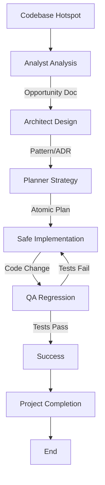

# Refactoring & Tech Debt Paydown Workflow

This workflow defines a systematic, safe approach to addressing technical debt. It prioritizes stability and regression testing over speed.

## Workflow Overview

Refactoring is high-risk if done ad-hoc. This workflow enforces a cycle of **Analysis -> Design -> Implementation -> Verification**, ensuring that structure changes without altering behavior.

## Workflow Steps

### 1. Hotspot Identification (Analyst Agent)
- **Agent**: Analyst
- **Input**: Codebase, complexity metrics, or "gut feel" from developers.
- **Action**: Run the Analyst agent as a subagent to identify specific areas of high complexity, cyclical dependencies, or legacy patterns.
- **Mandatory MCP Usage**:
  - Use `find_by_name` and `grep_search` to map dependencies.
  - Use `view_file` to assess code readability and cyclomatic complexity.
  - Use `context7` to understand library patterns in legacy code.
- **Output**: A Refactoring Opportunity Doc in `agent-output/analysis/Refactoring-Opp.md`.
- **Handoff**: `agent-output/handoffs/Refactor-Phase1-Handoff.md` (Template: Data-Only, No Fluff)

### 2. Pattern Selection (Architect Agent)
- **Agent**: Architect
- **Input**: `agent-output/handoffs/Refactor-Phase1-Handoff.md` AND `agent-output/analysis/Refactoring-Opp.md`
- **Action**: Run the Architect agent as a subagent to propose the new structure or design pattern (e.g., "Extract Strategy Pattern", "Replace Conditional with Polymorphism").
- **Output**: An Architecture Decision Record (ADR) or Design Sketch in `agent-output/architecture/ADR.md`.
- **Handoff**: `agent-output/handoffs/Refactor-Phase2-Handoff.md` (Template: Data-Only, No Fluff)

### 3. Step-by-Step Planning (Planner Agent)
- **Agent**: Planner
- **Input**: `agent-output/handoffs/Refactor-Phase2-Handoff.md` AND `agent-output/architecture/ADR.md`
- **Action**: Run the Planner agent as a subagent to break the refactoring into atomic, safe steps.
- **Constraint**: Each step must leave the system in a compiling, passing state.
- **Output**: A Refactoring Plan in `agent-output/planning/Refactor-Plan.md`.
- **Handoff**: `agent-output/handoffs/Refactor-Phase3-Handoff.md` (Template: Data-Only, No Fluff)

### 3a. Method Critique (Critic Agent)
- **Agent**: Critic
- **Input**: Refactoring Plan.
- **Action**: Run the Critic agent as a subagent to verify the plan follows the pattern correctly and maintains safety.
- **Iteration**: Return to **Planner** if unsafe.

### 3b. Documentation Detail Verification (Critic Agent)
- **Agent**: Critic
- **Input**: `agent-output/planning/Refactor-Plan.md`
- **Action**: **CRITICAL**: Run the Critic agent as a subagent to review specifically for "lack of detail". Refactoring requires atomic precision. Ensure no step is vague.
- **Iteration**: Return to **Planner** if lacking detail.
- **Handoff**: To Implementer.

### 4. Safe Implementation (Implementer Agent)
- **Agent**: Implementer
- **Input**: `agent-output/handoffs/Refactor-Phase3-Handoff.md` AND `agent-output/planning/Refactor-Plan.md`
- **Action**: Run the Implementer agent as a subagent to perform detailed execution of the plan.
- **Process**:
  1.  Ensure existing tests pass (Gold Master).
  2.  Apply refactoring for one step.
  3.  Run tests.
  4.  Commit.
- **Output**: Code changes + `agent-output/implementation/Refactor-Impl.md`
- **Handoff**: `agent-output/handoffs/Refactor-Phase4-Handoff.md` (Template: Data-Only, No Fluff)

### 4b. Code Review & Refinement (Critic Agent)
- **Agent**: Critic
- **Input**: Code changes.
- **Action**: Run the Critic agent as a subagent to check for regression in code quality or readability.
- **Checks**:
  - Code Style & Standards.
  - Complexity metrics.
- **Iteration**: Any findings must be addressed by **Implementer** before QA.
- **Handoff**: To QA.

### 5. Regression Verification (QA Agent)
- **Agent**: QA
- **Input**: `agent-output/handoffs/Refactor-Phase4-Handoff.md` AND `agent-output/implementation/Refactor-Impl.md`
- **Action**: Run the QA agent as a subagent to run the full regression suite. Verify no behavior changes.
- **Mandatory MCP Usage**:
  - Use `run_command` to execute test suites.
  - Use `playwright` (Web) or `ios-simulator` (Mobile) to verify UI behavior if applicable. **(For ios-simulator: check [Troubleshooting Guide](https://github.com/joshuayoes/ios-simulator-mcp/blob/main/TROUBLESHOOTING.md) / [LLM Guide](https://raw.githubusercontent.com/joshuayoes/ios-simulator-mcp/refs/heads/main/TROUBLESHOOTING.md))**
  - Use `context7` to verify refactored code usage against library documentation.
  - Use `view_code_item` to manually verify signatures if needed.
- **Iteration Loop**:
  - **FAIL**: Return to **Implementer**. The refactoring broke something. Revert or Fix.
  - **PASS**: Refactor successful. Create `agent-output/handoffs/Refactor-Phase5-Handoff.md` (Template: Data-Only, No Fluff).

### 6. Project Completion (Orchestrator)
- **Agent**: Orchestrator
- **Action**: Archive artifacts and generate final report.
- **Output**:
  - Move terminal artifacts to `agent-output/closed/`
  - Generate **Single** Project Completion Report: `agent-output/reports/[ID]-completion-report.md`
  - **STOP** (End of Workflow)

## Agent Roles Summary

| Agent | Role | Output Location |
| :--- | :--- | :--- |
| **Analyst** | Identify Debt | `agent-output/analysis/` |
| **Architect** | Define Target State | `agent-output/architecture/` |
| **Planner** | Atomic Steps | `agent-output/planning/` |
| **Implementer** | Execute Refactor | Codebase |
| **QA** | Regression Test | `agent-output/qa/` |
| **Orchestrator** | Final Report | `agent-output/reports/` |

## Workflow Diagram

