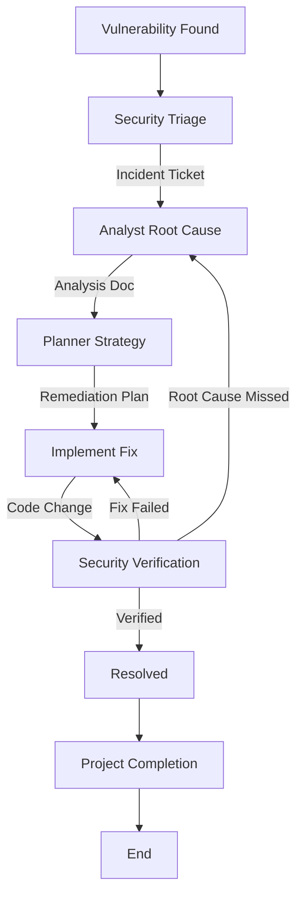

# Security Remediation Workflow

This workflow defines the standard process for addressing security vulnerabilities. It emphasizes root cause analysis and comprehensive verification.

## Workflow Overview

Security fixes must be precise. This workflow ensures we don't just "patch" the symptom but understand and fix the root cause, verifying it with the same rigor used to find it.

## Workflow Steps

### 1. Triage & Assessment (Security Agent)
- **Agent**: Security
- **Input**: Vulnerability report (from tool or external source).
- **Execution**: Run the **Security** agent as a subagent.
    - **Task**: "Assess vulnerability severity and impact. Output Security Incident Ticket."
- **Output**: Security Incident Ticket in `agent-output/security/Incident-Ticket.md`.
- **Handoff**: `agent-output/handoffs/SecFix-Phase1-Handoff.md` (Template: Data-Only, No Fluff)

### 2. Root Cause Analysis (Analyst Agent)
- **Agent**: Analyst
- **Input**: `agent-output/handoffs/SecFix-Phase1-Handoff.md` AND `agent-output/security/Incident-Ticket.md`
- **Execution**: Run the **Analyst** agent as a subagent.
    - **Task**: "Locate vulnerability in code. Trace from Sink to Source. Output Root Cause/Data Flow Analysis."
- **Handoff**: `agent-output/handoffs/SecFix-Phase2-Handoff.md` (Template: Data-Only, No Fluff)

### 3. Remediation Planning (Planner Agent)
- **Agent**: Planner
- **Input**: `agent-output/handoffs/SecFix-Phase2-Handoff.md` AND `agent-output/analysis/Root-Cause.md`
- **Execution**: Run the **Planner** agent as a subagent.
    - **Task**: "Plan the fix (patch/upgrade/rewrite) considering side effects. Output Remediation Plan."
- **Considerations**: patches, library upgrades, or code rewrites. Must consider side effects.
- **Output**: `agent-output/planning/Remediation-Plan.md`.
- **Handoff**: `agent-output/handoffs/SecFix-Phase3-Handoff.md` (Template: Data-Only, No Fluff)

### 3a. Plan Critique (Critic Agent)
- **Agent**: Critic
- **Input**: Remediation Plan.
- **Action**: Run the Critic agent as a subagent to verify the plan addresses the root cause without introducing new vulnerabilities.
- **Iteration**: Return to **Planner** if insufficient.

### 3b. Documentation Detail Verification (Critic Agent)
- **Agent**: Critic
- **Input**: `agent-output/planning/Remediation-Plan.md`
- **Action**: **CRITICAL**: Run the Critic agent as a subagent to review specifically for "lack of detail". Security fixes cannot be ambiguous.
- **Iteration Link**: Return to **Planner** if vague.
- **Handoff**: To Implementer.

### 4. Application of Fix (Implementer Agent)
- **Agent**: Implementer
- **Input**: `agent-output/handoffs/SecFix-Phase3-Handoff.md` AND `agent-output/planning/Remediation-Plan.md`
- **Execution**: Run the **Implementer** agent as a subagent.
    - **Task**: "Apply the fix. Output Code changes."
- **Output**: Code changes + `agent-output/implementation/Remediation-Impl.md`.
- **Handoff**: `agent-output/handoffs/SecFix-Phase4-Handoff.md` (Template: Data-Only, No Fluff)

### 4b. Code Review & Refinement (Critic Agent)
- **Agent**: Critic
- **Input**: Security Fix Code.
- **Action**: Run the Critic agent as a subagent to ensure the fix is secure and follows standards.
- **Checks**:
  - Secure Coding Patterns.
  - Maintainability.
- **Iteration**: Any findings must be addressed by **Implementer** before Verification.
- **Handoff**: To Security.

### 5. Verification (Security Agent)
- **Agent**: Security
- **Input**: `agent-output/handoffs/SecFix-Phase4-Handoff.md` AND `agent-output/implementation/Remediation-Impl.md`
- **Execution**: Run the **Security** agent as a subagent.
    - **Task**: "Verify fix specifically addresses vulnerability. Use `view_file` and security scanners."
- **Iteration Loop**:
  - **FAIL**: Fix is ineffective or incomplete. Return to **Analyst** (if root cause wrong) or **Implementer** (if implementation flawed).
  - **PASS**: Issue Resolved. Create `agent-output/handoffs/SecFix-Phase5-Handoff.md` (Template: Data-Only, No Fluff).

### 6. Project Completion (Orchestrator)
- **Agent**: Orchestrator
- **Action**: Archive artifacts and generate final report.
- **Output**:
  - Move terminal artifacts to `agent-output/closed/`
  - Generate **Single** Project Completion Report: `agent-output/reports/[ID]-completion-report.md`
  - **STOP** (End of Workflow)

## Agent Roles Summary

| Agent | Role | Output Location |
| :--- | :--- | :--- |
| **Security** | Triage & Verify | `agent-output/security/` |
| **Analyst** | Root Cause | `agent-output/analysis/` |
| **Planner** | Plan Fix | `agent-output/planning/` |
| **Implementer** | Apply Fix | Codebase |
| **Orchestrator** | Final Report | `agent-output/reports/` |

## Workflow Diagram

