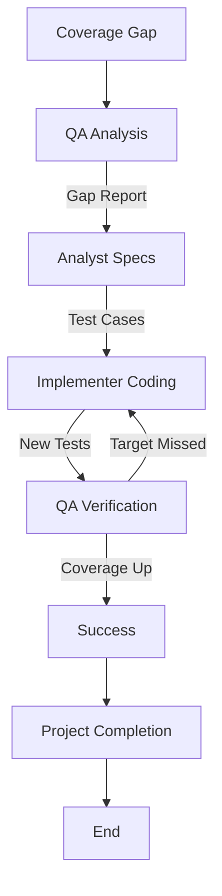

# Test Coverage Expansion Workflow

This workflow systematically increases test coverage for legacy or critical code paths.

## Workflow Overview

Coverage is not just a number; it's confidence. This workflow targets "dark corners" of the codebase and illuminates them with tests, without modifying the logic itself.

## Workflow Steps

### 1. Gap Analysis (QA Agent)
- **Agent**: QA
- **Input**: Coverage reports (LCOV, JaCoCo, etc.) or manual analysis.
- **Execution**: Run the **QA** agent as a subagent.
    - **Task**: "Identify critical paths with low/no coverage. Output Coverage Gap Report."
- **Output**: Coverage Gap Report in `agent-output/qa/`.
- **Handoff**: Passed to Analyst.

### 2. Logic Analysis (Analyst Agent)
- **Agent**: Analyst
- **Input**: Coverage Gap Report.
- **Execution**: Run the **Analyst** agent as a subagent.
    - **Task**: "Deep-dive into uncovered code logic. Output Test Case Specification (Input -> Output)."
- **Output**: Test Case Specification in `agent-output/analysis/` (inputs -> expected outputs).
- **Handoff**: Passed to Critic.

### 2b. Spec Detail Verification (Critic Agent)
- **Agent**: Critic
- **Input**: Test Case Specification.
- **Action**: **CRITICAL**: Run the Critic agent as a subagent to review specifically for "lack of detail". Ensure test cases are fully defined (Input + Expected Output).
- **Iteration**: Return to **Analyst** if vague.
- **Handoff**: Passed to Implementer.

### 3. Test Implementation (Implementer Agent)
- **Agent**: Implementer
- **Input**: Test Case Specification.
- **Execution**: Run the **Implementer** agent as a subagent.
    - **Task**: "Write unit/integration tests. Do NOT modify production code unless necessary. Output New test files."
- **Output**: New test files.
- **Handoff**: Passed to QA.

- **Handoff**: Passed to Critic.

### 3b. Code Review & Refinement (Critic Agent)
- **Agent**: Critic
- **Input**: New Tests.
- **Action**: Run the Critic agent as a subagent to ensure tests are clean, readable, and not brittle.
- **Checks**:
  - Test Patterns (AAAs).
  - No Hardcoding.
- **Iteration**: Any findings must be addressed by **Implementer** before Verification.
- **Handoff**: Passed to QA.

### 4. Verification (QA Agent)
- **Agent**: QA
- **Input**: New tests.
- **Execution**: Run the **QA** agent as a subagent.
    - **Task**: "Run tests and check coverage metrics. Verify targets met."
- **Iteration Loop**:
  - **FAIL**: Coverage target missed or tests fail. Return to **Implementer**.
  - **PASS**: Coverage improved.

### 5. Project Completion (Orchestrator)
- **Agent**: Orchestrator
- **Action**: Archive artifacts and generate final report.
- **Output**:
  - Move terminal artifacts to `agent-output/closed/`
  - Generate **Single** Project Completion Report: `agent-output/completion/[ID]-completion-report.md`
  - **STOP** (End of Workflow)

## Agent Roles Summary

| Agent | Role | Output Location |
| :--- | :--- | :--- |
| **QA** | Identify Gaps | `agent-output/qa/` |
| **Analyst** | Spec Behavior | `agent-output/analysis/` |
| **Implementer** | Write Tests | Test Files |
| **Orchestrator** | Final Report | `agent-output/completion/` |

## Workflow Diagram

