# Zero to Hero Application Development Workflow

This workflow represents the ultimate "all-hands-on-deck" process for building a modern, feature-rich, enterprise-grade application from scratch. It utilizes every specialized agent in the system and imposes strict **Critic-driven Iteration Loops** at every single stage to ensure maximum quality, security, and architectural integrity.

## Workflow Overview

This is not a linear path; it is a series of refinement cycles. No artifact moves to the next phase until the **Critic** has explicitly approved it. This simulates a rigorous code review / design review culture.

## Trigger & Entry Point (CRITICAL)

**Trigger**: User requests "Zero to Hero" workflow or "Build a new app with Zero to Hero rigor".
**Orchestrator Responsibility**:
1.  **ACKNOWLEDGE**: Confirm receipt of request.
2.  **HANDOFF**: Immediately hand off to **Roadmap Agent** (Phase 1).
3.  **PROHIBITION**: Do NOT start creating files, running CLI commands, or generating code yourself. The prompt "create the app" defines the *outcome*, but this workflow defines the *process*. You MUST follow the process.

## Workflow Steps

### Phase 1: Inception & Strategy (Roadmap, Navigator, Critic)
- **Primary Agents**: Navigator (Research), Roadmap (Strategy)
- **Reviewer**: Critic
- **Goal**: Define *what* to build and *why* it matters, refined to perfection.
- **Actions**:
    1.  **Context Analysis (Roadmap)**: Analyze any user-provided attachments (Readmes, existing code) as *input* for the vision.
    2.  **Market Research (Navigator)**: Explore current trends and "best-in-class" examples.
    2.  **Vision Definition (Roadmap)**: Synthesize research into a Product Vision.
    3.  **Feature Mapping (Roadmap)**: Define Epics and Value Statements.
    4.  **Critique Loop (Critic)**:
        - Review `Product-Brief.md` for clarity, ambition, and alignment with "Hero" status.
        - **Reject**: Roadmap refines.
        - **Approve**: Proceed to Analysis.
- **Output**: `agent-output/strategy/Product-Brief.md` (Status: APPROVED)
- **Handoff**: To Analyst.

### Phase 2: Technical Analysis (Analyst, Critic)
- **Primary Agent**: Analyst
- **Reviewer**: Critic
- **Goal**: Determine the *how* (Stack & Feasibility) with robust justification.
- **Actions**:
    1.  **Stack Selection**: Evaluate modern stacks (Next.js, Python, etc.).
    2.  **Dependency Research**: Identify best-in-class libraries.
    3.  **Risk Assessment**: Identify bottlenecks.
    4.  **Critique Loop (Critic)**:
        - Review `Technical-Feasibility.md`.
        - Check: Are we using truly modern tools? Are risks glossed over?
        - **Reject**: Analyst re-investigates.
        - **Approve**: Proceed to Design.
- **Output**: `agent-output/analysis/Technical-Feasibility.md` (Status: APPROVED)
- **Handoff**: To Architect.

### Phase 3: Architectural Design (Architect, Critic)
- **Primary Agent**: Architect
- **Reviewer**: Critic
- **Goal**: Design the system structure and data flow.
- **Actions**:
    1.  **System Design**: Define boundaries, components, and data models.
    2.  **Diagramming**: Create comprehensive Mermaid flowcharts.
    3.  **Critique Loop (Critic)**:
        - Review `System-Architecture.md`.
        - Check: Is it scalable? Clean? Do diagrams follow strict `flowchart` syntax?
        - **Reject**: Architect redesigns.
        - **Approve**: Proceed to Planning.
- **Output**: `agent-output/architecture/System-Architecture.md` (Status: APPROVED)
- **Handoff**: To Planner.

### Phase 4: Master Planning (Planner, Critic)
- **Primary Agent**: Planner
- **Reviewer**: Critic
- **Goal**: Create a step-by-step execution guide.
- **Actions**:
    1.  **Phasing**: Break project into logical phases.
    2.  **Task Breakdown**: Granular tasks with "Definition of Done".
    3.  **Critique Loop (Critic)**:
        - Review `Master-Implementation-Plan.md`.
        - Check: Is it detailed enough? Are testing steps included?
        - **Reject**: Planner adds detail.
        - **Approve**: Proceed to Foundation.
- **Output**: `agent-output/planning/Master-Implementation-Plan.md` (Status: APPROVED)
- **Handoff**: To DevOps.

### Phase 5: Foundation Setup (DevOps, Critic)
- **Primary Agent**: DevOps
- **Reviewer**: Critic
- **Goal**: Create a robust, linted, verified local environment.
- **Actions**:
    1.  **Setup**: Git, Linting, Formatting, Framework Init.
    2.  **Critique Loop (Critic)**:
        - Review the file structure and config files.
        - Check: Are `.gitignore` and `eslint` strict enough?
        - **Reject**: DevOps fixes config.
        - **Approve**: Proceed to Implementation.
- **Output**: Verified Local Environment.
- **Handoff**: To Implementer.

### Phase 6: The Implementation Loop (Implementer, Critic, QA)
*Repeat this cycle for each Feature Phase defined in the Plan.*

#### 6a. Component Implementation (Implementer)
- **Agent**: Implementer
- **Action**: Write modern, beautiful, clean code.

#### 6b. Code Critique (Critic)
- **Agent**: Critic
- **Action**: Strict code review.
- **Checks**:
    - **Aesthetics**: Is it "Zero to Hero" quality?
    - **Architecture**: Does it match Phase 3?
    - **Quality**: Clean code principles?
- **Result**:
    - **Reject**: Send back to 6a.
    - **Approve**: Move to 6c.

#### 6c. Functional Testing (QA)
- **Agent**: QA
- **Action**: Run tests.
- **Loop**: Failures go back to Implementer (6a).

### Phase 7: Security Audit (Security, Critic)
- **Primary Agent**: Security
- **Reviewer**: Critic
- **Goal**: Ensure safety and compliance.
- **Actions**:
    1.  **Audit**: Static analysis and CVE check.
    2.  **Critique Loop (Critic)**:
        - Review `Security-Audit.md`.
        - Check: Did we miss any obvious vectors? Is the report actionable?
        - **Reject**: Security scans again.
        - **Approve**: Implementer applies fixes.
- **Output**: `agent-output/security/Security-Audit.md` (Status: APPROVED)

### Phase 8: User Acceptance (UAT, Critic)
- **Primary Agent**: UAT
- **Reviewer**: Critic
- **Goal**: Verify "Hero" status.
- **Actions**:
    1.  **Validation**: Walkthrough and value check.
    2.  **Critique Loop (Critic)**:
        - Review `Final-Acceptance.md`.
        - Check: Was UAT rigorous? Did we just rubber-stamp it?
        - **Reject**: UAT re-verifies.
        - **Approve**: Proceed to Completion.
- **Output**: `agent-output/uat/Final-Acceptance.md` (Status: APPROVED)

### Phase 9: Documentation & Handoff (Analyst, Critic)
- **Primary Agent**: Analyst
- **Reviewer**: Critic
- **Actions**:
    1.  **Docs**: Create beautiful READMEs.
    2.  **Critique Loop (Critic)**:
        - Review final documentation.
        - Check: Spelling, formatting, screenshot presence.
        - **Reject**: Analyst fixes.
        - **Approve**: Finish.

## Workflow Visualization

```mermaid
flowchart TD
    Start([User Request]) --> Phase1
    subgraph Phase1 [Strategy]
        Nav[Navigator] --> Road[Roadmap]
        Road --> Crit1{Critic Review}
        Crit1 -->|Reject| Road
    end
    Crit1 -->|Approve| Phase2
    
    subgraph Phase2 [Analysis]
        Analyst --> Crit2{Critic Review}
        Crit2 -->|Reject| Analyst
    end
    Crit2 -->|Approve| Phase3

    subgraph Phase3 [Design]
        Arch[Architect] --> Crit3{Critic Review}
        Crit3 -->|Reject| Arch
    end
    Crit3 -->|Approve| Phase4

    subgraph Phase4 [Planning]
        Plan[Planner] --> Crit4{Critic Review}
        Crit4 -->|Reject| Plan
    end
    Crit4 -->|Approve| Phase5

    subgraph Phase5 [Foundation]
        DevOps --> Crit5{Critic Review}
        Crit5 -->|Reject| DevOps
    end
    Crit5 -->|Approve| Phase6

    subgraph Phase6 [Implementation Loop]
        Impl[Implementer] --> Crit6{Critic Review}
        Crit6 -->|Reject| Impl
        Crit6 -->|Approve| QA[QA Test]
        QA -->|Fail| Impl
    end
    QA -->|Pass| Phase7

    subgraph Phase7 [Security]
        Sec[Security] --> Crit7{Critic Review}
        Crit7 -->|Reject| Sec
    end
    Crit7 -->|Approve| Phase8

    subgraph Phase8 [Verification]
        UAT[UAT] --> Crit8{Critic Review}
        Crit8 -->|Reject| UAT
    end
    Crit8 -->|Approve| Phase9

    subgraph Phase9 [Completion]
        Doc[Analyst] --> Crit9{Critic Review}
        Crit9 -->|Reject| Doc
    end
    Crit9 -->|Approve| End([Ready Locally])
```

## Special Instructions
- **Aesthetics**: This compilation MUST be beautiful.
- **Critic Authority**: The Critic has absolute veto power. If the Critic says "it looks basic" or "not detailed enough", the previous agent MUST redo the work.
- **Diagrams**: EVERY phase must produce a Mermaid `flowchart`.

## Workflow Governance
- **Logging**: All agents MUST log tool usage and CLI commands to `agent-output/logs/`.
- **Output Structure**: Agents must ONLY write to their designated `agent-output/[role]/` directory. Root `agent-output/` must remain clean except for `management/` and `logs/`.
- **Handoffs**: All handoff documents must be saved to `agent-output/handoffs/`.
