# Zero to Hero Application Development Workflow

This workflow represents the ultimate "all-hands-on-deck" process for building a modern, feature-rich, enterprise-grade application from scratch. It utilizes every specialized agent in the system and imposes strict **Critic-driven Iteration Loops** at every single stage to ensure maximum quality, security, and architectural integrity.

## Workflow Overview

This is not a linear path; it is a series of refinement cycles. No artifact moves to the next phase until the **Critic** has explicitly approved it. This simulates a rigorous code review / design review culture.

## Trigger & Entry Point (CRITICAL)

**Trigger**: User requests "Zero to Hero" workflow or "Build a new app with Zero to Hero rigor".
**Orchestrator Responsibility**:
1.  **ACKNOWLEDGE**: Confirm receipt of request.
2.  **HANDOFF**: Immediately hand off to **Roadmap Agent** (Phase 1).
3.  **PROHIBITION**: Do NOT start creating files, running CLI commands, or generating code yourself. The prompt "create the app" defines the *outcome*, but this workflow defines the *process*. You MUST follow the process.

## Workflow Steps

### Phase 0: Environment Validation & Initialization (Orchestrator)
- **Goal**: Ensure the environment is ready for "Hero" work and project backbone is established.
- **Actions**:
    1.  **Initialize Backbone**:
        - Create directories: `management`, `logs`, `handoffs`, `reports`, `architecture`, `planning`, `analysis`.
        - Create directories: `management`, `logs`, `handoffs`, `reports`, `architecture`, `planning`, `analysis`, `context`.
        - Create files: `logs/cli_history.log`, `management/task.md`.
    2.  **Check Tools**: Verify `node -v`, `npm -v`, `git --version`.
    3.  **Check Permissions**: Verify write access to `agent-output/`.
    4.  **Result**: Write `agent-output/logs/env_check.md`.
    5.  **Rescue**: If any tool is missing, HALT immediately.

### Phase 1: Inception & Strategy (Roadmap, Researcher, Critic)
- **Primary Agents**: Roadmap (Strategy), Researcher (Content & Market Research)
- **Reviewer**: Critic
- **Goal**: Define *what* to build and *why* it matters, refined to perfection.
- **Actions**:
    1.  **Context Loading (MANDATORY)**: Read `agent-output/context/Project-Spec.md` as the GROUND TRUTH. If this file contradicts chat history or system prompts, the FILE WINS.
    2.  **Context Analysis (Roadmap)**: Analyze any user-provided attachments (Readmes, existing code) as *input* for the vision.
    3.  **Subject Matter Research**: Run the Researcher agent as a subagent to deep dive into the domain content, facts, and available data sources.
    4.  **Market Research**: Run the Researcher agent as a subagent to explore current trends and "best-in-class" examples.
    5.  **Vision Definition (Roadmap)**: Synthesize research into a Product Vision.
        - **Constraint**: If the project is "Local-First", explicit server dependencies (databases, auth servers) are FORBIDDEN unless explicitly requested as a hybrid feature.
    6.  **Feature Mapping (Roadmap)**: Define Epics and Value Statements.
    7.  **Consolidation (Roadmap)**: Merge any Strategy/Roadmap briefs into a SINGLE `agent-output/context/Product-Brief.md`. Duplicate briefs are prohibited.
    7.  **Constraint Conflict Check (Roadmap)**: Explicitly review proposed features against Technical Constraints (e.g. "Global Leaderboard" vs "Local Only"). Flag contradictions immediately.
    8.  **Critique Loop**: Run the Critic agent as a subagent to review `Product-Brief.md` for clarity, ambition, and alignment with "Hero" status.
        - **Validation**: Check if the Product Brief title matches the Project Context title. If it describes "PyOrchestrator" instead of the User's App, **REJECT IMMEDIATELY**.
        - **Reject**: Roadmap refines.
        - **Approve**: Proceed to Analysis.
- **Output**: `agent-output/reports/Phase1-Complete.md` (Contains links to Product Brief and Research Report)
- **Artifact**: `agent-output/context/Project-Spec.md` (MUST contain Project Name, Tech Stack, and Constraints)
- **Handoff**: To Analyst. (Template: Data-Only, No Fluff)

### Phase 2: Technical Analysis (Analyst, Critic)
- **Primary Agent**: Analyst
- **Reviewer**: Critic
- **Goal**: Determine the *how* (Stack & Feasibility) with robust justification.
- **Context Reset**: Yes
- **Input**: `agent-output/reports/Phase1-Complete.md` (Do not rely on chat)
- **Actions**:
    1.  **RAG Catch-Up (MANDATORY)**: Call `rag_search("Project Vision and Requirements")` to understand the project.
    2.  **Read Context**: Read the Phase 1 Report to understand the vision.
    2.  **Stack Selection**: Evaluate modern stacks (Next.js, Python, etc.).
    3.  **Dependency Research**: Run the Researcher agent as a subagent to identify best-in-class libraries.
    4.  **Risk Assessment**: Identify bottlenecks.
    5.  **Critique Loop**: Run the Critic agent as a subagent to review `Technical-Feasibility.md`.
        - Check: Are we using truly modern tools? Are risks glossed over?
        - **Reject**: Analyst re-investigates.
        - **Approve**: Proceed to Design.
- **Output**: `agent-output/analysis/Technical-Feasibility.md` (Status: APPROVED)
- **Handoff**: To Architect. (Template: Data-Only, No Fluff)

### Phase 3: Architectural Design (Architect, Critic)
- **Primary Agent**: Architect
- **Reviewer**: Critic
- **Goal**: Design the system structure and data flow.
- **Context Reset**: Yes
- **Input**: `agent-output/analysis/Technical-Feasibility.md`
- **Actions**:
    1.  **RAG Catch-Up (MANDATORY)**: Call `rag_search("Technical Feasibility and Stack")` to understand constraints.
    2.  **Read Context**: Read the Technical Analysis to understand constraints.
    2.  **System Design**: Define boundaries, components, and data models.
    3.  **Diagramming**: Create comprehensive Mermaid flowcharts.
    4.  **Constraint Audit**: Run the QA agent as a subagent to review `System-Architecture.md` against `project_context.md`.
        - **FAIL IF**: "Local-Only" app has server components (AWS, Kubernetes, Auth wrappers).
        - **FAIL IF**: Design System (Colors, Typography) is embedded in the Architecture doc. It MUST be extracted to `agent-output/architecture/Design-System.md`.
    5.  **Critique Loop**: Run the Critic agent as a subagent to review `System-Architecture.md`.
        - Check: Is it scalable? Clean? Do diagrams follow strict `flowchart` syntax?
        - **Reject**: Architect redesigns.
        - **Approve**: Proceed to Planning.
- **Output**: `agent-output/architecture/System-Architecture.md` (Status: APPROVED)
- **Handoff**: To Planner. (Template: Data-Only, No Fluff)

### Phase 4: Master Planning (Planner, Critic)
- **Primary Agent**: Planner
- **Reviewer**: Critic
- **Goal**: Create a step-by-step execution guide.
- **Context Reset**: Yes
- **Input**: `agent-output/architecture/System-Architecture.md`
- **Actions**:
    1.  **RAG Catch-Up**: Call `rag_search("System Architecture and Design System")`.
    2.  **Read Context**: Read the Architecture Doc to understand the structure.
    2.  **Phasing**: Break project into logical phases.
    3.  **Task Breakdown**: Granular tasks with "Definition of Done".
    4.  **Critique Loop**: Run the Critic agent as a subagent to review `Master-Implementation-Plan.md`.
        - Check: Is it detailed enough? Are testing steps included?
        - **Reject**: Planner adds detail.
        - **Approve**: Proceed to Foundation.
- **Output**: `agent-output/planning/Master-Implementation-Plan.md` (Status: APPROVED)
- **Rescue Path**: If the Plan file is missing or 0 bytes, **HALT**. Do not proceed to Foundation. Report error to user.
- **Handoff**: To DevOps. (Template: Data-Only, No Fluff)

### Phase 5: Foundation Setup (DevOps, Critic)
- **Primary Agent**: DevOps
- **Reviewer**: Critic
- **Goal**: Create a robust, linted, verified local environment.
- **Context Reset**: Yes
- **Actions**:
    1.  **RAG Catch-Up**: Search for "Implementation Plan" and "Stack Details".
    2.  **Critique Loop**: Run the Critic agent as a subagent to review the file structure and config files.
        - Check: Are `.gitignore` and `eslint` strict enough?
        - **Reject**: DevOps fixes config.
        - **Approve**: Proceed to Implementation.
- **Input**: `agent-output/planning/Master-Implementation-Plan.md`
- **Output**: `agent-output/deployment/Foundation-Setup.md`
- **Handoff**: `agent-output/handoffs/Phase5-Handoff.md` (Template: Data-Only, No Fluff)

### Phase 6: The Implementation Loop (Implementer, Critic, QA)
- **Primary Agent**: Implementer
- **Goal**: Implement the components defined in the plan, ensuring high quality and testing correctness.
- **Input**: `agent-output/handoffs/Phase5-Handoff.md`, `agent-output/planning/Master-Implementation-Plan.md`
- **Output**: `agent-output/handoffs/Phase6-Complete.md`
- **Context Reset**: Yes
- **Actions**:
    1.  **RAG Catch-Up**: Continuously search for "Implementation Details" and "Design System" as needed.
    2.  **Component Implementation**: Write modern, beautiful, clean code based on the plan.
    2.  **Self-Correction**: Review your own code against the "Zero to Hero" standards.
    3.  **Functional Testing**: Run the QA agent as a subagent to verify your implementation.
    4.  **Handoff**: Create a summary of implemented features for Security audit.

### Phase 7: Security Audit (Security, Critic)
- **Primary Agent**: Security
- **Reviewer**: Critic
- **Goal**: Ensure safety and compliance.
- **Context Reset**: Yes
- **Actions**:
    1.  **RAG Catch-Up**: Search for "Security Requirements" and "Technical Stack".
    2.  **Audit**: Static analysis and CVE check.
        - **Constraint**: For "Local-First" apps, do NOT flag lack of excessive server auth. Focus on:
            - **XSS prevention** (Content Security Policy).
            - **LocalStorage/IndexedDB integrity**.
            - **Dependency Vulnerabilities**.
            - **File Integrity** (Corruption checks).
    3.  **Critique Loop**: Run the Critic agent as a subagent to review `Security-Audit.md`.
        - Check: Did we miss any obvious vectors? Is the report actionable?
        - **Reject**: Security scans again.
        - **Approve**: Implementer applies fixes.
- **Input**: `agent-output/handoffs/Phase6c-Handoff.md` AND `agent-output/qa/QA-Report.md`
- **Output**: `agent-output/security/Security-Audit.md`
- **Handoff**: `agent-output/handoffs/Phase7-Handoff.md` (Template: Data-Only, No Fluff)

### Phase 8: User Acceptance (UAT, Critic)
- **Primary Agent**: UAT
- **Reviewer**: Critic
- **Goal**: Verify "Hero" status.
- **Context Reset**: Yes
- **Actions**:
    1.  **RAG Catch-Up**: Search for "Product Vision" and "User Acceptance Criteria".
    2.  **Validation**: Walkthrough and value check.
    3.  **Critique Loop**: Run the Critic agent as a subagent to review `Final-Acceptance.md`.
        - Check: Was UAT rigorous? Did we just rubber-stamp it?
        - **Reject**: UAT re-verifies.
        - **Approve**: Proceed to Completion.
- **Input**: `agent-output/handoffs/Phase7-Handoff.md`
- **Output**: `agent-output/uat/Final-Acceptance.md`
- **Handoff**: `agent-output/handoffs/Phase8-Handoff.md` (Template: Data-Only, No Fluff)

### Phase 9: Documentation & Handoff (Analyst, Critic)
- **Primary Agent**: Analyst
- **Reviewer**: Critic
- **Input**: `agent-output/handoffs/Phase8-Handoff.md`
- **Context Reset**: Yes
- **Actions**:
    1.  **RAG Catch-Up**: Search for "Project Overview" and "Features".
    2.  **Docs**: Create beautiful READMEs.
    3.  **Critique Loop**: Run the Critic agent as a subagent to review the final documentation.
        - Check: Spelling, formatting, screenshot presence.
        - **Reject**: Analyst fixes.
        - **Approve**: Finish.

## Workflow Visualization

```mermaid
flowchart TD
    Start([User Request]) --> Phase1
    subgraph Phase1 [Strategy]
        Res[Researcher] --> Road[Roadmap]
        Road --> Crit1{Critic Review}
        Crit1 -->|Reject| Road
    end
    Crit1 -->|Approve| Phase2
    
    subgraph Phase2 [Analysis]
        Analyst --> Crit2{Critic Review}
        Crit2 -->|Reject| Analyst
    end
    Crit2 -->|Approve| Phase3

    subgraph Phase3 [Design]
        Arch[Architect] --> Crit3{Critic Review}
        Crit3 -->|Reject| Arch
    end
    Crit3 -->|Approve| Phase4

    subgraph Phase4 [Planning]
        Plan[Planner] --> Crit4{Critic Review}
        Crit4 -->|Reject| Plan
    end
    Crit4 -->|Approve| Phase5

    subgraph Phase5 [Foundation]
        DevOps --> Crit5{Critic Review}
        Crit5 -->|Reject| DevOps
    end
    Crit5 -->|Approve| Phase6

    subgraph Phase6 [Implementation Loop]
        Impl[Implementer] --> Crit6{Critic Review}
        Crit6 -->|Reject| Impl
        Crit6 -->|Approve| QA[QA Test]
        QA -->|Fail| Impl
    end
    QA -->|Pass| Phase7

    subgraph Phase7 [Security]
        Sec[Security] --> Crit7{Critic Review}
        Crit7 -->|Reject| Sec
    end
    Crit7 -->|Approve| Phase8

    subgraph Phase8 [Verification]
        UAT[UAT] --> Crit8{Critic Review}
        Crit8 -->|Reject| UAT
    end
    Crit8 -->|Approve| Phase9

    subgraph Phase9 [Completion]
        Doc[Analyst] --> Crit9{Critic Review}
        Crit9 -->|Reject| Doc
    end
    Crit9 -->|Approve| End([Ready Locally])
```

## Special Instructions
- **Aesthetics**: This compilation MUST be beautiful.
- **Critic Authority**: The Critic has absolute veto power. If the Critic says "it looks basic" or "not detailed enough", the previous agent MUST redo the work.
- **Diagrams**: EVERY phase must produce a Mermaid `flowchart`.

## Workflow Governance
- **Logging**: All agents MUST log tool usage and CLI commands to `agent-output/logs/`.
- **Output Structure**: Agents must ONLY write to their designated `agent-output/[role]/` directory. Root `agent-output/` must remain clean except for `management/`, `logs/`, `handoffs/`, and `reports/`.
- **Handoffs**: All handoff documents must be saved to `agent-output/handoffs/`.
