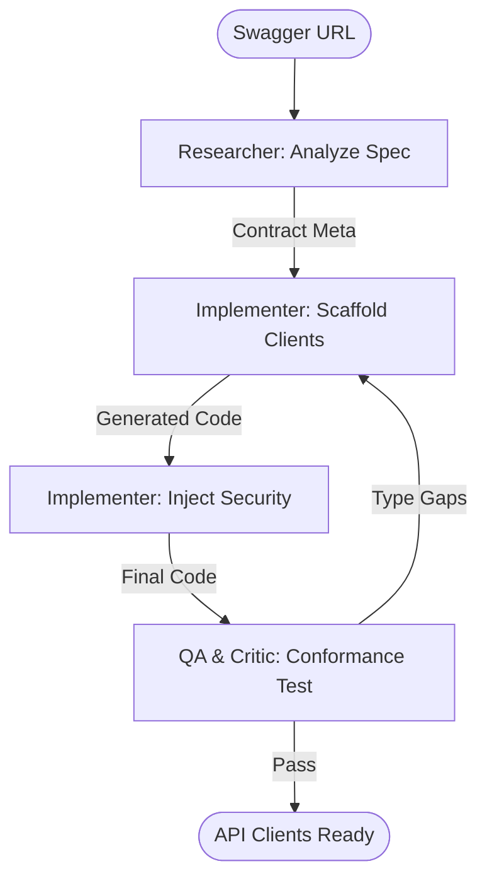

# API Contract Scaffolder Workflow

This workflow automates the generation of type-safe, cross-platform API clients from an OpenAPI/Swagger contract, ensuring backend parity for the entire frontend ecosystem.

## Workflow Overview

Manual API integration is error-prone. This workflow enforces **Contract Analysis -> Boilerplate Scaffolding -> Auth Wrapper Injection -> Functional Verification**.

## Workflow Steps

### 1. API Contract Analysis (Researcher)
- **Agent**: Researcher
- **Goal**: Fetch the Swagger/OpenAPI spec and identify core endpoints and models.
- **Execution**: Use `runSubagent` tool to run the **Researcher** agent.
    - **Task**: "Fetch the OpenAPI JSON from [URL]. Parse all `paths` and `components/schemas`. Identify required auth headers. Output a Contract Summary to `agent-output/analysis/api-contract-summary.json`."
- **Output**: `agent-output/analysis/api-contract-summary.json`
- **Handoff**: To Implementer.

### 2. SDK Scaffolding (Implementer)
- **Agent**: Implementer
- **Goal**: Generate client code and serialization DTOs.
- **Execution**: Use `runSubagent` tool to run the **Implementer** agent.
    - **Task**: "Read `api-contract-summary.json`. Use `openapi-generator` or custom templates to generate clients for React (Axios), Flutter (Dio), and MAUI (Refit). Ensure all path/query parameters are correctly typed. Output to `agent-output/generated/api-clients/`."
- **Output**: Multi-platform API client source files.
- **Handoff**: To Implementer (Step 3).

### 3. Security & Interceptor Injection (Implementer)
- **Agent**: Implementer
- **Goal**: Add global error handling and auth header injection.
- **Execution**: "Inject a global Interceptor/Middleware to handle 401 Unauthorized, 500 Errors, and Bearer token injection. Ensure tokens are read from secure platform storage."

### 4. Contract Conformance Verification (QA & Critic)
- **Agent**: QA, Critic
- **Goal**: Verify that the generated code matches the contract perfectly.
- **Actions**:
    1.  **QA**: Mock a 200 OK response for a complex endpoint. Verify the DTO is populated correctly.
    2.  **Critic**: Audit the generated code for "Any" or "Object" types that should be strongly typed.
- **Output**: `agent-output/reports/api-scaffold-verification.md`

## Agent Roles Summary

| Agent | Role | Output Location |
| :--- | :--- | :--- |
| **Researcher** | Contract Fetch | `agent-output/analysis/` |
| **Implementer** | Code Generation | `agent-output/generated/` |
| **QA** | Serialization Test | `agent-output/reports/` |
| **Critic** | Type Safety Audit | `agent-output/reports/` |

## Workflow Diagram

## Governance
- **Standards**: Must adhere to `custom-agents/instructions/output_standards.md`.
- **Format**: All clients must use `async/await` patterns with robust try/catch blocks.
