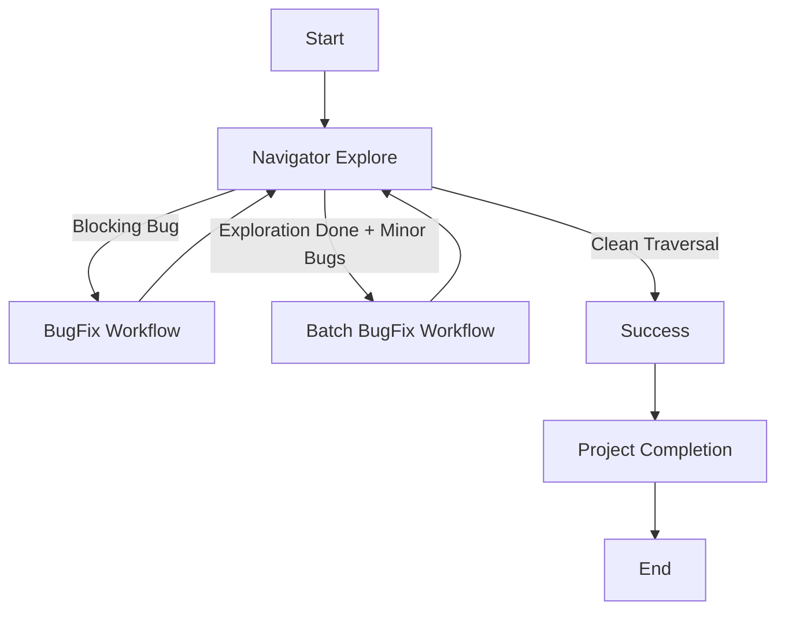

# AppNavigation & Quality Loop Workflow

This workflow drives autonomous application exploration, bug discovery, and recursive resolution.

## Workflow Overview

The **Navigator** explores the app. If it finds a **Blocking Bug**, it stops immediately for a fix. If it finds **Non-Blocking Bugs**, it batches them for later. The workflow loops until the app can be fully traversed with zero open bugs.

## Workflow Steps

### 1. Discovery & Navigation (Navigator Agent)
- **Agent**: Navigator
- **Input**: Application URL or Bundle ID.
- **Execution**: Use the `runSubagent` tool to run the **Navigator** agent.
    - **Task**: "Systematically explore routes, click elements, and record sessions. Decide path based on findings: Blocking Bug (Stop), Non-Blocking (Report), or Clean."

### Scenario A: Immediate Blocking Fix
1. **Orchestrator**: Trigger **BugFix Workflow** immediately for the specific blocking issue.
2. **Orchestrator**: Upon BugFix completion, **RESTART** AppNavigation Workflow from Step 

### Scenario B: Batch Non-Blocking Fixes
1. **Navigator**: Submit `bugs.md` (list of minor issues).
2. **Critic**: Use the `runSubagent` tool to run the Critic agent to **Detail Verification**. Review `bugs.md` for "lack of detail". Ensure every bug has clear reproduction steps and evidence linkages. If vague, send back to Navigator.
3. **Orchestrator**: Trigger **BugFix Workflow** (potentially multiple times or batched) to resolve all logged items.
3. **Orchestrator**: Upon resolution, **RESTART** AppNavigation Workflow from Step 1 (Regression Check).

### Scenario C: Success
1. **Navigator**: Reports "Traversal Complete. Zero Bugs."
2. **Orchestrator**: Proceed to Project Completion.

### Project Completion (Orchestrator)
- **Agent**: Orchestrator
- **Action**: Archive artifacts and generate final report.
- **Output**:
  - Move terminal artifacts to `agent-output/closed/`
  - Generate **Single** Project Completion Report: `agent-output/completion/[ID]-completion-report.md`
  - **STOP** (End of Workflow)

## Agent Roles Summary

| Agent | Role | Output Location |
| :--- | :--- | :--- |
| **Navigator** | Explore & Log Bugs | `agent-output/navigation/` |
| **Orchestrator** | Loop Management | `agent-output/` |

## Workflow Diagram

