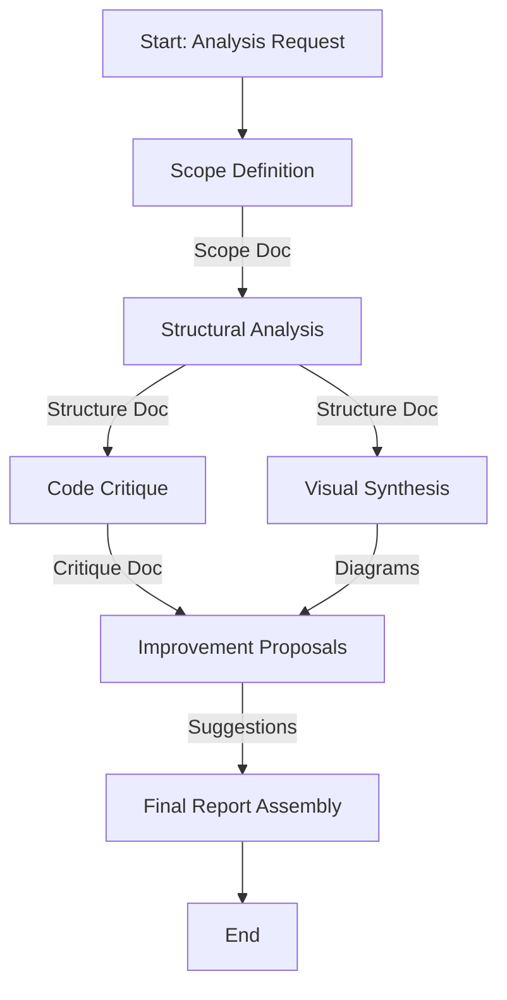

# Functionality Analysis Workflow

This workflow provides a structured approach to deeply analyzing specific application functionality (e.g., submission flows, user interactions). It delivers a comprehensive critique, structural breakdown, visual diagrams, and improvement suggestions.

## Workflow Overview

This workflow is designed to be thorough and agent-driven, utilizing the Analyst, Critic, Architect, and Planner agents to deconstruct, evaluate, and reimagine parts of the codebase. It moves from **Discovery -> Analysis -> Critique -> Visualization -> Recommendation**.

## Workflow Steps

### 1. Scope Definition & Discovery (Analyst Agent)
- **Agent**: Analyst
- **Input**: User-defined functionality name or entry point (e.g., "User Submission Flow").
- **Execution**: Use the `runSubagent` tool to run the **Analyst** agent.
    - **Task**: "Identify core files and entry points for [Functionality] using `find_by_name`. Output Scope Definition."
- **Output**: A Scope Definition document in `agent-output/analysis/` (e.g., `001-scope-definition.md`) listing all relevant files and entry points.
- **Handoff**: Passed to Analyst for Phase 2.

### 2. Structural Analysis & Logic Tracing (Analyst Agent)
- **Agent**: Analyst
- **Input**: Scope Definition document.
- **Execution**: Use the `runSubagent` tool to run the **Analyst** agent.
    - **Task**: "Trace execution paths and state management. Output Existing Logic/Structure document."
- **Handoff**: Passed to Critic.

### 3. Code Critique (Critic Agent)
- **Agent**: Critic
- **Input**: Existing Structure document and Raw Code.
- **Action**: Use the `runSubagent` tool to run the Critic agent to evaluate the implementation against best practices, performance standards, and maintainability guidelines.
- **Checks**:
  - **Code Quality**: DRY principles, naming conventions, complexity.
  - **Performance**: Potential bottlenecks, unnecessary renders/computations.
  - **Security**: Basic vulnerability checks (input validation, auth checks).
  - **UX/UI**: (If applicable) Interaction feedback, state handling.
- **Output**: A Critique document in `agent-output/analysis/` (e.g., `003-critique.md`) with rated severity (Low/Medium/High) for each issue.
- **Handoff**: Passed to Architect.

### 4. Visual Synthesis (Architect Agent)
- **Agent**: Architect
- **Input**: Existing Structure document.
- **Execution**: Use the `runSubagent` tool to run the **Architect** agent.
    - **Task**: "Generate Mermaid diagrams to visualize control flow using `mermaid-diagramming` skill. Output Diagrams document."
- **Output**: An Architecture Diagrams document in `agent-output/architecture/` (e.g., `004-current-flow-diagrams.md`).
- **Handoff**: Passed to Planner.

### 5. Improvement Proposals (Planner Agent)
- **Agent**: Planner
- **Input**: Critique document and Architecture Diagrams.
- **Execution**: Use the `runSubagent` tool to run the **Planner** agent.
    - **Task**: "Propose concrete actionable updates/refactoring. Output Suggested Updates document."
- **Handoff**: Passed to Orchestrator.

### 6. Final Report Assembly (Orchestrator Agent)
- **Agent**: Orchestrator
- **Input**: All previous artifacts.
- **Action**: Compile a single, comprehensive report for the user.
- **Output**: `Functionality-Analysis-Report.md` in `agent-output/`.
  - Executive Summary.
  - Current Structure & Diagrams.
  - Critical Findings.
  - Recommended Next Steps.
  - **STOP** (End of Workflow).

## Agent Roles Summary

| Agent | Role | Output Location |
| :--- | :--- | :--- |
| **Analyst** | Discovery & Structure Analysis | `agent-output/analysis/` |
| **Critic** | Code & Design Critique | `agent-output/analysis/` |
| **Architect** | Visual Diagrams (Mermaid) | `agent-output/architecture/` |
| **Planner** | Improvement Proposals | `agent-output/planning/` |
| **Orchestrator** | Final Report Assembly | `agent-output/` |

## Workflow Diagram

