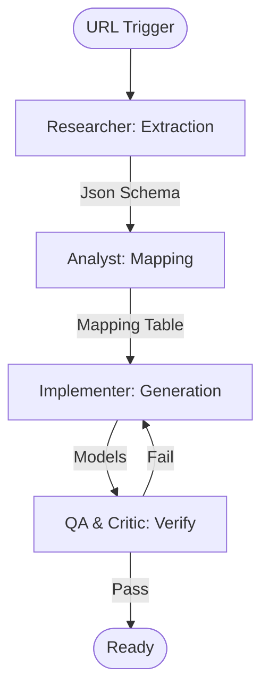

# ArcGIS Model Generator Workflow

This workflow automates the creation of C#, Dart, and TypeScript model classes from an ArcGIS Feature Layer, ensuring cross-platform data consistency.

## Workflow Overview

No model is generated until the **Researcher** has extracted the schema and the **Analyst** has mapped the types. All generated code must be verified by **QA** and **Critic**.

## Workflow Steps

### 1. Schema Extraction (ArcGIS Specialist)
- **Agent**: ArcGIS Specialist
- **Goal**: Retrieve the raw JSON schema of the ArcGIS Feature Layer.
- **Execution**: Use `runSubagent` tool to run the **ArcGIS Specialist** agent.
    - **Task**: "Fetch the raw JSON for the Feature Layer at [URL]. Extract the `fields`, `geometryType`, and `name`. Store results in `agent-output/analysis/layer-schema.json`."
- **Output**: `agent-output/analysis/layer-schema.json`
- **Handoff**: To Analyst.

### 2. Type Mapping & Analysis (ArcGIS Specialist)
- **Agent**: ArcGIS Specialist
- **Goal**: Map ArcGIS types to language-specific primitives.
- **Execution**: Use `runSubagent` tool to run the **ArcGIS Specialist** agent.
    - **Task**: "Read `layer-schema.json`. Map `esriFieldType` values to C#, Dart, and TypeScript types. Output a mapping report to `agent-output/analysis/type-mapping.md`."
- **Critique Loop**: Use `runSubagent` for **Critic** to verify mapping accuracy.
- **Output**: `agent-output/analysis/type-mapping.md` (APPROVED)
- **Handoff**: To Implementer.

### 3. Implementation (Implementer)
- **Agent**: Implementer
- **Goal**: Generate source code files for all platforms.
- **Execution**: Use `runSubagent` tool to run the **Implementer** agent.
    - **Task**: "Read `type-mapping.md`. Generate `FeatureLayer` models for .NET MAUI (C#), Flutter (Dart), and React (TypeScript). Use standard serialization attributes. Output files to `agent-output/generated/models/`."
- **Output**: `.cs`, `.dart`, and `.ts` model files.
- **Handoff**: To QA.

### 4. Verification (QA & Critic)
- **Agent**: QA, Critic
- **Goal**: Ensure syntactic correctness and schema parity.
- **Actions**:
    1.  **QA**: Use `run_command` to verify syntax if possible. Ensure every field from the schema is present.
    2.  **Critic**: Use `runSubagent` to review code style and documentation detail.
- **Output**: `agent-output/reports/model-gen-verification.md`

## Agent Roles Summary

| Agent | Role | Output Location |
| :--- | :--- | :--- |
| ArcGIS Specialist | Schema & Mapping | `agent-output/analysis/` |
| **Implementer** | Code Generation | `agent-output/generated/models/` |
| **QA** | Verification | `agent-output/reports/` |
| **Critic** | Quality Review | `agent-output/reports/` |

## Workflow Visualization

## Governance
- **Standards**: Must adhere to `custom-agents/instructions/output_standards.md`.
- **Handoffs**: Use `agent-output/handoffs/` for data transfers between subagents.
