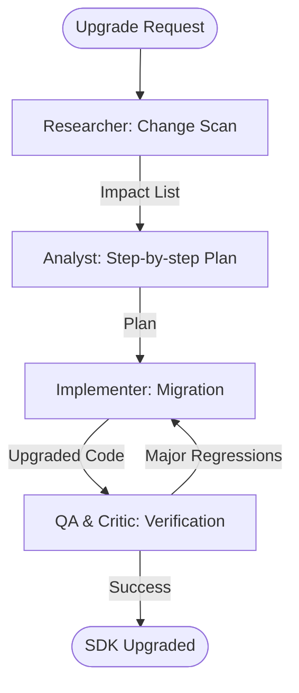

# ArcGIS SDK Migration Assistant

This workflow provides a controlled, multi-phase process for upgrading the ArcGIS SDK while minimizing breaking change impact and regression risk.

## Workflow Overview

SDK upgrades are high-risk. This workflow enforces **Impact Analysis -> Package Migration -> Refactoring -> Regression Testing**.

## Workflow Steps

### 1. Breaking Change Impact Analysis (ArcGIS Specialist)
- **Agent**: ArcGIS Specialist
- **Goal**: Identify all deprecated or removed APIs in the target SDK version.
- **Execution**: Use `runSubagent` tool to run the **ArcGIS Specialist** agent.
    - **Task**: "Analyze the ArcGIS SDK migration guide from [Current] to [Target]. Identify specific breaking changes relevant to this codebase. Output to `agent-output/analysis/migration-impact.md`."
- **Output**: `agent-output/analysis/migration-impact.md`
- **Handoff**: To Analyst.

### 2. Dependency Migration Plan (ArcGIS Specialist)
- **Agent**: ArcGIS Specialist
- **Goal**: Decide the upgrade sequence (Big Bang vs Incremental) and rollback strategy.
- **Execution**: Use `runSubagent` tool to run the **ArcGIS Specialist** agent.
    - **Task**: "Read `migration-impact.md`. Map every breaking change to a specific file/module. Formulate a step-by-step upgrade plan. Output `agent-output/planning/migration-strategy.md`."
- **Critique Loop**: Use **Critic** agent to verify the rollback strategy.
- **Output**: `agent-output/planning/migration-strategy.md` (APPROVED)
- **Handoff**: To Implementer.

### 3. Implementation & Refinement (Implementer)
- **Agent**: Implementer
- **Goal**: Update versions and refactor code to compliant APIs.
- **Execution**: Use `runSubagent` tool to run the **Implementer** agent.
    - **Task**: "Update NuGet/Pub/NPM packages. Refactor deprecated API calls as defined in `migration-strategy.md`. Ensure the project compiles after each phase."
- **Output**: Upgraded codebase + `agent-output/implementation/migration-trace.md`.
- **Handoff**: To QA.

### 4. SDK Parity Verification (QA & Critic)
- **Agent**: QA, Critic
- **Goal**: Ensure all map functionality remains identical after the upgrade.
- **Actions**:
    1.  **QA**: Use `run_command` to execute the full spatial test suite.
    2.  **QA**: Use `playwright` or `ios-simulator` to verify rendering performance hasn't degraded.
    3.  **Critic**: Review refactored code for architectural alignment with the new SDK.
- **Output**: `agent-output/reports/upgrade-summary.md`

## Agent Roles Summary

| Agent | Role | Output Location |
| :--- | :--- | :--- |
| ArcGIS Specialist | Change & Strategy | `agent-output/analysis/` |
| **Implementer** | Refactoring | Codebase |
| **QA** | Regression Test | `agent-output/reports/` |
| **Critic** | Design Alignment | `agent-output/reports/` |

## Workflow Diagram

## Governance
- **Standards**: Must adhere to `custom-agents/instructions/output_standards.md`.
- **Handoffs**: Use `agent-output/handoffs/` for data-dry transfers.
