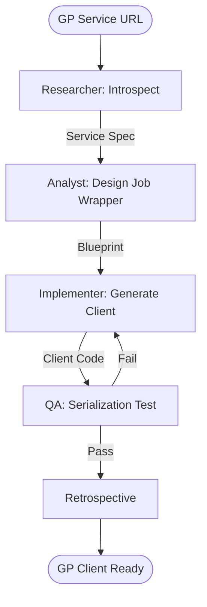

# Geoprocessing Service Client Generator Workflow

This workflow automates the creation of strongly-typed client code for executing complex ArcGIS Geoprocessing services on web and mobile.

## Workflow Overview

GP Services are asynchronous and complex. This workflow enforces **Metadata Introspection -> Job Pattern Design -> Async Implementation -> Mock Execution**.

## Workflow Steps

### 1. GP Service Introspection (ArcGIS Specialist)
- **Agent**: ArcGIS Specialist
- **Goal**: Extract the service specification and parameter types.
- **Execution**: Use `runSubagent` tool to run the **ArcGIS Specialist** agent.
    - **Task**: "Fetch the REST JSON for GP Service at [URL]. Define input parameters, data types (e.g. `GPFeatureRecordSetLayer`), and output types. Identify if execution is `sync` or `async`. Output to `agent-output/analysis/gp-service-spec.json`."
- **Output**: `agent-output/analysis/gp-service-spec.json`
- **Handoff**: To Analyst.

### 2. Job Pattern Architecture (ArcGIS Specialist)
- **Agent**: ArcGIS Specialist
- **Goal**: Define the polling and status-handling strategy for the GP Job.
- **Execution**: Use `runSubagent` tool to run the **ArcGIS Specialist** agent.
    - **Task**: "Read `gp-service-spec.json`. Design the client Job Wrapper. Map status messages (Succeeded, Failed, Executing) to UI events. Output a Technical Design to `agent-output/analysis/gp-client-blueprint.md`."
- **Critique Loop**: Use the `runSubagent` tool to run the **Critic** agent to verify polling intervals and error handling patterns.
- **Output**: `agent-output/analysis/gp-client-blueprint.md` (APPROVED)
- **Handoff**: To Implementer.

### 3. Client Implementation (Implementer)
- **Agent**: Implementer
- **Goal**: Generate the source code for the GP Client.
- **Execution**: Use `runSubagent` tool to run the **Implementer** agent.
    - **Task**: "Read `gp-client-blueprint.md`. Implement a type-safe GP Client for [Target Platform]. Handle parameter serialization and async result fetching. Output to `agent-output/generated/gp/`."
- **Output**: Platform-specific GP Client source files.
- **Handoff**: To QA.

### 4. Serialization & Result Verification (QA)
- **Agent**: QA
- **Goal**: Ensure the client correctly serializes complex GIS types.
- **Execution**: Use `runSubagent` tool to run the **QA** agent.
    - **Task**: "Mock a GP Service response for a successful job. Verify the client correctly deserializes the geometry results. Output `agent-output/reports/gp-client-verification.md`."
- **Output**: `agent-output/reports/gp-client-verification.md`

### 5. Retrospective (Retrospective)
- **Agent**: Retrospective
- **Input**: All `agent-output/` artifacts.
- **Execution**: Use the `runSubagent` tool to run the **Retrospective** agent.
    - **Task**: "Read `custom-agents/instructions/output_standards.md`. Run Retrospective analysis. Output `agent-output/retrospectives/retrospective-[ID].md`."
- **Output**: `agent-output/retrospectives/retrospective-[ID].md`

## Agent Roles Summary

| Agent | Role | Output Location |
| :--- | :--- | :--- |
| ArcGIS Specialist | Service & Job Design| `agent-output/analysis/` |
| **Implementer** | Code Generation | `agent-output/generated/` |
| **QA** | Serialization Test | `agent-output/reports/` |

## Workflow Diagram

## Governance
- **Standards**: Must adhere to `custom-agents/instructions/output_standards.md`.
- **Cancellation**: Generated clients MUST support job cancellation.
