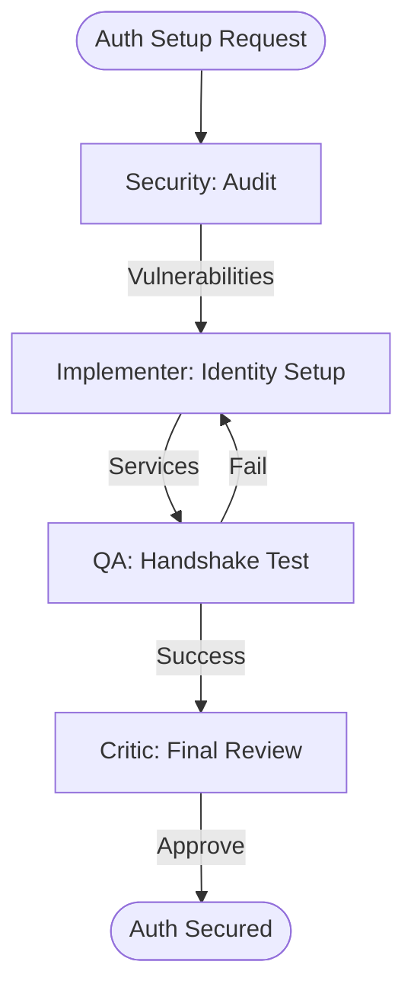

# Secure ArcGIS Auth Configuration

This workflow ensures that your ArcGIS credentials, tokens, and identity management are handled using enterprise-grade security standards across all platforms.

## Workflow Overview

Authentication is a critical security boundary. This workflow enforces **Vulnerability Audit -> Identity Setup -> Handshake Validation -> Final Security Approval**.

## Workflow Steps

### 1. Security Vulnerability Audit (Security)
- **Agent**: Security
- **Goal**: Identify hardcoded secrets and insecure auth patterns.
- **Execution**: Use `runSubagent` tool to run the **Security** agent.
    - **Task**: "Scan codebase for hardcoded `client_id`, `client_secret`, or API keys. Audit `redirect_uri` configs in Android/iOS manifests. Output `agent-output/security/auth-vulnerability-scan.md`."
- **Output**: `agent-output/security/auth-vulnerability-scan.md`
- **Handoff**: To Implementer.

### 2. Identity Implementation (Implementer)
- **Agent**: Implementer
- **Goal**: Setup the secure auth plumbing (Proxy or OAuth2).
- **Execution**: Use `runSubagent` tool to run the **Implementer** agent.
    - **Task**: "Read `auth-vulnerability-scan.md`. Setup cross-platform `IdentityManager` logic. If web, configure a server-side proxy. If mobile, implement PKCE-based OAuth2. Store tokens in `SecureStorage`. Output code changes."
- **Output**: Code changes for Auth Services.
- **Handoff**: To QA.

### 3. Handshake Validation (ArcGIS Specialist)
- **Agent**: ArcGIS Specialist
- **Goal**: Verify the end-to-end auth flow and token retention.
- **Execution**: Use `runSubagent` tool to run the **ArcGIS Specialist** agent.
    - **Task**: "Validate the OAuth2 handshake against the ArcGIS Portal. Verify that `access_token` is never exposed in client logs. Test token refresh logic. Output `agent-output/reports/auth-verification.md`."
- **Output**: `agent-output/reports/auth-verification.md`
- **Handoff**: To Critic.

### 4. Final Security Review (Critic)
- **Agent**: Critic
- **Goal**: Ensure the implementation follows the "Principle of Least Privilege".
- **Actions**:
    1.  **Critic**: Review the audit trail and the final implementation.
    2.  **Verify**: Ensure the app uses secure system browsers (ASWebAuthenticationSession / CustomTabs) for auth.
- **Output**: `agent-output/reports/security-sign-off.md`

## Agent Roles Summary

| Agent | Role | Output Location |
| :--- | :--- | :--- |
| **Security** | Vulnerability Scan | `agent-output/security/` |
| **Implementer** | Plumbing Setup | Codebase |
| ArcGIS Specialist | Handshake Test | `agent-output/reports/` |
| **Critic** | Best Practice Review | `agent-output/reports/` |

## Workflow Diagram

## Governance
- **Standards**: Must adhere to `custom-agents/instructions/output_standards.md`.
- **Secrets**: No actual client secrets should ever be committed to the repository.
