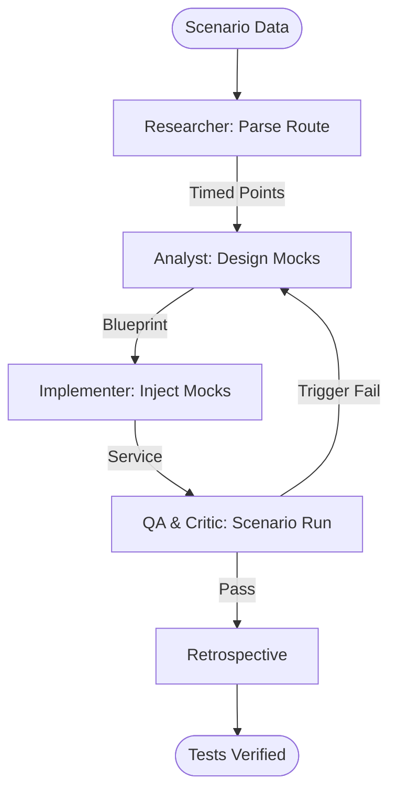

# Geo-Context Tester

This workflow creates high-fidelity spatial test scenarios by mocking GPS movements, layer query results, and geoprocessing outputs.

## Workflow Overview

Reliable spatial testing requires reproducible scenarios. This workflow enforces **Scenario Scripting -> Mock Configuration -> Automated Execution -> Value Verification**.

## Workflow Steps

### 1. Spatial Scenario Scripting (ArcGIS Specialist)
- **Agent**: ArcGIS Specialist
- **Goal**: Parse raw route data into a structured time/location sequence.
- **Execution**: Use `runSubagent` tool to run the **ArcGIS Specialist** agent.
    - **Task**: "Parse the provided GPX/GeoJSON into a series of timed checkpoints. Identify 'Interest Points' where geofence triggers are expected. Output to `agent-output/analysis/test-scenario.json`."
- **Output**: `agent-output/analysis/test-scenario.json`
- **Handoff**: To Analyst.

### 2. Mock Implementation Design (ArcGIS Specialist)
- **Agent**: ArcGIS Specialist
- **Goal**: Define the mocking strategy for each platform's SDK.
- **Execution**: Use `runSubagent` tool to run the **ArcGIS Specialist** agent.
    - **Task**: "Read `test-scenario.json`. Design Mock providers for Flutter, MAUI, and React. Map expected spatial query responses for each checkpoint. Output `agent-output/analysis/mock-blueprint.md`."
- **Critique Loop**: Use the `runSubagent` tool to run the **Critic** agent to verify that the scenario covers edge cases (e.g. crossing anti-meridian, coordinate wraps).
- **Output**: `agent-output/analysis/mock-blueprint.md` (APPROVED)
- **Handoff**: To Implementer.

### 3. Implementation (Implementer)
- **Agent**: Implementer
- **Goal**: Generate and inject the mock source code.
- **Execution**: Use `runSubagent` tool to run the **Implementer** agent.
    - **Task**: "Implement `MockLocationProvider` and `MockSpatialQueryService` based on `mock-blueprint.md`. Inject into the target platform using conditional compilation or dependency injection."
- **Output**: Mock service files + `agent-output/implementation/geo-mock-trace.md`.
- **Handoff**: To QA.

### 4. Scenario Execution & Log Analysis (QA & Critic)
- **Agent**: QA, Critic
- **Goal**: Verify that the app behaves correctly during the "Spatial Walkthrough".
- **Actions**:
    1.  **QA**: Use `playwright` or `ios-simulator` to "play" the scenario.
    2.  **QA**: Monitor logs for expected event triggers (e.g. `EnteredGeofence`).
    3.  **Critic**: Use the `runSubagent` tool to run the **Critic** agent to ensure the test logs are actionable and highly detailed.
- **Output**: `agent-output/reports/geo-test-log.md`

### 5. Retrospective (Retrospective)
- **Agent**: Retrospective
- **Input**: All `agent-output/` artifacts.
- **Execution**: Use the `runSubagent` tool to run the **Retrospective** agent.
    - **Task**: "Read `custom-agents/instructions/output_standards.md`. Run Retrospective analysis. Output `agent-output/retrospectives/retrospective-[ID].md`."
- **Output**: `agent-output/retrospectives/retrospective-[ID].md`

## Agent Roles Summary

| Agent | Role | Output Location |
| :--- | :--- | :--- |
| ArcGIS Specialist | Scenario & Mock Design | `agent-output/analysis/` |
| **Implementer** | Mock Creation | `agent-output/implementation/` |
| **QA** | Scenario Playback | `agent-output/reports/` |
| **Critic** | Edge Case Review | `agent-output/reports/` |

## Workflow Diagram

## Governance
- **Standards**: Must adhere to `custom-agents/instructions/output_standards.md`.
- **Pruning**: Mocks must be clearly separated from production code to avoid accidental shipment.
