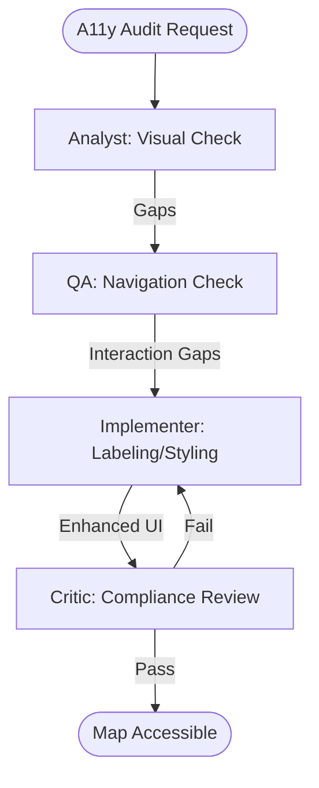

# Map Accessibility Auditor Workflow

This workflow ensures that your geographic applications are inclusive and meet WCAG standards for map interactivity and symbology.

## Workflow Overview

Maps are visually dense and often inaccessible. This workflow enforces **Visual Symbology Audit -> Interaction Tap Audit -> Semantic Labeling -> Remediation Design**.

## Workflow Steps

### 1. Visual & Contrast Audit (ArcGIS Specialist)
- **Agent**: ArcGIS Specialist
- **Goal**: Audit map symbology and basemaps for color accessibility.
- **Execution**: Use `runSubagent` tool to run the **ArcGIS Specialist** agent.
    - **Task**: "Analyze map screenshots. Check contrast between Feature Layers and Basemaps. Identify 'color-only' data indicators. Output an Accessibility Gap Report to `agent-output/analysis/geo-a11y-report.md`."
- **Output**: `agent-output/analysis/geo-a11y-report.md`
- **Handoff**: To QA.

### 2. Interaction & Navigation Audit (QA)
- **Agent**: QA
- **Goal**: Verify tap targets and keyboard/screen-reader navigation.
- **Execution**: Use `runSubagent` tool to run the **QA** agent.
    - **Task**: "Read `geo-a11y-report.md`. Audit tap target sizes (min 44x44px). Test tab order for map controls. Verify screen reader feedback for 'Feature Selected' events. Output findings to `agent-output/reports/a11y-interaction-audit.md`."
- **Output**: `agent-output/reports/a11y-interaction-audit.md`
- **Handoff**: To Implementer.

### 3. Semantic Remediation (Implementer)
- **Agent**: Implementer
- **Goal**: Add accessible labels and contrast fixes to the code.
- **Execution**: Use `runSubagent` tool to run the **Implementer** agent.
    - **Task**: "Apply remediations from the audit reports. Add `aria-label` to web elements. Implement high-contrast basemap toggles. Update tap target styles. Output code changes."
- **Output**: Multi-platform CSS/XAML/Dart updates.
- **Handoff**: To Critic.

### 4. WCAG Compliance Review (Critic)
- **Agent**: Critic
- **Goal**: Ensure the fixes meet specialized GIS accessibility standards.
- **Actions**:
    1.  **Critic**: Review symbology changes for colorblind safety (Protanopia/Deuteranopia).
    2.  **Verify**: Ensure screen reader descriptions for features are non-repetitive but descriptive.
- **Output**: `agent-output/reports/a11y-sign-off.md`

## Agent Roles Summary

| Agent | Role | Output Location |
| :--- | :--- | :--- |
| ArcGIS Specialist | Visual Audit | `agent-output/analysis/` |
| **QA** | Interaction Audit | `agent-output/reports/` |
| **Implementer** | Remediation | Codebase |
| **Critic** | WCAG Review | `agent-output/reports/` |

## Workflow Diagram

## Governance
- **Standards**: Must adhere to `custom-agents/instructions/output_standards.md`.
- **Validation**: Use browser-based accessibility tools (Lighthouse/Wave) during Phase 2.
