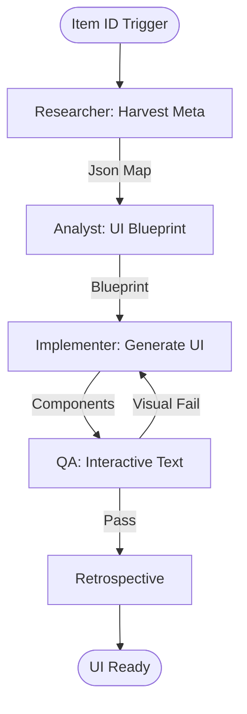

# Web Map to UI Scaffolder Workflow

This workflow automates the transformation of ArcGIS Web Map configurations into interactive UI components for React, Flutter, and MAUI.

## Workflow Overview

Hand-coding UI for maps is tedious. This workflow enforces **Metadata Harvesting -> Component Scaffolding -> Service Integration -> Visual QA**.

## Workflow Steps

### 1. Web Map Metadata Harvesting (ArcGIS Specialist)
- **Agent**: ArcGIS Specialist
- **Goal**: Extract the full JSON definition of the Web Map.
- **Execution**: Use `runSubagent` tool to run the **ArcGIS Specialist** agent.
    - **Task**: "Fetch the raw JSON for Web Map [Item ID]. Extract layer list, visibility, symbology, and `popupInfo`. Output to `agent-output/analysis/webmap-summary.json`."
- **Output**: `agent-output/analysis/webmap-summary.json`
- **Handoff**: To Analyst.

### 2. UI Component Scaffolding (ArcGIS Specialist)
- **Agent**: ArcGIS Specialist
- **Goal**: Design the UI hierarchy based on the map's contents.
- **Execution**: Use `runSubagent` tool to run the **ArcGIS Specialist** agent.
    - **Task**: "Read `webmap-summary.json`. Design Sidebar, Legend, and Popup templates for [Target Platform]. Map layer visibility toggles. Output `agent-output/analysis/ui-scaffolding-blueprint.md`."
- **Critique Loop**: Use the `runSubagent` tool to run the **Critic** agent to verify the UI plan meets design standards.
- **Output**: `agent-output/analysis/ui-scaffolding-blueprint.md` (APPROVED)
- **Handoff**: To Implementer.

### 3. Implementation & Styling (Implementer)
- **Agent**: Implementer
- **Goal**: Generate functional UI code.
- **Execution**: Use `runSubagent` tool to run the **Implementer** agent.
    - **Task**: "Read `ui-scaffolding-blueprint.md`. Generate components (React, Flutter, or MAUI). Wire visibility events to the ArcGIS SDK. Use design system tokens. Output to `agent-output/generated/ui/`."
- **Output**: UI source files + `agent-output/implementation/scaffold-trace.md`.
- **Handoff**: To QA.

### 4. Interactive & Visual Verification (QA)
- **Agent**: QA
- **Goal**: Ensure the UI correctly reflects the Web Map state.
- **Actions**:
    1.  **QA**: Use `playwright` or `ios-simulator` to verify layer toggles.
    2.  **QA**: Confirm that Popups display the correct fields defined in the Web Map.
- **Output**: `agent-output/reports/scaffolding-verification.md`

### 5. Retrospective (Retrospective)
- **Agent**: Retrospective
- **Input**: All `agent-output/` artifacts.
- **Execution**: Use the `runSubagent` tool to run the **Retrospective** agent.
    - **Task**: "Read `custom-agents/instructions/output_standards.md`. Run Retrospective analysis. Output `agent-output/retrospectives/retrospective-[ID].md`."
- **Output**: `agent-output/retrospectives/retrospective-[ID].md`

## Agent Roles Summary

| Agent | Role | Output Location |
| :--- | :--- | :--- |
| ArcGIS Specialist | Metadata & UI Design | `agent-output/analysis/` |
| **Implementer** | Code Generation | `agent-output/generated/ui/` |
| **QA** | Visual/Logic Test | `agent-output/reports/` |

## Workflow Diagram

## Governance
- **Standards**: Must adhere to `custom-agents/instructions/output_standards.md`.
- **Accessibility**: Generated UI must include ARIA labels or semantic mobile headings.
