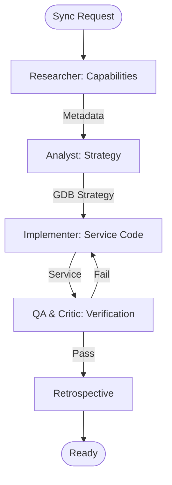

# Offline Map Strategy Orchestrator

This workflow automates the configuration and implementation of offline synchronization for ArcGIS-enabled Flutter and MAUI applications.

## Workflow Overview

Offline sync is one of the most complex spatial workflows. This process enforces **Capability Research -> Logic Design -> Safe Implementation -> Verified QA**.

## Workflow Steps

### 1. Sync Capability Research (ArcGIS Specialist)
- **Agent**: ArcGIS Specialist
- **Goal**: Identify if the target Feature Layer supports sync and what requirements exist.
- **Execution**: Use `runSubagent` tool to run the **ArcGIS Specialist** agent.
    - **Task**: "Fetch service metadata for [URL]. Verify `supportsSync`. Identify required global IDs or editor tracking. Output results to `agent-output/analysis/sync-capabilities.md`."
- **Output**: `agent-output/analysis/sync-capabilities.md`
- **Handoff**: To Analyst.

### 2. Geodatabase & Sync Strategy (ArcGIS Specialist)
- **Agent**: ArcGIS Specialist
- **Goal**: Design the geodatabase parameters and conflict resolution strategy.
- **Execution**: Use `runSubagent` tool to run the **ArcGIS Specialist** agent.
    - **Task**: "Read `sync-capabilities.md`. Design `GenerateGeodatabaseParameters`. Define `SyncModel` and conflict policy. Output `agent-output/analysis/geodatabase-strategy.md`."
- **Critique Loop**: Use the `runSubagent` tool to run the **Critic** agent to verify the technical soundness of the sync strategy.
- **Output**: `agent-output/analysis/geodatabase-strategy.md` (APPROVED)
- **Handoff**: To Implementer.

### 3. Service Implementation (Implementer)
- **Agent**: Implementer
- **Goal**: Write the production-ready sync service code.
- **Execution**: Use `runSubagent` tool to run the **Implementer** agent.
    - **Task**: "Read `geodatabase-strategy.md`. Implement `SyncService` for Flutter (Dart) or MAUI (C#). Include boilerplate for `GenerateGeodatabaseJob` and `SyncGeodatabaseJob`. Output to `agent-output/generated/services/`."
- **Output**: `SyncService.dart` or `SyncService.cs`.
- **Handoff**: To QA.

### 4. Verification & Stress Test (QA)
- **Agent**: QA
- **Goal**: Verify job parameters and mock sync responses.
- **Actions**:
    1.  **QA**: Use `runSubagent` to verify the code meets the design. Mock a successful sync job.
    2.  **Critic**: Use the `runSubagent` tool to run the **Critic** agent to ensure the documentation for the sync service is comprehensive.
- **Output**: `agent-output/reports/sync-verification.md`

### 5. Retrospective (Retrospective)
- **Agent**: Retrospective
- **Input**: All `agent-output/` artifacts.
- **Execution**: Use the `runSubagent` tool to run the **Retrospective** agent.
    - **Task**: "Read `custom-agents/instructions/output_standards.md`. Run Retrospective analysis. Output `agent-output/retrospectives/retrospective-[ID].md`."
- **Output**: `agent-output/retrospectives/retrospective-[ID].md`

## Agent Roles Summary

| Agent | Role | Output Location |
| :--- | :--- | :--- |
| ArcGIS Specialist | Capability & Strategy | `agent-output/analysis/` |
| **Implementer** | Service Writing | `agent-output/generated/services/` |
| **QA** | Validation | `agent-output/reports/` |
| **Critic** | Quality Review | `agent-output/reports/` |

## Workflow Diagram

## Governance
- **Verification**: Verify sync job completion via app UI status.
- **Standards**: Must adhere to `custom-agents/instructions/output_standards.md`.
