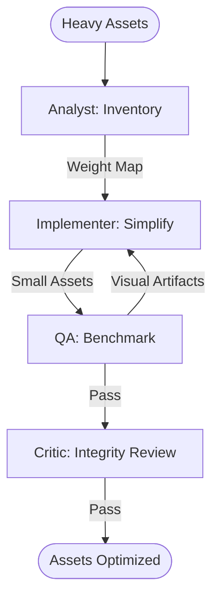

# Spatial Asset Micro-Optimizer Workflow

This workflow optimizes the payload and rendering efficiency of geographic assets (GeoJSON, SVG, Vector Tiles) to improve mobile performance.

## Workflow Overview

Heavy spatial assets degrade mobile experiences. This workflow enforces **Inventory Analysis -> Precision Simplification -> Format Compression -> Performance Benchmarking**.

## Workflow Steps

### 1. Asset Inventory & Weight Analysis (ArcGIS Specialist)
- **Agent**: ArcGIS Specialist
- **Goal**: Identify heavy assets and measure their current byte-weight.
- **Execution**: Use `runSubagent` tool to run the **ArcGIS Specialist** agent.
    - **Task**: "Locate all local GeoJSON, SVG, and Vector Tile assets. Analyze point counts and file sizes. Output an asset map to `agent-output/analysis/geo-asset-inventory.json`."
- **Output**: `agent-output/analysis/geo-asset-inventory.json`
- **Handoff**: To Implementer.

### 2. Geometry Simplification (Implementer)
- **Agent**: Implementer
- **Goal**: Reduce decimal precision and simplify path complexity.
- **Execution**: Use `runSubagent` tool to run the **Implementer** agent.
    - **Task**: "Read `geo-asset-inventory.json`. For GeoJSON, reduce precision to 6 decimal places. For SVGs, apply path simplification. For Vector Tiles, optimize sprite sheets. Output files to `agent-output/generated/optimized-assets/`."
- **Output**: Optimized spatial asset files.
- **Handoff**: To QA.

### 3. Rendering Benchmarking (QA)
- **Agent**: QA
- **Goal**: Measure frame-rate improvements and verify visual integrity.
- **Execution**: Use `runSubagent` tool to run the **QA** agent.
    - **Task**: "Run the app (simulator/browser) with optimized assets. Compare load times and pan/zoom frame rates against baseline. Verify geometries still represent features accurately. Output `agent-output/reports/geo-asset-performance.md`."
- **Output**: `agent-output/reports/geo-asset-performance.md`
- **Handoff**: To Critic.

### 4. Integrity & Detail Review (Critic)
- **Agent**: Critic
- **Goal**: Ensure simplification hasn't introduced topological errors.
- **Actions**:
    1.  **Critic**: Audit the simplified assets for "point spikes" or overlapping boundaries.
    2.  **Verify**: Ensure naming conventions for optimized assets are consistent.
- **Output**: `agent-output/reports/asset-optimization-sign-off.md`

## Agent Roles Summary

| Agent | Role | Output Location |
| :--- | :--- | :--- |
| ArcGIS Specialist | Asset Weighting | `agent-output/analysis/` |
| **Implementer** | Simplification | `agent-output/generated/` |
| **QA** | Benchmarking | `agent-output/reports/` |
| **Critic** | Integrity Review | `agent-output/reports/` |

## Workflow Diagram

## Governance
- **Standards**: Must adhere to `custom-agents/instructions/output_standards.md`.
- **Constraint**: Never simplify below the required functional accuracy (e.g. dont simplify survey-grade points into street-grade).
