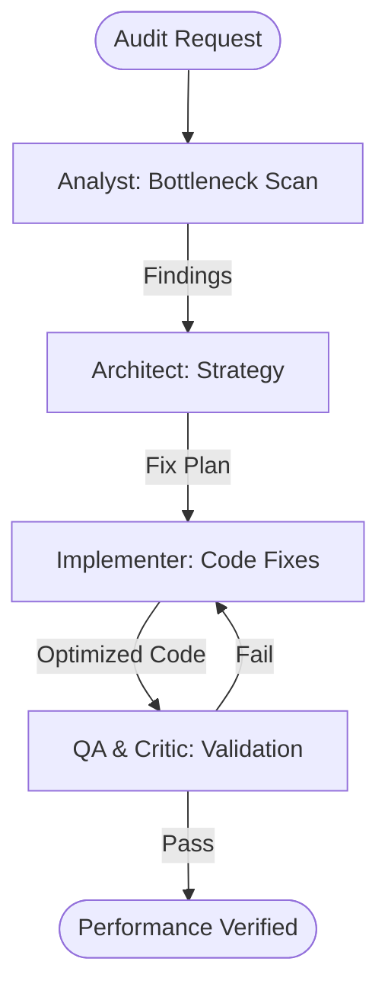

# Spatial Performance & Integrity Auditor

This workflow scans mapping code to identify performance pitfalls, spatial reference mismatches, and data loading inefficiencies.

## Workflow Overview

Performance issues in GIS apps are often silent. This workflow enforces a rigorous **Deep Scan -> Impact Remediation -> Automated Fix -> Performance Validation**.

## Workflow Steps

### 1. Spatial Code Audit (ArcGIS Specialist)
- **Agent**: ArcGIS Specialist
- **Goal**: Scan codebase for common spatial performance anti-patterns.
- **Execution**: Use `runSubagent` tool to run the **ArcGIS Specialist** agent.
    - **Task**: "Scan codebase for spatial anti-patterns: `returnGeometry: true` on attribute-only queries, mismatched `SpatialReference` between Map and layers, and excessive feature counts. Output findings to `agent-output/analysis/spatial-bottlenecks.md`."
- **Output**: `agent-output/analysis/spatial-bottlenecks.md`
- **Handoff**: To Architect.

### 2. Remediation Strategy (Architect)
- **Agent**: Architect
- **Goal**: Propose specific technical fixes for identified bottlenecks.
- **Execution**: Use `runSubagent` tool to run the **Architect** agent.
    - **Task**: "Read `spatial-bottlenecks.md`. Recommend `DefinitionExpression` changes, layer tiling strategies, or client-side projection fixes. Output `agent-output/analysis/geo-remediation.md`."
- **Critique Loop**: Use **Critic** agent to verify the proposed fixes will not alter spatial correctness.
- **Output**: `agent-output/analysis/geo-remediation.md` (APPROVED)
- **Handoff**: To Implementer.

### 3. Automated Remediation (Implementer)
- **Agent**: Implementer
- **Goal**: Apply the approved performance fixes to the codebase.
- **Execution**: Use `runSubagent` tool to run the **Implementer** agent.
    - **Task**: "Apply fixes from `geo-remediation.md`. Update Map config, query parameters, and layer initialization. Output code changes to respective platform files."
- **Output**: Code changes.
- **Handoff**: To QA.

### 4. Performance Validation (QA & Critic)
- **Agent**: QA, Critic
- **Goal**: Measure performance gains and verify spatial integrity.
- **Actions**:
    1.  **QA**: Use `run_command` or `playwright` to measure layer load times (simulated).
    2.  **Critic**: Ensure documentation clearly explains the *reasoning* for each performance fix.
- **Output**: `agent-output/reports/geo-performance-score.md`

## Agent Roles Summary

| Agent | Role | Output Location |
| :--- | :--- | :--- |
| ArcGIS Specialist | Anti-Pattern Scan | `agent-output/analysis/` |
| **Architect** | Remediation Design | `agent-output/architecture/` |
| **Implementer** | Code Fixes | Codebase |
| **QA** | Benchmarking | `agent-output/reports/` |
| **Critic** | Quality Review | `agent-output/reports/` |

## Workflow Diagram

## Governance
- **Standards**: Must adhere to `custom-agents/instructions/output_standards.md`.
- **Validation**: Every fix must be verified to have zero impact on geographic accuracy.
