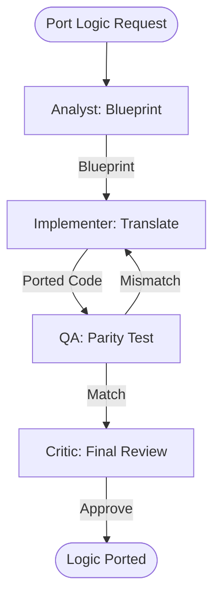

# Spatial Logic Portability Workflow

This workflow ensures that complex geographic calculations or geofence rules are consistent and verified across web and mobile platforms.

## Workflow Overview

Logic drift between platforms causes data integrity issues. This workflow enforces **Logic Extraction -> Platform Translation -> Parity Verification -> Final Acceptance**.

## Workflow Steps

### 1. Spatial Logic Extraction (ArcGIS Specialist)
- **Agent**: ArcGIS Specialist
- **Goal**: Analyze source logic and identify spatial engine dependencies.
- **Execution**: Use `runSubagent` tool to run the **ArcGIS Specialist** agent.
    - **Task**: "Analyze the spatial logic in [Source File]. Identify formulas, ArcGIS `GeometryEngine` calls, and unit assumptions. Output a Logical Blueprint to `agent-output/analysis/logical-blueprint.md`."
- **Output**: `agent-output/analysis/logical-blueprint.md`
- **Handoff**: To Implementer.

### 2. Logic Translation (Implementer)
- **Agent**: Implementer
- **Goal**: Rewrite the logic for the target platform (C#, Dart, or TS).
- **Execution**: Use `runSubagent` tool to run the **Implementer** agent.
    - **Task**: "Read `logical-blueprint.md`. Port the logic to [Target Language]. Adapt to the specific naming conventions and method signatures of the target platform's ArcGIS SDK. Output to `agent-output/generated/logic/`."
- **Output**: Ported logic source file.
- **Handoff**: To QA.

### 3. Logic Parity Testing (QA)
- **Agent**: QA
- **Goal**: Verify that identical inputs produce identical spatial results.
- **Execution**: Use `runSubagent` tool to run the **QA** agent.
    - **Task**: "Define a set of 10 complex spatial inputs (coordinates, polygons). Run the logic on both source and target platforms. Compare results (areas, intersections, distances). Output `agent-output/reports/logic-parity-report.md`."
- **Output**: `agent-output/reports/logic-parity-report.md`
- **Handoff**: To Critic.

### 4. Code & Detail Review (Critic)
- **Agent**: Critic
- **Goal**: Ensure the ported logic is efficient and well-documented.
- **Actions**:
    1.  **Critic**: Review the code for algorithmic parity.
    2.  **Verify**: Ensure all edge cases (null geometries, empty extents) are handled.
- **Output**: `agent-output/reports/logic-review-sign-off.md`

## Agent Roles Summary

| Agent | Role | Output Location |
| :--- | :--- | :--- |
| ArcGIS Specialist | Blueprinting | `agent-output/analysis/` |
| **Implementer** | Porting | `agent-output/generated/logic/` |
| **QA** | Parity Verification | `agent-output/reports/` |
| **Critic** | Quality Review | `agent-output/reports/` |

## Workflow Diagram

## Governance
- **Standards**: Must adhere to `custom-agents/instructions/output_standards.md`.
- **Validation**: Area/distance results must match within a 0.0001% tolerance.
