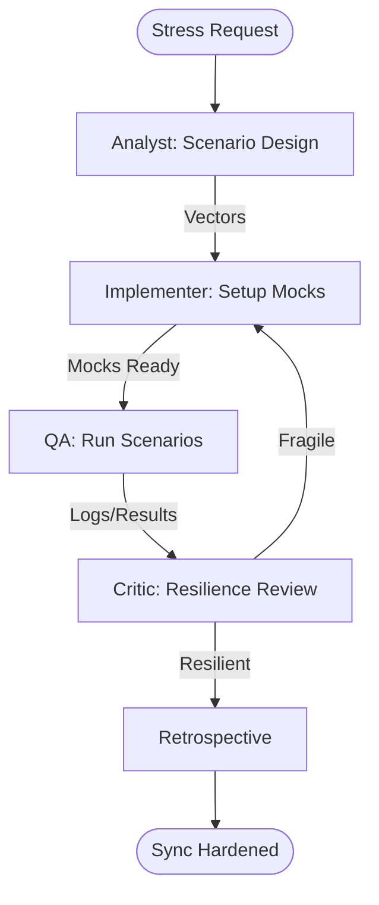

# Sync Stress Tester Workflow

This workflow rigorously validates ArcGIS offline synchronization logic by simulating real-world network failures and data conflicts.

## Workflow Overview

Offline apps fail in the field, not the office. This workflow enforces **Failure Scenario Design -> Infrastructure Mocking -> Stress Execution -> Recovery Validation**.

## Workflow Steps

### 1. Stress Scenario Design (ArcGIS Specialist)
- **Agent**: ArcGIS Specialist
- **Goal**: Define specific failure vectors (packet loss, timeouts, conflicts).
- **Execution**: Use `runSubagent` tool to run the **ArcGIS Specialist** agent.
    - **Task**: "Design 5 critical failure scenarios: 1. Mid-sync disconnect, 2. Large attachment timeout, 3. Simultaneous server/client edit, 4. Identity token expiry during sync, 5. SQLite corruption (simulated). Output to `agent-output/analysis/stress-test-vectors.json`."
- **Output**: `agent-output/analysis/stress-test-vectors.json`
- **Handoff**: To Implementer.

### 2. Mock & Tool Configuration (Implementer)
- **Agent**: Implementer
- **Goal**: Setup the environment to trigger the defined failures.
- **Execution**: Use `runSubagent` tool to run the **Implementer** agent.
    - **Task**: "Read `stress-test-vectors.json`. Configure network intercepts using Playwright or mock the `SyncGeodatabaseJob` status messages. Create 'Conflict' data in the Feature Layer. Output `agent-output/implementation/stress-setup.md`."
- **Output**: `agent-output/implementation/stress-setup.md`
- **Handoff**: To QA.

### 3. Stress Execution & Monitoring (QA)
- **Agent**: QA
- **Goal**: Run the sync scenarios and monitor app stability.
- **Execution**: Use `runSubagent` tool to run the **QA** agent.
    - **Task**: "Execute all 5 scenarios. Capture `SyncJob` error codes and recovery duration. Verify no local data is lost during failure. Output `agent-output/reports/stress-test-results.md`."
- **Output**: `agent-output/reports/stress-test-results.md`
- **Handoff**: To Critic.

### 4. Resilience Review & Remediation (Critic)
- **Agent**: Critic
- **Goal**: Assess if the app's recovery logic is "Hero" grade.
- **Actions**:
    1.  **Critic**: Review the error handling code for the identified failure points.
    2.  **Verify**: Ensure user notifications during failure are clear and non-technical.
- **Output**: `agent-output/reports/resilience-audit.md`

### 5. Retrospective (Retrospective)
- **Agent**: Retrospective
- **Input**: All `agent-output/` artifacts.
- **Execution**: Use the `runSubagent` tool to run the **Retrospective** agent.
    - **Task**: "Read `custom-agents/instructions/output_standards.md`. Run Retrospective analysis. Output `agent-output/retrospectives/retrospective-[ID].md`."
- **Output**: `agent-output/retrospectives/retrospective-[ID].md`

## Agent Roles Summary

| Agent | Role | Output Location |
| :--- | :--- | :--- |
| ArcGIS Specialist | Failure Design | `agent-output/analysis/` |
| **Implementer** | Mock Setup | `agent-output/implementation/` |
| **QA** | Stress Testing | `agent-output/reports/` |
| **Critic** | Recovery Audit | `agent-output/reports/` |

## Workflow Diagram

## Governance
- **Standards**: Must adhere to `custom-agents/instructions/output_standards.md`.
- **Safety**: Tests should be run against a Staging/Test Feature Service, never Production.
