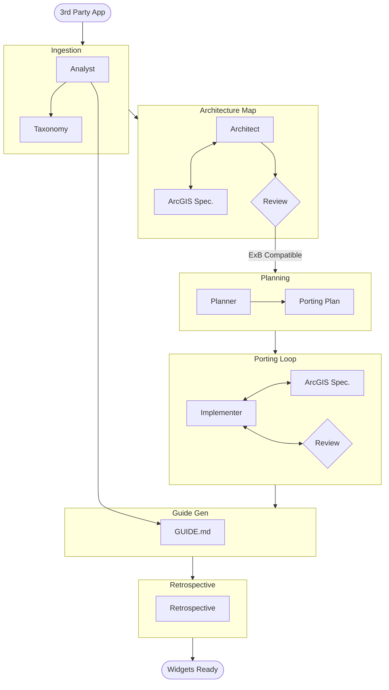

# Web App to ArcGIS Experience Builder Porting Workflow

This workflow is a specialized, high-complexity protocol designed to ingest a 3rd party web application (React, Angular, etc.) and transforming its functionality into native ArcGIS Experience Builder (ExB) Custom Widgets.

## Trigger & Entry Point

**Trigger**: User wants to "port this app to ExB", "convert React app to widgets", or "feature dump external code to ArcGIS".

**Orchestrator Responsibility**:
1.  **ACKNOWLEDGE**: Confirm the source repo/path and the target ExB version.
2.  **HANDOFF**: Immediately hand off to **Analyst** (Phase 1).

## Workflow Steps

### Phase 1: Ingestion & Taxonomy (Analyst)
- **Primary Agent**: Analyst
- **Goal**: Ingest external codebase, categorize components, identify dependencies (libs vs pure logic).
- **Execution**: Use the `runSubagent` tool to run the **Analyst** agent.
    - **Task**: "Read `custom-agents/instructions/output_standards.md`.
      1.  Analyze the Source Codebase (React/Angular/Vue).
      2.  Identify 'Pure Logic' (utils, helpers) vs 'UI Components' vs 'State Management'.
      3.  Flag dependencies incompatible with ExB (e.g., Redux - prefer Jimu State; React Router - prefer ExB Pages).
      4.  Output `agent-output/analysis/porting-taxonomy.md` mapping source files to their logical categories."
- **Output**: `agent-output/analysis/porting-taxonomy.md`
- **Handoff**: To Architect.

### Phase 2: Architecture Mapping (Architect + ArcGIS Specialist)
- **Primary Agent**: Architect
- **Support Agent**: ArcGIS Specialist (REQUIRED)
- **Reviewer**: Critic
- **Goal**: Map source components to ExB Concepts (Widgets, JimuMapView, State, Datasources).
- **Execution**: Use the `runSubagent` tool to run the **Architect** agent.
    - **Task**: "Read `custom-agents/instructions/output_standards.md`.
      1.  Consult **ArcGIS Specialist** subagent: 'Map these identified components to ExB Widget types or Core Jimu libraries.'
      2.  Define the conversion strategy:
          -   Global State -> Jimu Store / Message Actions.
          -   Routes -> ExB Views/Pages.
          -   API Calls -> Jimu ServiceManager / Datasources.
      3.  Output `agent-output/architecture/exb-conversion-map.md`.
      4.  Create Mermaid diagram showing Source -> Target mapping."
    - **Critique Loop**: Use the `runSubagent` tool to run the **Critic** agent.
        - **Critic** reviews for valid Jimu patterns.
        - **Reject**: If proposing standard React Router or Redux (Anti-pattern in ExB).
- **Output**: `agent-output/architecture/exb-conversion-map.md` (Status: APPROVED)
- **Handoff**: To Planner.

### Phase 3: Porting Strategy Plan (Planner)
- **Primary Agent**: Planner
- **Goal**: Create a phased plan to port logic piece by piece.
- **Execution**: Use the `runSubagent` tool to run the **Planner** agent.
    - **Task**: "Read `custom-agents/instructions/output_standards.md`. Create a step-by-step plan:
      1.  **Scaffolding**: Generate Widget structure (`jimu-for-builder`, `manifest.json`, `config.json`).
      2.  **Logic Port**: Move utils/services.
      3.  **UI Port**: Convert JSX/HTML to Jimu-compatible React components (Theme integration).
      4.  **Wiring**: Connect JimuMapView and Datasources.
      5.  Output `agent-output/planning/porting-plan.md`."
    - **Critique Loop**: Use the `runSubagent` tool to run the **Critic** agent.
        - **Check**: Is the plan granular enough? Does it account for ExB specific constraints?
        - **Reject**: Planner refines.
        - **Approve**: Proceed to Implementation.
- **Output**: `agent-output/planning/porting-plan.md`
- **Handoff**: To Implementer.

### Phase 4: The Porting Loop (Implementer + ArcGIS Specialist)
- **Primary Agent**: Implementer
- **Support Agent**: ArcGIS Specialist (REQUIRED)
- **Reviewer**: Critic
- **Goal**: Execute the port, ensuring code actually runs in the ExB context ("jimu-core", "jimu-ui").
- **Execution**: Use the `runSubagent` tool to run the **Implementer** agent.
    - **Task**: "Read `custom-agents/instructions/output_standards.md`. Execute the Porting Loop:
      1.  **Scaffold**: If new widget, ask **ArcGIS Specialist** for `manifest.json` and `config.json` templates.
      2.  **Transpile/Refactor**: Take source code and refactor for Jimu.
          -   Replace `styled-components`/CSS with `jimu-ui` components or ThemeUtils where possible.
          -   Replace `fetch` with `SessionManager` if auth is needed.
      3.  **Verification Loop**:
          -   Call **ArcGIS Specialist**: 'Review this ported code. Does it use valid Jimu hooks (UseDataSource, UseJimuMapView)?'
          -   Use `runSubagent` to call **Critic**: 'Check for lingering source-framework anti-patterns'.
      4.  **Next Component**: Repeat.
      5.  **Finish**: Write `agent-output/reports/porting-complete.md`."
- **Output**: `agent-output/reports/porting-complete.md`
- **Handoff**: To Analyst.

### Phase 5: Implementation Guide Generation (Analyst)
- **Primary Agent**: Analyst
- **Goal**: Create a specific "How-To" guide for the user to finish the integration.
- **Execution**: Use the `runSubagent` tool to run the **Analyst** agent.
    - **Task**: "Read `porting-complete.md`. Generating a `GUIDE.md`:
      1.  How to register the widgets in the ExB Client (manifest registration).
      2.  Dependencies to install in `client`.
      3.  Configuration steps in the Builder UI.
      4.  Output `agent-output/docs/GUIDE.md`."
    - **Critique Loop**: Use the `runSubagent` tool to run the **Critic** agent to review the guide for clarity and completeness.
- **Output**: `agent-output/docs/GUIDE.md`
- **Handoff**: To Retrospective.

### Phase 6: Retrospective (Retrospective)
- **Primary Agent**: Retrospective
- **Goal**: Analyze the porting success/failure.
- **Execution**: Use the `runSubagent` tool to run the **Retrospective** agent.
    - **Task**: "Run Retrospective. Focus on: What parts of the source app were hardest to map to Jimu?"
- **Output**: `agent-output/retrospectives/retrospective-[id].md`
- **Stop**: End of Workflow.

## Workflow Visualization

