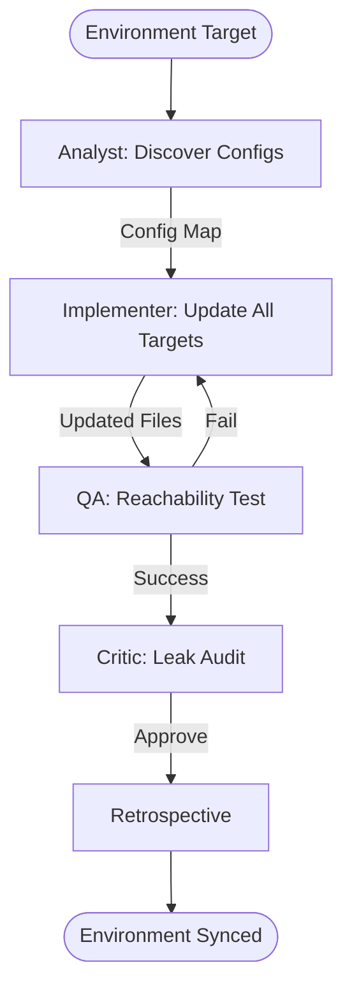

# Environment Sync Orchestrator

This workflow ensures that your entire multi-platform development ecosystem (MAUI, Flutter, React) is synchronized with the target geographic data environment.

## Workflow Overview

Environment drift causes "wrong map" bugs. This workflow enforces **Config Discovery -> Unified Update -> Reachability Validation -> Environment Verification**.

## Workflow Steps

### 1. Configuration Discovery (Analyst)
- **Agent**: Analyst
- **Goal**: Collect current environmental settings from all platform projects.
- **Execution**: Use `runSubagent` tool to run the **Analyst** agent.
    - **Task**: "Locate and read all config files (`.env`, `appsettings.json`, `pubspec.yaml`, etc.). Extract Portal URLs, Map IDs, and Auth endoints. Output `agent-output/analysis/env-config-map.json`."
- **Output**: `agent-output/analysis/env-config-map.json`
- **Handoff**: To Implementer.

### 2. Target Environment Update (Implementer)
- **Agent**: Implementer
- **Goal**: Apply the target (Dev/Prod) settings to all platforms.
- **Execution**: Use `runSubagent` tool to run the **Implementer** agent.
    - **Task**: "Apply the target environmental values from the user request to all files identified in `env-config-map.json`. Update feature flags and API base URLs. Output file changes."
- **Output**: Multi-platform config updates.
- **Handoff**: To QA.

### 3. Reachability & Item Validation (ArcGIS Specialist)
- **Agent**: ArcGIS Specialist
- **Goal**: Prevent broken environments by checking connectivity and item existence.
- **Execution**: Use `runSubagent` tool to run the **ArcGIS Specialist** agent.
    - **Task**: "Ping all updated Portal URLs. Use ArcGIS REST API to verify that every Web Map ID exists in the target environment. Output `agent-output/reports/env-sync-status.md`."
- **Output**: `agent-output/reports/env-sync-status.md`
- **Handoff**: To Critic.

### 4. Leak Detection & Review (Critic)
- **Agent**: Critic
- **Goal**: Ensure no development credentials or URLs have leaked into the Production config.
- **Actions**:
    1.  **Critic**: Audit the final diff for any hardcoded "localhost" or test URLs.
    2.  **Verify**: Ensure environment synchronization is logged accurately.
- **Output**: `agent-output/reports/env-verification.md`

### 5. Retrospective (Retrospective)
- **Agent**: Retrospective
- **Input**: All `agent-output/` artifacts.
- **Execution**: Use the `runSubagent` tool to run the **Retrospective** agent.
    - **Task**: "Read `custom-agents/instructions/output_standards.md`. Run Retrospective analysis. Output `agent-output/retrospectives/retrospective-[ID].md`."
- **Output**: `agent-output/retrospectives/retrospective-[ID].md`

## Agent Roles Summary

| Agent | Role | Output Location |
| :--- | :--- | :--- |
| **Analyst** | Config Harvesting | `agent-output/analysis/` |
| **Implementer** | Value Injection | Project Config Files |
| ArcGIS Specialist | Item Existence Check | `agent-output/reports/` |
| **Critic** | Leak Detection | `agent-output/reports/` |

## Workflow Diagram

## Governance
- **Standards**: Must adhere to `custom-agents/instructions/output_standards.md`.
- **Verification**: Confirm changes via diff or UI check.
