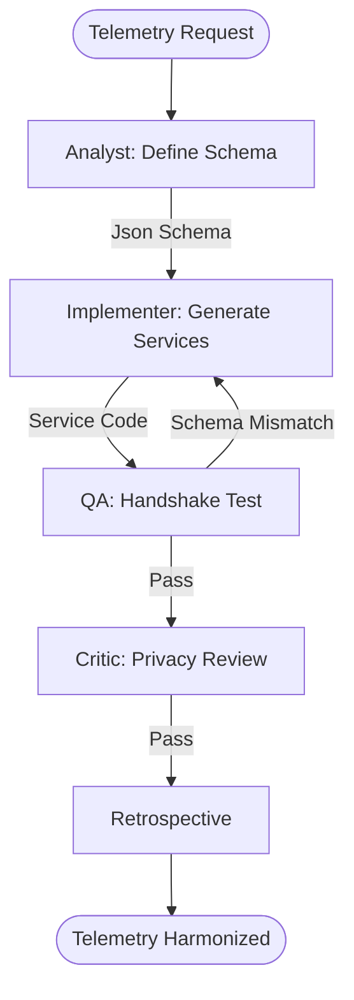

# Cross-Platform Telemetry Harmonizer Workflow

This workflow ensures consistent analytics tracking for geographic interactions across web and mobile platforms, enabling unified spatial business intelligence.

## Workflow Overview

Inconsistent telemetry makes cross-platform analytics impossible. This workflow enforces **Event Schema Definition -> Platform Implementation -> Data Value Handshake -> Parity QA**.

## Workflow Steps

### 1. Spatial Event Schema Definition (ArcGIS Specialist)
- **Agent**: ArcGIS Specialist
- **Goal**: Define a unified schema for spatial interactions.
- **Execution**: Use `runSubagent` tool to run the **ArcGIS Specialist** agent.
    - **Task**: "Define a set of 10 core spatial events (e.g. `MapExtentChanged`, `SearchResultSelected`, `OfflineSyncComplete`). Specify required properties for each (e.g. `center_wgs84`, `zoom_level`, `item_id`). Output to `agent-output/analysis/telemetry-schema.json`."
- **Output**: `agent-output/analysis/telemetry-schema.json`
- **Handoff**: To Implementer.

### 2. Implementation & Integration (Implementer)
- **Agent**: Implementer
- **Goal**: Generate telemetry services for all three platforms.
- **Execution**: Use `runSubagent` tool to run the **Implementer** agent.
    - **Task**: "Read `telemetry-schema.json`. Implement a Telemetry Service for React (TS), Flutter (Dart), and MAUI (C#). Wire these services into the map interaction loops. Ensure property names are identical across platforms. Output to `agent-output/generated/analytics/`."
- **Output**: Platform-specific telemetry service files.
- **Handoff**: To QA.

### 3. Data Integrity & Handshake Test (QA)
- **Agent**: QA
- **Goal**: Verify that events are fired with correct payloads on each platform.
- **Execution**: Use `runSubagent` tool to run the **QA** agent.
    - **Task**: "Trigger all 10 events on each platform (simulator/browser). Validate that the JSON payload matches `telemetry-schema.json` exactly. Output `agent-output/reports/telemetry-verification.md`."
- **Output**: `agent-output/reports/telemetry-verification.md`
- **Handoff**: To Critic.

### 4. Semantic & Privacy Review (Critic)
- **Agent**: Critic
- **Goal**: Ensure telemetry is descriptive but respects data privacy.
- **Actions**:
    1.  **Critic**: Review event names for clarity.
    2.  **Verify**: Ensure no Personally Identifiable Information (PII) is inadvertently captured in location properties.
- **Output**: `agent-output/reports/telemetry-sign-off.md`

### 5. Retrospective (Retrospective)
- **Agent**: Retrospective
- **Input**: All `agent-output/` artifacts.
- **Execution**: Use the `runSubagent` tool to run the **Retrospective** agent.
    - **Task**: "Read `custom-agents/instructions/output_standards.md`. Run Retrospective analysis. Output `agent-output/retrospectives/retrospective-[ID].md`."
- **Output**: `agent-output/retrospectives/retrospective-[ID].md`

## Agent Roles Summary

| Agent | Role | Output Location |
| :--- | :--- | :--- |
| ArcGIS Specialist | Schema Definition | `agent-output/analysis/` |
| **Implementer** | Service Generation| `agent-output/generated/` |
| **QA** | Payload Validation | `agent-output/reports/` |
| **Critic** | Privacy Review | `agent-output/reports/` |

## Workflow Diagram

## Governance
- **Standards**: Must adhere to `custom-agents/instructions/output_standards.md`.
- **Latency**: Telemetry calls must not block the main Map interaction thread.
