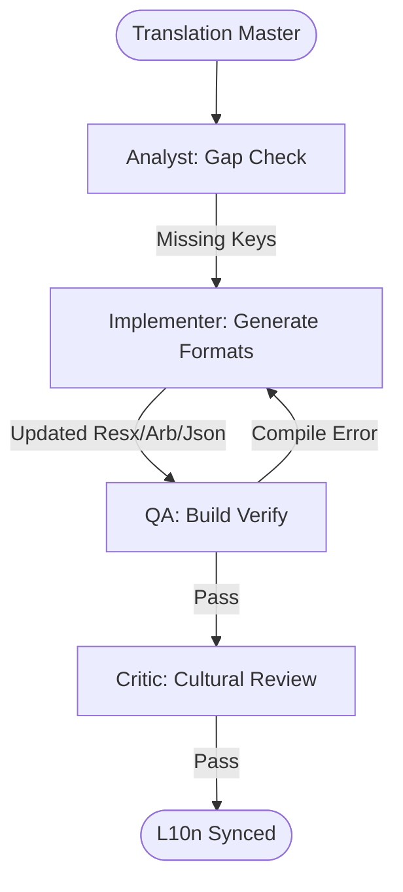

# Multi-Platform Localization Sync Workflow

This workflow ensures that your application provides a consistent localized experience across all platforms by synchronizing translation strings from a master source.

## Workflow Overview

Inconsistent translations harm international user trust. This workflow enforces **String Harvesting -> Format-Specific Generation -> Build Verification -> Linguistic QA**.

## Workflow Steps

### 1. Cross-Platform String Harvesting (Analyst)
- **Agent**: Analyst
- **Goal**: Identify missing keys or inconsistent translations across platforms.
- **Execution**: Use `runSubagent` tool to run the **Analyst** agent.
    - **Task**: "Compare current keys in `locales/` (React), `l10n/` (Flutter), and `Resources/` (MAUI). Identify discrepancies where a key exists on one platform but not others. Output a Gap Report to `agent-output/analysis/localization-gap-report.md`."
- **Output**: `agent-output/analysis/localization-gap-report.md`
- **Handoff**: To Implementer.

### 2. Format-Specific Generation (Implementer)
- **Agent**: Implementer
- **Goal**: Generate platform-compliant localization files from a master source.
- **Execution**: Use `runSubagent` tool to run the **Implementer** agent.
    - **Task**: "Convert the Master Translation CSV/JSON into `.json` (React), `.arb` (Flutter), and `.resx` (MAUI). Ensure placeholders (e.g. `{name}`) are escaped correctly for each target. Output updated files."
- **Output**: Multi-platform localization source files.
- **Handoff**: To QA.

### 3. Build & Resource Verification (QA)
- **Agent**: QA
- **Goal**: Ensure the new resource files don't break the build or UI.
- **Execution**: Use `runSubagent` tool to run the **QA** agent.
    - **Task**: "Perform a build-check for each platform. Verify that specific UI labels correctly reflect the new strings in a secondary language. Output `agent-output/reports/intl-verification.md`."
- **Output**: `agent-output/reports/intl-verification.md`
- **Handoff**: To Critic.

### 4. Cultural & Linguistic Review (Critic)
- **Agent**: Critic
- **Goal**: Ensure translations are contextually appropriate for the app's domain.
- **Actions**:
    1.  **Critic**: Spot-check keys for length (e.g. German strings often overflow buttons).
    2.  **Verify**: Ensure right-to-left (RTL) locales have basic layout support if requested.
- **Output**: `agent-output/reports/localization-sign-off.md`

## Agent Roles Summary

| Agent | Role | Output Location |
| :--- | :--- | :--- |
| **Analyst** | Gap Analysis | `agent-output/analysis/` |
| **Implementer** | Format Conversion | Codebase |
| **QA** | Build/UI Test | `agent-output/reports/` |
| **Critic** | Linguistic Review | `agent-output/reports/` |

## Workflow Diagram

## Governance
- **Standards**: Must adhere to `custom-agents/instructions/output_standards.md`.
- **Key Safety**: Never delete a key that is still referenced in the codebase unless explicitly asked.
破
