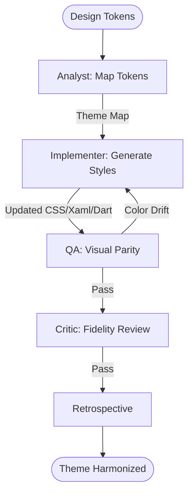

# Cross-Platform Theme Harmonizer Workflow

This workflow synchronizes your application's design system (colors, spacing, typography) across all platforms from a single master token definition.

## Workflow Overview

Visual drift between platforms harms the brand. This workflow enforces **Token Mapping -> Multi-Format Generation -> Platform Deployment -> Visual Parity Review**.

## Workflow Steps

### 1. Design Token Mapping (Analyst)
- **Agent**: Analyst
- **Goal**: Parse master design tokens and map them to platform primitives.
- **Execution**: Use `runSubagent` tool to run the **Analyst** agent.
    - **Task**: "Parse the provided Design Tokens JSON. Map semantic names (e.g. `surface-primary`) to Platform specific types: CSS HSL, Flutter `Color(0xFF...)`, and MAUI `StaticResource`. Output a Theme Map to `agent-output/analysis/theme-parity-map.json`."
- **Output**: `agent-output/analysis/theme-parity-map.json`
- **Handoff**: To Implementer.

### 2. Multi-Platform Theme Generation (Implementer)
- **Agent**: Implementer
- **Goal**: Overwrite platform style files with updated token values.
- **Execution**: Use `runSubagent` tool to run the **Implementer** agent.
    - **Task**: "Read `theme-parity-map.json`. Generate `index.css` (React), `app_theme.dart` (Flutter), and `Colors.xaml` (MAUI). Preserve existing layout styles while updating color/font tokens. Output updated files."
- **Output**: Updated style/resource files.
- **Handoff**: To QA.

### 3. Visual Parity Verification (QA)
- **Agent**: QA
- **Goal**: Ensure the colors and spacing match across all platforms.
- **Execution**: Use `runSubagent` tool to run the **QA** agent.
    - **Task**: "Use `playwright` (Web) and `ios-simulator` (Mobile) to capture screenshots of the same component (e.g. a Primary Button). Use image comparison to verify color hex match. Output `agent-output/reports/theme-parity-verification.md`."
- **Output**: `agent-output/reports/theme-parity-verification.md`
- **Handoff**: To Critic.

### 4. Design Fidelity Review (Critic)
- **Agent**: Critic
- **Goal**: Ensure the themes feel "Hero" grade on each operating system.
- **Actions**:
    1.  **Critic**: Review screenshots for font weight consistency.
    2.  **Verify**: Ensure Dark/Light mode tokens are correctly mapped for each OS.
- **Output**: `agent-output/reports/design-sign-off.md`

### 5. Retrospective (Retrospective)
- **Agent**: Retrospective
- **Input**: All `agent-output/` artifacts.
- **Execution**: Use the `runSubagent` tool to run the **Retrospective** agent.
    - **Task**: "Read `custom-agents/instructions/output_standards.md`. Run Retrospective analysis. Output `agent-output/retrospectives/retrospective-[ID].md`."
- **Output**: `agent-output/retrospectives/retrospective-[ID].md`

## Agent Roles Summary

| Agent | Role | Output Location |
| :--- | :--- | :--- |
| **Analyst** | Token Mapping | `agent-output/analysis/` |
| **Implementer** | Code Generation | Codebase |
| **QA** | Visual Parity Test | `agent-output/reports/` |
| **Critic** | Fidelity Review | `agent-output/reports/` |

## Workflow Diagram

## Governance
- **Standards**: Must adhere to `custom-agents/instructions/output_standards.md`.
- **Variables**: Use semantic naming (e.g. `$brand-primary`) rather than literal naming (e.g. `$blue`) in all generated files.
