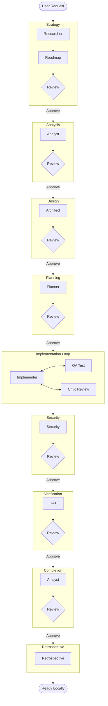

# Zero to Hero Application Development Workflow

This workflow represents the ultimate "all-hands-on-deck" process for building a modern, feature-rich, enterprise-grade application from scratch. It utilizes every specialized agent in the system and imposes strict **Critic-driven Iteration Loops** at every single stage to ensure maximum quality, security, and architectural integrity.

## Workflow Overview

This is not a linear path; it is a series of refinement cycles. No artifact moves to the next phase until the **Critic** has explicitly approved it. This simulates a rigorous code review / design review culture.

## Trigger & Entry Point (CRITICAL)

**Trigger**: User requests "Zero to Hero" workflow or "Build a new app with Zero to Hero rigor".
**Orchestrator Responsibility**:
1.  **ACKNOWLEDGE**: Confirm receipt of request.
2.  **HANDOFF**: Immediately hand off to **Roadmap Agent** (Phase 1).
3.  **PROHIBITION**: Do NOT start creating files, running CLI commands, or generating code yourself. The prompt "create the app" defines the *outcome*, but this workflow defines the *process*. You MUST follow the process.
4.  **STANDARDS ENFORCEMENT**: You MUST ensure all agents adhere to `custom-agents/instructions/output_standards.md`.
    -   Handoffs must be LINKS, not copies.
    -   Filenames must be `kebab-case`.
    -   No redundant `reports/` files.

## Workflow Steps

### Phase 0: Environment Validation & Initialization (Orchestrator)
- **Goal**: Ensure the environment is ready for "Hero" work and project backbone is established.
- **Actions**:
    1.  **Initialize Backbone**:
        -   Create directories: `management`, `logs`, `reports`, `architecture`, `planning`, `analysis`, `context`.
        -   Create files: `logs/cli_history.log`, `management/task.md`.
    2.  **Read Standards**: Read `custom-agents/instructions/output_standards.md` to understand output requirements.
    3.  **Check Tools**: Verify `node -v`, `npm -v`, `git --version`.
    4.  **Check Permissions**: Verify write access to `agent-output/`.
    5.  **Result**: Write `agent-output/logs/env-check.md`.
    5.  **Rescue**: If any tool is missing, HALT immediately.

### Phase 1: Inception & Strategy (Roadmap, Researcher, Critic)
- **Primary Agents**: Roadmap (Strategy), Researcher (Content & Market Research)
- **Reviewer**: Critic
- **Goal**: Define *what* to build and *why* it matters, refined to perfection.
- **Execution**: Use the `runSubagent` tool to run the **Roadmap** agent.
    -   **Task**: "Read `custom-agents/instructions/output_standards.md`. Analyze `project-spec.md`. Use the **Researcher** agent as a subagent to perform Domain and Market Research. Synthesize a Product Vision and Feature Mapping into `agent-output/context/product-brief.md` (kebab-case). Explicitly check for constraint conflicts. Do NOT create a separate handoff file."
    8.  **Critique Loop**: Use the `runSubagent` tool to run the **Critic** agent to review `product-brief.md`.
        - **Validation**: Check if the Product Brief title matches the Project Context title. If it describes "PyOrchestrator" instead of the User's App, **REJECT IMMEDIATELY**.
        - **Reject**: Roadmap refines.
        - **Approve**: Proceed to Analysis.
- **Output**: `agent-output/context/product-brief.md` (Status: APPROVED)
- **Handoff**: To Analyst.

### Phase 2: Technical Analysis (Analyst, Critic)
- **Primary Agent**: Analyst
- **Reviewer**: Critic
- **Goal**: Determine the *how* (Stack & Feasibility) with robust justification.

- **Input**: `agent-output/context/product-brief.md`
- **Execution**: Use the `runSubagent` tool to run the **Analyst** agent.
    - **Task**: "Read `custom-agents/instructions/output_standards.md`. Call `rag/rag_search` for context. Read `agent-output/context/product-brief.md`. Perform Stack Selection and Risk Assessment. Use the **Researcher** agent as a subagent for Dependency Research. Output `agent-output/analysis/technical-feasibility.md`."
    5.  **Critique Loop**: Use the `runSubagent` tool to run the **Critic** agent to review `technical-feasibility.md`.
        - Check: Are we using truly modern tools? Are risks glossed over?
        - **Reject**: Analyst re-investigates.
        - **Approve**: Proceed to Design.
- **Output**: `agent-output/analysis/technical-feasibility.md` (Status: APPROVED)
- **Handoff**: To Architect.

### Phase 3: Architectural Design (Architect, Critic)
- **Primary Agent**: Architect
- **Reviewer**: Critic
- **Goal**: Design the system structure and data flow.

- **Input**: `agent-output/analysis/technical-feasibility.md`
- **Execution**: Use the `runSubagent` tool to run the **Architect** agent.
    - **Task**: "Read `custom-agents/instructions/output_standards.md`. Read `technical-feasibility.md`. Define System Design boundaries and data models. Create Mermaid flowcharts. Use the **QA** agent as a subagent to audit `system-architecture.md` against constraints. Extract Design System to `agent-output/architecture/design-system.md`. Output `agent-output/architecture/system-architecture.md`."
    5.  **Critique Loop**: Use the `runSubagent` tool to run the **Critic** agent to review `system-architecture.md`.
        - Check: Is it scalable? Clean? Do diagrams follow strict `flowchart` syntax?
        - **Reject**: Architect redesigns.
        - **Approve**: Proceed to Planning.
- **Output**: `agent-output/architecture/system-architecture.md` (Status: APPROVED)
- **Handoff**: To Planner.

### Phase 4: Master Planning (Planner, Critic)
- **Primary Agent**: Planner
- **Reviewer**: Critic
- **Goal**: Create a step-by-step execution guide.

- **Input**: `agent-output/architecture/system-architecture.md`
- **Execution**: Use the `runSubagent` tool to run the **Planner** agent.
    - **Task**: "Read `custom-agents/instructions/output_standards.md`. Read `system-architecture.md`. Break project into logical phases. Define granular tasks with 'Definition of Done'. Ensure the master plan is aligned with the original guide document (`agent-output/context/product-brief.md`). Output `agent-output/planning/master-implementation-plan.md`."
    4.  **Critique Loop**: Use the `runSubagent` tool to run the **Critic** agent to review `master-implementation-plan.md`.
        - Check: Is it detailed enough? Does it align with `product-brief.md`? Are testing steps included?
        - **Reject**: Planner adds detail.
        - **Approve**: Proceed to Implementation.
- **Output**: `agent-output/planning/master-implementation-plan.md` (Status: APPROVED)
- **Rescue Path**: If the Plan file is missing or 0 bytes, **HALT**. Do not proceed to Implementation. Report error to user.
- **Handoff**: To Implementer.

### Phase 5: The Implementation Loop (Implementer, QA, Critic)
- **Primary Agent**: Implementer
- **Support Agents**: QA, Critic
- **Goal**: Implement components defined in the plan, ensuring high quality and testing correctness via a tight subagent feedback loop.

- **Input**: `agent-output/planning/master-implementation-plan.md`
- **Execution**: Use the `runSubagent` tool to run the **Implementer** agent.
    - **Task**: "Read `custom-agents/instructions/output_standards.md`. You are responsible for the Development Loop. Ensure alignment with the original guide document (`agent-output/context/product-brief.md`). DO NOT exit this loop until specific components are complete and verified.
      1.  **Read Plan**: Identify the next component to build from `master-implementation-plan.md`.
      2.  **Implement**: Write the code for the component.
      3.  **Verification Loop (Subagent Delegation)**:
          -   Call **QA** agent: 'Tests MUST be interactive (Playwright/Puppeteer/Simulator). DO NOT write unit tests. Verify [Component] meets the Product Vision in `agent-output/context/product-brief.md`.'
          -   **If Tests Fail**: You (Implementer) MUST fix the code and Ask QA to re-run. Repeat until Pass.
          -   **If Tests Pass**: Call **Critic** agent: 'Review code style and logic for [Component].'
      4.  **Refine**: Address Critic feedback immediately.
      5.  **Commit**: Mark the task as clean in your internal tracking.
      6.  **Next**: Move to the next component.
      7.  **Finish**: When all components are built and verified, Perform a final "Vision Check" against `product-brief.md`. If aligned, write `agent-output/reports/implementation-complete.md`."
- **Output**: `agent-output/reports/implementation-complete.md` (Verified by QA/Critic during loop)

### Phase 6: Security Audit (Security, Critic)
- **Primary Agent**: Security
- **Reviewer**: Critic
- **Goal**: Ensure safety and compliance.

- **Input**: `agent-output/reports/implementation-complete.md`
- **Execution**: Use the `runSubagent` tool to run the **Security** agent.
    - **Task**: "Read `custom-agents/instructions/output_standards.md`. Perform static analysis and CVE checks. Focus on XSS, LocalStorage integrity, and Dependencies. Output `agent-output/security/security-audit.md`."
    3.  **Critique Loop**: Use the `runSubagent` tool to run the **Critic** agent to review `security-audit.md`.
        - Check: Did we miss any obvious vectors? Is the report actionable?
        - **Reject**: Security scans again.
        - **Approve**: Implementer applies fixes.
- **Output**: `agent-output/security/security-audit.md`
- **Handoff**: To UAT.

### Phase 7: User Acceptance (UAT, Critic)
- **Primary Agent**: UAT
- **Reviewer**: Critic
- **Goal**: Verify "Hero" status.

- **Input**: `agent-output/security/security-audit.md`
- **Execution**: Use the `runSubagent` tool to run the **UAT** agent.
    -   **Task**: "Read `custom-agents/instructions/output_standards.md`. Read Product Vision. Perform walkthrough and value check. MUST use `ios-simulator` MCP for mobile applications and `playwright` MCP for web apps. Does this feel like a 'Hero' product? Output `agent-output/uat/final-acceptance.md`."
    3.  **Critique Loop**: Use the `runSubagent` tool to run the **Critic** agent to review `final-acceptance.md`.
        - Check: Was UAT rigorous? Did we just rubber-stamp it?
        - **Reject**: UAT re-verifies.
        - **Approve**: Proceed to Completion.
- **Output**: `agent-output/uat/final-acceptance.md`
- **Handoff**: To Completion.

### Phase 8: Documentation & Completion (Analyst, Critic)
- **Primary Agent**: Analyst
- **Reviewer**: Critic
- **Input**: `agent-output/uat/final-acceptance.md`
- **Execution**: Use the `runSubagent` tool to run the **Analyst** agent.
    - **Task**: "Read Project Overview. Create beautiful READMEs (including screenshots if available)."
    3.  **Critique Loop**: Use the `runSubagent` tool to run the **Critic** agent to review the final documentation.
        - Check: Spelling, formatting, screenshot presence.
        - **Reject**: Analyst fixes.
        - **Approve**: Proceed to Retrospective.
- **Output**: `agent-output/docs/README.md`
- **Handoff**: To Retrospective.

### Phase 9: Retrospective (Retrospective)
- **Primary Agent**: Retrospective
- **Goal**: Analyze the entire workflow for process improvements.
- **Input**: All `agent-output/` artifacts.
- **Execution**: Use the `runSubagent` tool to run the **Retrospective** agent.
    - **Task**: "Read `custom-agents/instructions/output_standards.md`. Read all artifacts. Run the Retrospective process to identify improvements for the next iteration. Output `agent-output/retrospectives/retrospective-[id].md`."
- **Output**: `agent-output/retrospectives/retrospective-[id].md`
- **Handoff**: End of Workflow.

## Workflow Visualization

## Special Instructions
- **Aesthetics**: This compilation MUST be beautiful.
- **Critic Authority**: The Critic has absolute veto power. If the Critic says "it looks basic" or "not detailed enough", the previous agent MUST redo the work.
- **Diagrams**: EVERY phase must produce a Mermaid `flowchart`.

## Workflow Governance
- **Logging**: All agents MUST log tool usage and CLI commands to `agent-output/logs/`.
- **Output Structure**: Agents must ONLY write to their designated `agent-output/[role]/` directory. Root `agent-output/` must remain clean except for `management/`, `logs/`, `reports/`, `architecture/`, `analysis/`.
- **No Handoff Files**: Agents should read the authoritative artifacts (e.g., `system-architecture.md`) directly. Do not generate intermediate "handoff.md" files. Refer to `custom-agents/instructions/output_standards.md` for strict rules.
