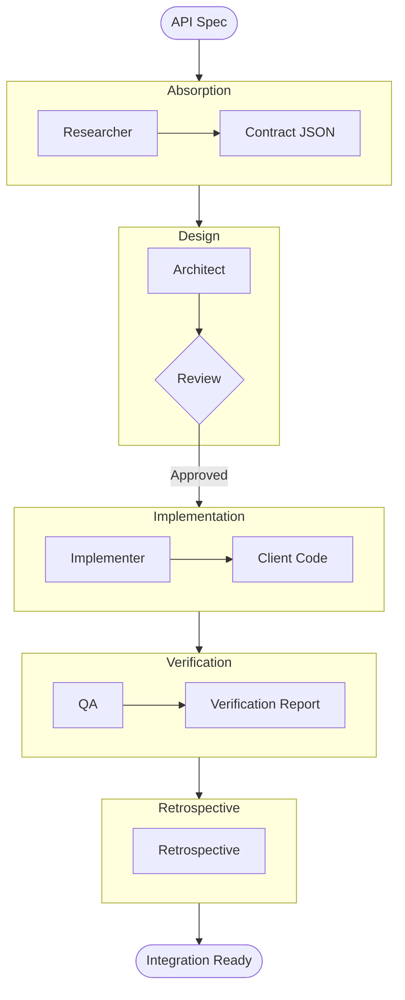

# API Integration Workflow

This workflow automates the safe integration of external REST or GraphQL APIs into the application, ensuring strong typing and contract verification.

## Trigger & Entry Point

**Trigger**: User wants to "consume the X API", "add an integration", or "generate an API client".

**Orchestrator Responsibility**:
1.  **ACKNOWLEDGE**: Confirm the API endpoint or documentation location.
2.  **HANDOFF**: Immediately hand off to **Analyst** (Phase 1).

## Workflow Steps

### Phase 1: Spec Absorption & Contract Analysis (Researcher)
- **Primary Agent**: Researcher
- **Goal**: Absorb the API specification (OpenAPI/Swagger, Graph Schema, or Documentation).
- **Execution**: Use the `runSubagent` tool to run the **Researcher** agent.
    - **Task**: "Fetch the API specification from [Source]. Extract all Endpoints, HTTP Methods, Request parameters, and Response schemas. Output an Indexed Contract to `agent-output/analysis/api-contract.json`."
- **Output**: `agent-output/analysis/api-contract.json`
- **Handoff**: To Architect.

### Phase 2: Client Architecture Design (Architect)
- **Primary Agent**: Architect
- **Reviewer**: Critic
- **Goal**: Define the Interface/DTO structure.
- **Execution**: Use the `runSubagent` tool to run the **Architect** agent.
    - **Task**: "Read `api-contract.json`. Design strict Types/Interfaces for the client. Define the error handling strategy (e.g. `Result<T>` pattern). Output a Design Spec to `agent-output/architecture/api-client-design.md`."
    - **Critique Loop**: Use the `runSubagent` tool to run the **Critic** agent.
        - **Check**: Are we over-fetching? Is error handling robust?
        - **Reject**: Architect refines.
- **Output**: `agent-output/architecture/api-client-design.md` (Status: APPROVED)
- **Handoff**: To Implementer.

### Phase 3: Client Implementation (Implementer)
- **Primary Agent**: Implementer
- **Goal**: Generate the typed client code.
- **Execution**: Use the `runSubagent` tool to run the **Implementer** agent.
    - **Task**: "Read `api-client-design.md`. Generate the API Client class and DTOs. Implement retry logic and authentication headers. Output source files."
- **Output**: Source code (e.g., `services/ApiClient.ts` or `ApiClient.cs`).
- **Handoff**: To QA.

### Phase 4: Contract Verification (QA)
- **Primary Agent**: QA
- **Goal**: Verify that the generated client actually matches the live API (or the Spec).
- **Execution**: Use the `runSubagent` tool to run the **QA** agent.
    - **Task**: "Write a contract test. Mock the API based on the `api-contract.json`. Verify the Client correctly deserializes the response. Output `agent-output/reports/api-verification.md`."
- **Output**: `agent-output/reports/api-verification.md`
- **Handoff**: To Retrospective.

### Phase 5: Retrospective (Retrospective)
- **Primary Agent**: Retrospective
- **Goal**: Review the integration.
- **Execution**: Use the `runSubagent` tool to run the **Retrospective** agent.
    - **Task**: "Read `custom-agents/instructions/output_standards.md`. Run Retrospective analysis. Output `agent-output/retrospectives/retrospective-[id].md`."
- **Output**: `agent-output/retrospectives/retrospective-[id].md`
- **Stop**: End of Workflow.

## Workflow Visualization

