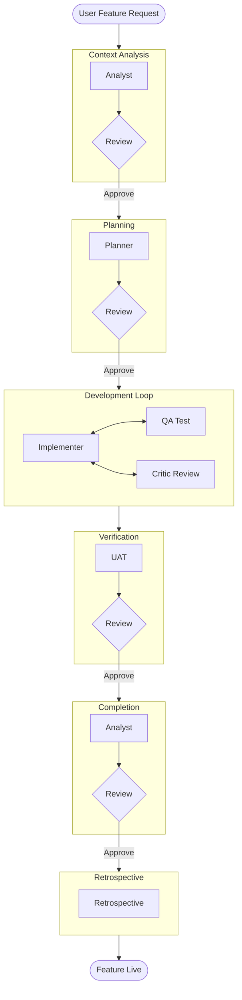

# New Feature Development Workflow

This workflow is specialized for adding a new feature to an existing application. It focuses on surgical precision: analyzing the existing codebase, determining exactly where the new feature fits, and implementing it with a rigorous test-driven loop.

## Workflow Overview

Unlike "Zero to Hero" which builds an entire app, this workflow assumes an existing context. It leverages **Analyst** for fit-gap analysis and **Implementer** for a tight "Implement-Interact-Refactor" loop.

## Trigger & Entry Point

**Trigger**: User requests "Add feature X", "Implement X in existing app", or similar.

**Orchestrator Responsibility**:
1.  **ACKNOWLEDGE**: Confirm the specific feature request.
2.  **HANDOFF**: Immediately hand off to **Analyst** (Phase 1).
3.  **PROHIBITION**: Do not modify code yourself. Follow the process.

## Workflow Steps

### Phase 1: Context & Fit Analysis (Analyst, Critic)
- **Primary Agent**: Analyst
- **Reviewer**: Critic
- **Goal**: Understand the current codebase and determine *where* and *how* to insert the new feature.
- **Execution**: Use the `runSubagent` tool to run the **Analyst** agent.
    - **Task**: "Read `custom-agents/instructions/output_standards.md`.
      1.  Analyze the provided Feature Request/Prompt.
      2.  Analyze the Current Codebase State (architecture, existing patterns).
      3.  Identify the exact locations (files/directories) to modify or create.
      4.  Assess impact/risks (breaking changes).
      5.  Output `agent-output/analysis/feature-context-analysis.md`."
    - **Critique Loop**: Use the `runSubagent` tool to run the **Critic** agent to review the analysis.
        - **Check**: Did we miss a similar existing feature? Is the integration point correct?
        - **Reject**: Analyst refines.
        - **Approve**: Proceed to Planning.
- **Output**: `agent-output/analysis/feature-context-analysis.md` (Status: APPROVED)
- **Handoff**: To Planner.

### Phase 2: Feature Implementation Plan (Planner, Critic)
- **Primary Agent**: Planner
- **Reviewer**: Critic
- **Goal**: Create a step-by-step TASKS list for the implementation.
- **Execution**: Use the `runSubagent` tool to run the **Planner** agent.
    - **Task**: "Read `custom-agents/instructions/output_standards.md`. Read `feature-context-analysis.md`.
      1.  Break the Feature into atomic implementation details.
      2.  Define 'Definition of Done' for the feature.
      3.  List required dependencies or assets.
      4.  Output `agent-output/planning/feature-implementation-plan.md`."
    - **Critique Loop**: Use the `runSubagent` tool to run the **Critic** agent to review the plan.
        - **Check**: Is it too vague? Are the steps logical?
        - **Reject**: Planner refines.
        - **Approve**: Proceed to Implementation.
- **Output**: `agent-output/planning/feature-implementation-plan.md` (Status: APPROVED)
- **Handoff**: To Implementer.

### Phase 3: The Development Loop (Implementer, QA, Critic)
- **Primary Agent**: Implementer
- **Support Agents**: QA, Critic
- **Goal**: Write code, interactively verify, and refine.
- **Execution**: Use the `runSubagent` tool to run the **Implementer** agent.
    - **Task**: "Read `custom-agents/instructions/output_standards.md`. Read `feature-implementation-plan.md`. Execute the Development Loop:
      1.  **Read Step**: Pick the next item from the plan.
      2.  **Implement**: Write/Modify code in the codebase.
      3.  **Verification Loop (Subagent Delegation)**:
          -   Call **QA** agent: 'Tests MUST be interactive (Playwright/Puppeteer/Simulator). DO NOT write unit tests. Verify feature works in running app.'
          -   **If Verification Fails**: Fix code. Repeat.
          -   **If Verification Passes**: Use `runSubagent` to call the **Critic** agent: 'Review code style and integration.'
      4.  **Refine**: Fix Critic findings.
      5.  **Loop**: Repeat until feature is complete.
      6.  **Finish**: Write `agent-output/reports/feature-complete.md`."
- **Output**: `agent-output/reports/feature-complete.md`
- **Handoff**: To UAT.

### Phase 4: User Acceptance (UAT, Critic)
- **Primary Agent**: UAT
- **Reviewer**: Critic
- **Goal**: Verify the feature works from a USER perspective.
- **Execution**: Use the `runSubagent` tool to run the **UAT** agent.
    - **Task**: "Read `custom-agents/instructions/output_standards.md`. Perform final user-centric validation of the new feature. Ensure it meets the original prompt's intent. Output `agent-output/uat/feature-acceptance.md`."
    - **Critique Loop**: Use the `runSubagent` tool to run the **Critic** agent.
        - **Check**: Did we actually solve the user's problem?
        - **Reject**: Implementer must fix.
        - **Approve**: Proceed to Completion.
- **Output**: `agent-output/uat/feature-acceptance.md`
- **Handoff**: To Completion.

### Phase 5: Documentation & Completion (Analyst, Critic)
- **Primary Agent**: Analyst
- **Reviewer**: Critic
- **Goal**: Update documentation to reflect the new feature.
- **Execution**: Use the `runSubagent` tool to run the **Analyst** agent.
    - **Task**: "Update `README.md` or other docs to include the new feature. Write final summary."
    - **Critique Loop**: Use the `runSubagent` tool to run the **Critic** agent to review documentation updates.
- **Output**: Updated docs + `agent-output/reports/feature-integration-report.md`
- **Handoff**: To Retrospective.

### Phase 6: Retrospective (Retrospective)
- **Primary Agent**: Retrospective
- **Goal**: Improve the process.
- **Execution**: Use the `runSubagent` tool to run the **Retrospective** agent.
    - **Task**: "Read `custom-agents/instructions/output_standards.md`. Analyze this feature cycle. What went wrong? What was slow? Output `agent-output/retrospectives/retrospective-[id].md`."
- **Output**: `agent-output/retrospectives/retrospective-[id].md`
- **Stop**: End of Workflow.

## Workflow Visualization

