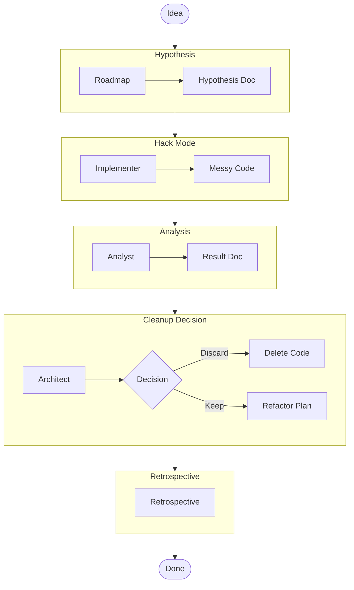

# Spike & Rapid Prototyping Workflow

This workflow is for "Spikes" - time-boxed research or rapid implementation to explore a concept. It emphasizes speed but enforces a mandatory cleanup phase to prevent "Spike code" from becoming "Production legacy".

## Trigger & Entry Point

**Trigger**: User wants to "hack on", "explore", "try out", or "spike" a new idea.

**Orchestrator Responsibility**:
1.  **ACKNOWLEDGE**: Confirm this is a SPIKE (temporary/explorative).
2.  **HANDOFF**: Immediately hand off to **Roadmap Agent** (Phase 1).

## Workflow Steps

### Phase 1: Hypothesis Definition (Roadmap)
- **Primary Agent**: Roadmap
- **Goal**: Define *what* we are trying to prove or learn.
- **Execution**: Use the `runSubagent` tool to run the **Roadmap** agent.
    - **Task**: "Define the Hypothesis. What is the question we are answering? What is the 'Time Box'? Output `agent-output/planning/spike-hypothesis.md`."
- **Output**: `agent-output/planning/spike-hypothesis.md`
- **Handoff**: To Implementer.

### Phase 2: The "Hack" Phase (Implementer)
- **Primary Agent**: Implementer
- **Goal**: Rapidly implement the concept.
- **Constraint**: **SPEED OVER QUALITY**. Tests are optional. hardcoding is allowed.
- **Execution**: Use the `runSubagent` tool to run the **Implementer** agent.
    - **Task**: "Read `spike-hypothesis.md`. Build the prototype. Cut corners if needed. Just make it work. Output to a `spike/` directory or a temporary branch."
- **Output**: Working (but messy) code.
- **Handoff**: To Analyst.

### Phase 3: Result Analysis (Analyst)
- **Primary Agent**: Analyst
- **Goal**: Did it work?
- **Execution**: Use the `runSubagent` tool to run the **Analyst** agent.
    - **Task**: "Analyze the prototype. detailed findings. Did we prove the hypothesis? Output `agent-output/analysis/spike-results.md`."
- **Output**: `agent-output/analysis/spike-results.md`
- **Handoff**: To Architect.

### Phase 4: The Cleanup Decision (Architect)
- **Primary Agent**: Architect
- **Goal**: **CRITICAL PHASE**. Decide the fate of the code.
- **Execution**: Use the `runSubagent` tool to run the **Architect** agent.
    - **Task**: "Review `spike-results.md` and the code. Choose one:
      1.  **Discard**: Delete the code. (We learned what we needed).
      2.  **Refactor**: Create a plan to productionize it.
      Output `agent-output/architecture/spike-decision.md`."
- **Output**: `agent-output/architecture/spike-decision.md`
- **Handoff**: To Retrospective.

### Phase 5: Retrospective (Retrospective)
- **Primary Agent**: Retrospective
- **Goal**: Capture the learning.
- **Execution**: Use the `runSubagent` tool to run the **Retrospective** agent.
    - **Task**: "Read `custom-agents/instructions/output_standards.md`. Run Retrospective analysis. Output `agent-output/retrospectives/retrospective-[id].md`."
- **Output**: `agent-output/retrospectives/retrospective-[id].md`
- **Stop**: End of Workflow.

## Workflow Visualization

