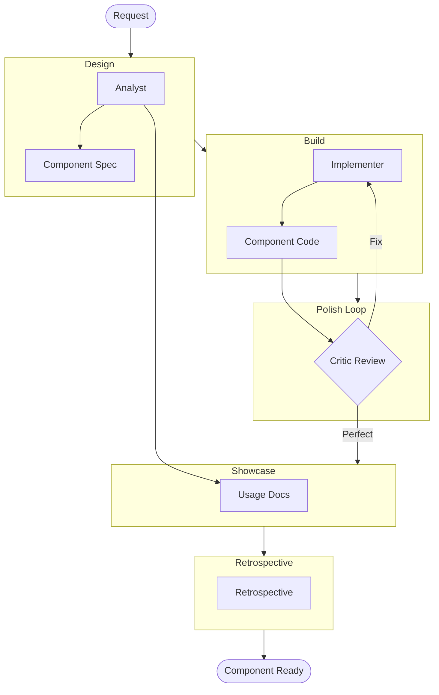

# UI Component Builder Workflow

This workflow focuses on building high-fidelity, accessible, and reusable UI components. It prioritizes visual polish and strict accessibility validation over business logic.

## Trigger & Entry Point

**Trigger**: User wants to "create a button", "build a card component", "add a UI widget".

**Orchestrator Responsibility**:
1.  **ACKNOWLEDGE**: Confirm the component scope.
2.  **HANDOFF**: Immediately hand off to **Analyst** (Phase 1).

## Workflow Steps

### Phase 1: Component Design Specs (Analyst)
- **Primary Agent**: Analyst
- **Goal**: Define the Component API (Props/Inputs) and States.
- **Execution**: Use the `runSubagent` tool to run the **Analyst** agent.
    - **Task**: "Analyze the request/mock. Define the Component props (inputs), events, and visual states (Hover, Active, Disabled, Loading). Output `agent-output/analysis/component-spec.md`."
- **Output**: `agent-output/analysis/component-spec.md`
- **Handoff**: To Implementer.

### Phase 2: Implementation (Implementer)
- **Primary Agent**: Implementer
- **Goal**: Build the component structure and styles.
- **Execution**: Use the `runSubagent` tool to run the **Implementer** agent.
    - **Task**: "Read `component-spec.md`. Implement the component using the project's styling system. Output source code."
- **Output**: Component Source Code.
- **Handoff**: To Critic.

### Phase 3: The Polish Loop (Critic)
- **Primary Agent**: Critic
- **Goal**: Ensure "Hero" grade quality. 
- **Execution**: Use the `runSubagent` tool to run the **Critic** agent.
    - **Task**: "Review the component. Focus DEEPLY on:
      1.  **Micro-interactions**: Does it feel alive? (Transitions, Scales).
      2.  **Accessibility**: Are ARIA labels present? Is contrast correct?
      3.  **Aesthetics**: Does it match the 'Premium' design rule?
      If issues found, Implementer MUST fix."
    - **Action**: Loop back to **Implementer** until perfect.
- **Output**: Polished Component.
- **Handoff**: To Analyst.

### Phase 4: Showcase Generation (Analyst)
- **Primary Agent**: Analyst
- **Goal**: Create documentation/showcase.
- **Execution**: Use the `runSubagent` tool to run the **Analyst** agent.
    - **Task**: "Generate a usage example or 'Storybook' entry. Update `agent-output/docs/component-gallery.md`."
- **Output**: `agent-output/docs/component-gallery.md`
- **Handoff**: To Retrospective.

### Phase 5: Retrospective (Retrospective)
- **Primary Agent**: Retrospective
- **Goal**: Review workflow.
- **Execution**: Use the `runSubagent` tool to run the **Retrospective** agent.
    - **Task**: "Read `custom-agents/instructions/output_standards.md`. Run Retrospective analysis. Output `agent-output/retrospectives/retrospective-[id].md`."
- **Output**: `agent-output/retrospectives/retrospective-[id].md`
- **Stop**: End of Workflow.

## Workflow Visualization

