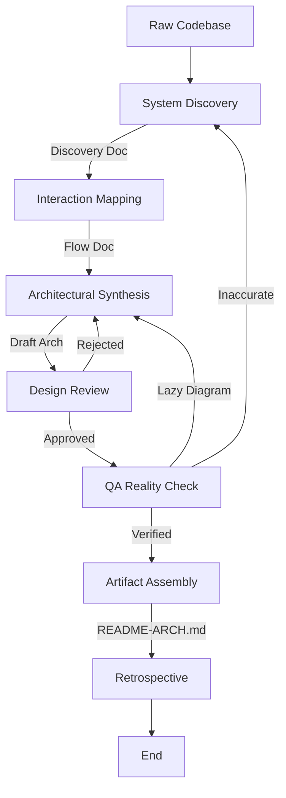

# Architecture Documentation Workflow

This workflow defines the process for reverse-engineering a codebase, documenting its architecture, and synthesizing high-fidelity visual diagrams.

## Workflow Overview

This workflow transforms a raw codebase into a high-quality `README-ARCH.md` and a set of detailed architectural diagrams. It enforces a strict **Verify-then-Synthesize** loop using MCP tools to prove every finding.

## Workflow Steps

### 1. System Discovery (Analyst Agent)
- **Agent**: Analyst
- **Input**: The raw codebase and repository root.
- **Execution**: Use the `runSubagent` tool to run the **Analyst** agent.
    - **Task**: "Read `custom-agents/instructions/output_standards.md`. Perform deep discovery pass to identify entry points, core layers, data sources, and infrastructure using MCP tools (find_by_name, grep_search). Output `001-system-discovery.md`."
- **Handoff**: Passed to the Analyst for Phase 2.

### 2. Interaction Mapping (Analyst Agent)
- **Agent**: Analyst
- **Input**: The System Discovery document.
- **Execution**: Use the `runSubagent` tool to run the **Analyst** agent.
    - **Task**: "Trace specific user-facing flows to map 'behavioral' architecture. Use `view_file` on entry points. Output `002-interaction-flows.md`."
    - **Task**: "Read `custom-agents/instructions/output_standards.md`. Transform text findings into detailed Mermaid.js diagrams using `flowchart` syntax only. Output `003-system-architecture.md`."
- **Handoff**: Passed to Critic for Review.

### 4. Design Review (Critic Agent)
- **Agent**: Critic
- **Input**: The System Architecture document and original Analysis docs.
- **Action**: Use the `runSubagent` tool to run the Critic agent to perform rigorous peer review of the proposed architecture.
- **Checks**:
  - Do the diagrams match the standard patterns?
  - Are the Sequence Diagrams sufficiently detailed?
  - Are error paths represented?
- **Iteration Loop**:
  - **FAIL**: Return to **Architect** with specific change requests.
  - **PASS**: Detailed architecture is approved for QA verification.

### 5. Reality Check (QA Agent)
- **Agent**: QA
- **Input**: The System Architecture document.
- **Execution**: Use the `runSubagent` tool to run the **QA** agent.
    - **Task**: "Audit proposed architecture against actual code execution. Use `view_code_item` and `grep_search`. Output verification report."
- **Handoff**: Passed to Critic.

### 5b. Documentation Detail Verification (Critic Agent)
- **Agent**: Critic
- **Input**: Verified Architecture Document.
- **Action**: **CRITICAL**: Use the `runSubagent` tool to run the Critic agent to review specifically for "lack of detail in the documentation". Ensure diagrams are fully explained, decisions have rationale, and system context is rich.
- **Iteration Loop**:
- **FAIL (Too Vague)**: Return to **Architect** (for detail expansion).
- **PASS**: Approved for Final Assembly.
- **Handoff**: Passed to Implementer.

### 6. Artifact Assembly (Implementer Agent)
- **Agent**: Implementer
- **Input**: Verified Architecture document.
- **Execution**: Use the `runSubagent` tool to run the **Implementer** agent.
    - **Task**: "Read `custom-agents/instructions/output_standards.md`. Compile verified analysis and diagrams into `README-ARCH.md` at repository root. Ensure Mermaid renders."
- **Handoff**: Passed to Critic.

### 6b. Artifact Review (Critic Agent)
- **Agent**: Critic
- **Input**: Generated `README-ARCH.md`.
- **Action**: Use the `runSubagent` tool to run the Critic agent to verify the final artifact styling and formatting.
- **Iteration**: Return to **Implementer** if issues found.
- **Handoff**: Passed to Orchestrator.

### 7. Retrospective (Retrospective)
- **Agent**: Retrospective
- **Input**: All `agent-output/` artifacts.
- **Execution**: Use the `runSubagent` tool to run the **Retrospective** agent.
    - **Task**: "Read `custom-agents/instructions/output_standards.md`. Run Retrospective analysis. Output `agent-output/retrospectives/retrospective-[ID].md`."
- **Output**: `agent-output/retrospectives/retrospective-[ID].md`
- **Handoff**: End of Workflow.

## Agent Roles Summary

| Agent | Role | Output Location |
| :--- | :--- | :--- |
| **Analyst** | Discover & Prove (via MCP) | `agent-output/analysis/` |
| **Architect** | Synthesize Detailed Diagrams | `agent-output/architecture/` |
| **Critic** | Design Review | `agent-output/critiques/` |
| **QA** | Verify against Code (via MCP) | `agent-output/qa/` |
| **Implementer** | Create final `README-ARCH.md` | Repository Root |

## Workflow Diagram

