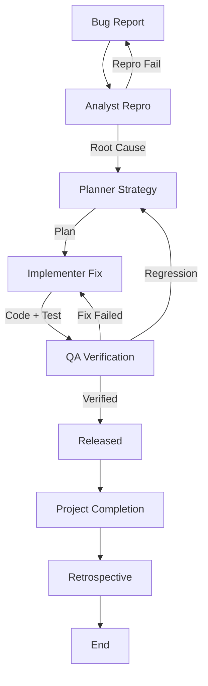

# Bug Fix & Incident Response Workflow

This workflow provides a standardized process for reproducible bug fixes, ensuring root cause analysis and non-regression.

## Workflow Overview

"Quick fixes" often cause regressions. This workflow enforces **Reproduction -> Root Cause -> Fix -> Verify**.

## Workflow Steps

### 1. Reproduction & Analysis (Analyst Agent)
- **Agent**: Analyst
- **Input**: Bug Report (User feedback, Sentry issue, etc.).
- **Execution**: Use the `runSubagent` tool to run the **Analyst** agent.
    - **Task**: "Read `custom-agents/instructions/output_standards.md`. Load Bug Report. Create minimal reproduction case. Identify Root Cause (Code/Config/Data) using `grep_search` and `view_file`. Output `root-cause-analysis.md`."
- **Output**: `agent-output/analysis/root-cause-analysis.md`
- **Handoff**: `agent-output/handoffs/bug-fix-phase-1-handoff.md` (Template: Data-Only, No Fluff)

### 2. Fix Planning (Planner Agent)
- **Agent**: Planner
- **Input**: `agent-output/handoffs/bug-fix-phase-1-handoff.md` AND `agent-output/analysis/root-cause-analysis.md`
- **Execution**: Use the `runSubagent` tool to run the **Planner** agent.
    - **Task**: "Read `custom-agents/instructions/output_standards.md`. Load Root Cause. Plan the fix and Regression Test strategy. Output `fix-plan.md`."
- **Output**: `agent-output/planning/fix-plan.md`
- **Handoff**: `agent-output/handoffs/bug-fix-phase-2-handoff.md` (Template: Data-Only, No Fluff)

### 2a. Plan Critique (Critic Agent)
- **Agent**: Critic
- **Input**: Fix Plan.
- **Action**: Use the `runSubagent` tool to run the Critic agent to assess technical soundness, regression risks, and completeness.
- **Iteration Link**: If rejected, return to **Planner**.

### 2b. Documentation Detail Verification (Critic Agent)
- **Agent**: Critic
- **Input**: `agent-output/planning/fix-plan.md`
- **Action**: **CRITICAL**: Use the `runSubagent` tool to run the Critic agent to review specifically for "lack of detail in the documentation". Ensure steps are explicit, context is clear, and no ambiguity exists.
- **Iteration Link**: If lacking detail, return to **Planner**.
- **Handoff**: To Implementer.

### 3. Implementation (Implementer Agent)
- **Agent**: Implementer
- **Input**: `agent-output/handoffs/bug-fix-phase-2-handoff.md` AND `agent-output/planning/fix-plan.md`
- **Execution**: Use the `runSubagent` tool to run the **Implementer** agent.
    - **Task**: "Read `custom-agents/instructions/output_standards.md`. Load Fix Plan. Write failing test (reproduction). Fix code. Verify test passes. Output Code changes and `fix-implementation.md`."
- **Output**: Code changes + New Test + `agent-output/implementation/fix-implementation.md`
- **Handoff**: `agent-output/handoffs/bug-fix-phase-3-handoff.md` (Template: Data-Only, No Fluff)

### 3b. Code Review & Refinement (Critic Agent)
- **Agent**: Critic
- **Input**: Code changes.
- **Action**: Use the `runSubagent` tool to run the Critic agent to perform strict code review against standards (SOLID, DRY, etc.).
- **Checks**:
  - Code Style & Standards.
  - Potential performance issues.
  - Maintainability & Readability.
- **Iteration**: Any findings must be addressed by **Implementer** before QA.
- **Handoff**: To QA.

### 4. Verification (QA Agent)
- **Agent**: QA
- **Input**: `agent-output/handoffs/bug-fix-phase-3-handoff.md` AND `agent-output/implementation/fix-implementation.md`
- **Action**: Use the `runSubagent` tool to run the QA agent to verify the fix and run regression suite.
- **Mandatory MCP Usage**:
  - Use `playwright` to verify web bug fixes.
  - Use `ios-simulator` to verify mobile bug fixes. **(Always check [Troubleshooting Guide](https://github.com/joshuayoes/ios-simulator-mcp/blob/main/TROUBLESHOOTING.md) / [LLM Guide](https://raw.githubusercontent.com/joshuayoes/ios-simulator-mcp/refs/heads/main/TROUBLESHOOTING.md) first)**
  - Use `context7` to verify fix implementation against library documentation.
- **Output**: `agent-output/qa/fix-verification.md`
- **Iteration Loop**:
  - **FAIL**: Return to **Analyst** (if reproduction was wrong) or **Implementer**.
  - **PASS**: Bug Squashed. Create `agent-output/handoffs/bug-fix-phase-4-handoff.md` (Template: Data-Only, No Fluff).

### 5. Project Completion (Orchestrator)
- **Agent**: Orchestrator
- **Action**: Archive artifacts and generate final report.
- **Output**:
  - Move terminal artifacts to `agent-output/closed/`
  - Generate **Single** Project Completion Report: `agent-output/reports/[ID]-completion-report.md`
  - Proceed to Phase 6.

### 6. Retrospective (Retrospective)
- **Agent**: Retrospective
- **Input**: All `agent-output/` artifacts.
- **Execution**: Use the `runSubagent` tool to run the **Retrospective** agent.
    - **Task**: "Read `custom-agents/instructions/output_standards.md`. Run Retrospective analysis on the Bug Fix process. Output `agent-output/retrospectives/retrospective-[ID].md`."
- **Output**: `agent-output/retrospectives/retrospective-[ID].md`
- **Stop**: End of Workflow.

## Agent Roles Summary

| Agent | Role | Output Location |
| :--- | :--- | :--- |
| **Analyst** | Repro & Root Cause | `agent-output/analysis/` |
| **Planner** | Fix Strategy | `agent-output/planning/` |
| **Implementer** | Fix & Test | Codebase |
| **QA** | Verify | `agent-output/qa/` |
| **Orchestrator** | Final Report | `agent-output/reports/` |

## Workflow Diagram

