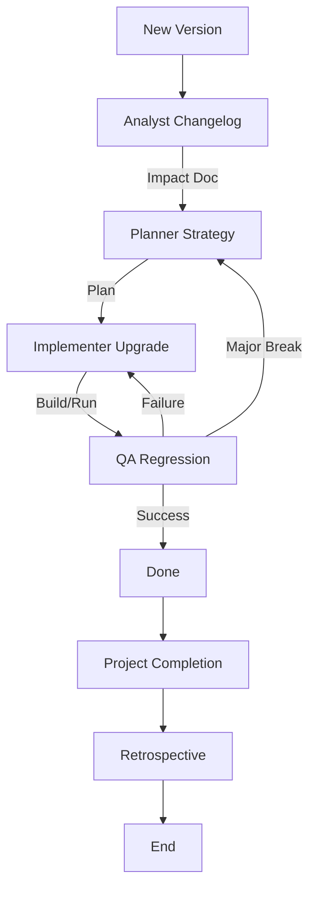

# Dependency Upgrade Workflow

This workflow ensures that upgrading dependencies (frameworks, libraries) is safe and controlled.

## Workflow Overview

Upgrading dependencies is a common source of regressions. This workflow de-risks upgrades through analysis and planned regression testing.

## Workflow Steps

### 1. Changelog Analysis (Analyst Agent)
- **Agent**: Analyst
- **Input**: Target package name and version.
- **Execution**: Use the `runSubagent` tool to run the **Analyst** agent.
    - **Task**: "Read changelogs, migration guides, and release notes for [Package]. Identify breaking changes. Output Impact Assessment."
- **Output**: Upgrade Impact Assessment in `agent-output/analysis/`.
- **Handoff**: Passed to Planner.

### 2. Upgrade Strategy (Planner Agent)
- **Agent**: Planner
- **Input**: Upgrade Impact Assessment.
- **Execution**: Use the `runSubagent` tool to run the **Planner** agent.
    - **Task**: "Plan the upgrade. Decide strategy (Big Bang vs Incremental). Output Upgrade Plan."
- **Handoff**: Passed to Critic.

### 2a. Plan Critique (Critic Agent)
- **Agent**: Critic
- **Input**: Upgrade Plan.
- **Action**: Use the `runSubagent` tool to run the Critic agent to assess technical soundness and rollback strategy effectiveness.
- **Iteration Link**: If rejected, return to **Planner**.

### 2b. Documentation Detail Verification (Critic Agent)
- **Agent**: Critic
- **Input**: Upgrade Plan.
- **Action**: **CRITICAL**: Use the `runSubagent` tool to run the Critic agent to review specifically for "lack of detail in the documentation". Ensure steps are explicit and context is clear.
- **Iteration Link**: If lacking detail, return to **Planner**.
- **Handoff**: Passed to Implementer.

### 3. Execution (Implementer Agent)
- **Agent**: Implementer
- **Input**: Upgrade Plan.
- **Execution**: Use the `runSubagent` tool to run the **Implementer** agent.
    - **Task**: "Update `package.json`, install, fix build errors. Output code changes."
- **Output**: Code changes.
- **Handoff**: Passed to QA.

- **Handoff**: Passed to Critic.

### 3b. Code Review & Refinement (Critic Agent)
- **Agent**: Critic
- **Input**: Code changes.
- **Action**: Use the `runSubagent` tool to run the Critic agent to strict code review against standards.
- **Checks**:
  - Code Style & Standards.
  - Maintainability & Readability.
- **Iteration**: Any findings must be addressed by **Implementer** before QA.
- **Handoff**: Passed to QA.

### 4. Regression Testing (QA Agent)
- **Agent**: QA
- **Input**: Code changes.
- **Action**: Use the `runSubagent` tool to run the QA agent to run the full regression suite.
- **Mandatory MCP Usage**:
  - Use `run_command` to execute tests.
  - Use `playwright` or `ios-simulator` for UI/mobile verification. **(For ios-simulator: check [Troubleshooting Guide](https://github.com/joshuayoes/ios-simulator-mcp/blob/main/TROUBLESHOOTING.md) / [LLM Guide](https://raw.githubusercontent.com/joshuayoes/ios-simulator-mcp/refs/heads/main/TROUBLESHOOTING.md))**
- **Iteration Loop**:
  - **FAIL**: Tests fail or build breaks. Return to **Implementer** (for fixes) or **Planner** (if strategy needs rethinking).
  - **PASS**: Upgrade successful.

### 5. Project Completion (Orchestrator)
- **Agent**: Orchestrator
- **Action**: Archive artifacts and generate final report.
- **Output**:
  - Move terminal artifacts to `agent-output/closed/`
  - Generate **Single** Project Completion Report: `agent-output/completion/[ID]-completion-report.md`
  - Proceed to Phase 6.

### 6. Retrospective (Retrospective)
- **Agent**: Retrospective
- **Input**: All `agent-output/` artifacts.
- **Execution**: Use the `runSubagent` tool to run the **Retrospective** agent.
    - **Task**: "Read `custom-agents/instructions/output_standards.md`. Run Retrospective analysis. Output `agent-output/retrospectives/retrospective-[ID].md`."
- **Output**: `agent-output/retrospectives/retrospective-[ID].md`
- **Stop**: End of Workflow.

## Agent Roles Summary

| Agent | Role | Output Location |
| :--- | :--- | :--- |
| **Analyst** | Risk Assessment | `agent-output/analysis/` |
| **Planner** | Strategy | `agent-output/planning/` |
| **Implementer** | Execute Upgrade | Codebase |
| **QA** | Regression | `agent-output/qa/` |
| **Orchestrator** | Final Report | `agent-output/completion/` |

## Workflow Diagram

