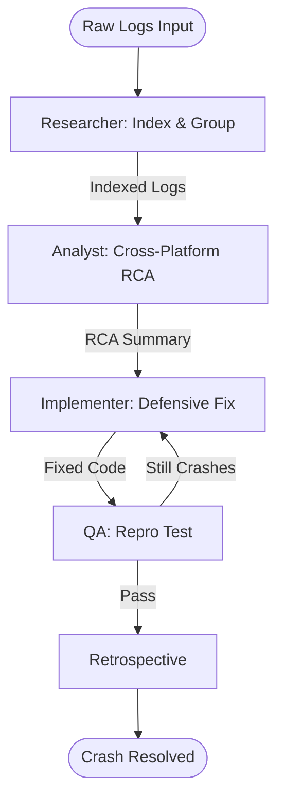

# Production Log Analyst Workflow

This workflow transforms raw, provided crash logs into actionable cross-platform remediation plans, identifying common failure patterns in the ecosystem.

## Workflow Overview

Production logs are noisy. This workflow enforces **Log Indexing -> Multi-Platform RCA -> Defensive Remediation -> Mock Verification**.

## Workflow Steps

### 1. Log Indexing & Preparation (Researcher)
- **Agent**: Researcher
- **Goal**: Categorize and index the provided raw logs.
- **Execution**: Use `runSubagent` tool to run the **Researcher** agent.
    - **Task**: "Analyze the provided crash logs. Group by Exception Type and Platform. Identify the 'Top 5' unique crash signatures. Output an indexed summary to `agent-output/analysis/crash-logs-indexed.json`."
- **Output**: `agent-output/analysis/crash-logs-indexed.json`
- **Handoff**: To Analyst.

### 2. Cross-Platform Root Cause Analysis (Analyst)
- **Agent**: Analyst
- **Goal**: Identify shared failure points (e.g., API payload drift).
- **Execution**: Use `runSubagent` tool to run the **Analyst** agent.
    - **Task**: "Read `crash-logs-indexed.json`. Trace stack traces back to specific files in the repository. Look for shared logic failures (e.g. date parsing) that appear on both MAUI and Flutter. Output `agent-output/analysis/log-rca-summary.md`."
- **Critique Loop**: Use the `runSubagent` tool to run the **Critic** agent to verify that the RCA isn't just "blaming the library" but finds the root coding error.
- **Output**: `agent-output/analysis/log-rca-summary.md` (APPROVED)
- **Handoff**: To Implementer.

### 3. Defensive Implementation (Implementer)
- **Agent**: Implementer
- **Goal**: Draft and apply fixes, focusing on defensive patterns.
- **Execution**: Use `runSubagent` tool to run the **Implementer** agent.
    - **Task**: "Apply fixes identified in the RCA summary. Implement null-safety checks, robust try/catch blocks, and meaningful user-facing error messages. Propose the fix in `agent-output/implementation/log-remediation.md` before applying."
- **Output**: Code changes + Remediation report.
- **Handoff**: To QA.

### 4. Regression & Mock Verification (QA)
- **Agent**: QA
- **Goal**: Verify that the fix actually prevents the crash under identical log conditions.
- **Execution**: Use `runSubagent` tool to run the **QA** agent.
    - **Task**: "Define a reproduction test case that mimics the crash log scenario. Verify the app now handles the scenario gracefully without crashing. Output `agent-output/reports/log-fix-verification.md`."
- **Output**: `agent-output/reports/log-fix-verification.md`

### 5. Retrospective (Retrospective)
- **Agent**: Retrospective
- **Input**: All `agent-output/` artifacts.
- **Execution**: Use the `runSubagent` tool to run the **Retrospective** agent.
    - **Task**: "Read `custom-agents/instructions/output_standards.md`. Run Retrospective analysis. Output `agent-output/retrospectives/retrospective-[ID].md`."
- **Output**: `agent-output/retrospectives/retrospective-[ID].md`

## Agent Roles Summary

| Agent | Role | Output Location |
| :--- | :--- | :--- |
| **Researcher** | Log Indexing | `agent-output/analysis/` |
| **Analyst** | RCA | `agent-output/analysis/` |
| **Implementer** | Defensive Patching | Codebase |
| **QA** | Mock Verification | `agent-output/reports/` |

## Workflow Diagram

## Governance
- **Standards**: Must adhere to `custom-agents/instructions/output_standards.md`.
- **Privacy**: Ensure raw logs containing PII are NOT stored in the permanent `agent-output` reports.
破
