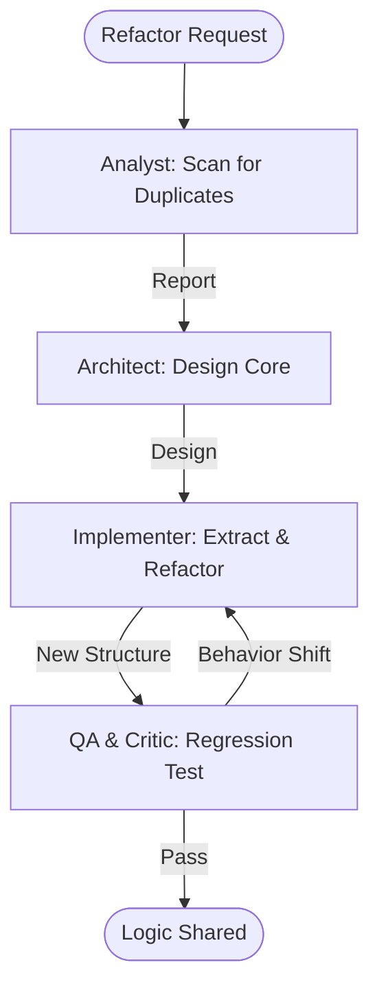

# Shared Logic Extractor Workflow

This workflow identifies redundant implementation patterns across React, Flutter, and MAUI, and automates their migration to a shared codebase.

## Workflow Overview

Duplicate logic increases technical debt. This workflow enforces **Redundancy Scan -> Shared Architecture Design -> Safe Extraction -> Regression Testing**.

## Workflow Steps

### 1. Cross-Platform Redundancy Scan (Analyst)
- **Agent**: Analyst
- **Goal**: Identify duplicate business logic or utility functions across platforms.
- **Execution**: Use `runSubagent` tool to run the **Analyst** agent.
    - **Task**: "Scan the `src/` (React), `lib/` (Flutter), and `Models/` (MAUI) directories. Identify logic (e.g. data validation, math formulas, string parsing) that is implemented multiple times. Output a Redundancy Report to `agent-output/analysis/shared-logic-candidates.md`."
- **Output**: `agent-output/analysis/shared-logic-candidates.md`
- **Handoff**: To Architect.

### 2. Shared Library Design (Architect)
- **Agent**: Architect
- **Goal**: Design the interface for the shared logic repository.
- **Execution**: Use `runSubagent` tool to run the **Architect** agent.
    - **Task**: "Read `shared-logic-candidates.md`. Design a unified API for the shared logic. Recommend the sharing mechanism (e.g. Git Submodule, Private Package, or logic porting). Output `agent-output/architecture/shared-core-design.md`."
- **Critique Loop**: Use **Critic** agent to verify that the shared design is decoupled from platform-specific UI.
- **Output**: `agent-output/architecture/shared-core-design.md` (APPROVED)
- **Handoff**: To Implementer.

### 3. Logic Extraction & Refactoring (Implementer)
- **Agent**: Implementer
- **Goal**: Move logic to the shared core and update platform calls.
- **Execution**: Use `runSubagent` tool to run the **Implementer** agent.
    - **Task**: "Read `shared-core-design.md`. Extract candidates into the shared core. Replace platform-specific code with calls to the shared library. Ensure all type signatures are preserved. Output code changes."
- **Output**: Code changes in shared and platform directories.
- **Handoff**: To QA.

### 4. Integration & Regression Verification (QA & Critic)
- **Agent**: QA, Critic
- **Goal**: Ensure no functional behavior was changed during extraction.
- **Actions**:
    1.  **QA**: Use `run_command` to execute unit tests on all 3 platforms. Verify code-coverage has not dropped.
    2.  **Critic**: Audit the shared library for "platform leaks" (e.g. accidentally including a React hook in a shared core).
- **Output**: `agent-output/reports/extraction-verification.md`

## Agent Roles Summary

| Agent | Role | Output Location |
| :--- | :--- | :--- |
| **Analyst** | Redundancy Scan | `agent-output/analysis/` |
| **Architect** | Core Design | `agent-output/architecture/` |
| **Implementer** | Move & Refactor | Codebase |
| **QA** | Regression Test | `agent-output/reports/` |
| **Critic** | Leak Detection | `agent-output/reports/` |

## Workflow Diagram

## Governance
- **Standards**: Must adhere to `custom-agents/instructions/output_standards.md`.
- **Constraint**: Shared logic must be 100% platform-agnostic (No `System.Windows`, `dart:ui`, or DOM references).
