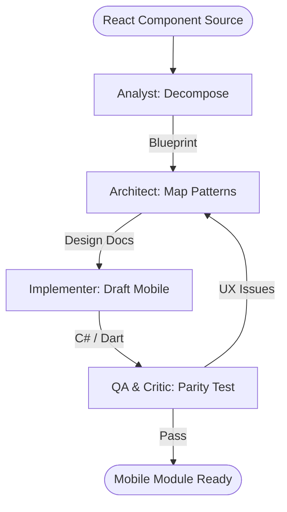

# React-to-Mobile Porting Assistant Workflow

This workflow streamlines the migration of web-based React features to native mobile platforms (Flutter/MAUI) while maintaining logic parity and adapting to mobile UX standards.

## Workflow Overview

Porting web components to mobile requires architectural shifts. This workflow enforces **Component Decomposition -> Pattern Mapping -> Mobile Drafting -> Parity Review**.

## Workflow Steps

### 1. React Component Decomposition (Analyst)
- **Agent**: Analyst
- **Goal**: Analyze the source React component and separate business logic from UI.
- **Execution**: Use `runSubagent` tool to run the **Analyst** agent.
    - **Task**: "Analyze the React component at [FileName]. Identify `useState`, `useEffect`, and third-party dependencies. Separate the core business logic from the JSX layout. Output a Porting Blueprint to `agent-output/analysis/react-porting-blueprint.md`."
- **Output**: `agent-output/analysis/react-porting-blueprint.md`
- **Handoff**: To Architect.

### 2. Pattern & Logic Mapping (Architect)
- **Agent**: Architect
- **Goal**: Map React paradigms to Flutter/MAUI equivalents.
- **Execution**: Use `runSubagent` tool to run the **Architect** agent.
    - **Task**: "Read `react-porting-blueprint.md`. Map React Hooks to Flutter `StateProvider` or MAUI `ViewModel`. Map CSS flexbox to Mobile `Column/Row` layouts. Recommend mobile-native UX shifts (e.g. 'dropdown' -> 'bottom sheet'). Output `agent-output/analysis/mobile-mapping-design.md`."
- **Critique Loop**: Use **Critic** agent to verify that the mobile design follows Material/Cupertino best practices.
- **Output**: `agent-output/analysis/mobile-mapping-design.md` (APPROVED)
- **Handoff**: To Implementer.

### 3. Mobile Source Drafting (Implementer)
- **Agent**: Implementer
- **Goal**: Generate the mobile implementation code.
- **Execution**: Use `runSubagent` tool to run the **Implementer** agent.
    - **Task**: "Read `mobile-mapping-design.md`. Generate Dart or C# code for the component. Ensure business logic parity with the original React version. Implement platform-specific themes. Output to `agent-output/generated/mobile-port/`."
- **Output**: Ported mobile source files.
- **Handoff**: To QA.

### 4. Functional Parity Review (QA & Critic)
- **Agent**: QA, Critic
- **Goal**: Ensure the mobile component behaves identically to the React original.
- **Actions**:
    1.  **QA**: Use `ios-simulator` to verify the mobile UI. Trigger all interactive states (clicks, inputs).
    2.  **Critic**: Audit the code for "web-isms" that should be native mobile patterns.
- **Output**: `agent-output/reports/porting-verification.md`

## Agent Roles Summary

| Agent | Role | Output Location |
| :--- | :--- | :--- |
| **Analyst** | Decomposition | `agent-output/analysis/` |
| **Architect** | Pattern Mapping | `agent-output/analysis/` |
| **Implementer** | Mobile Drafting | `agent-output/generated/` |
| **QA** | Parity Verification | `agent-output/reports/` |
| **Critic** | UX/Code Review | `agent-output/reports/` |

## Workflow Diagram

## Governance
- **Standards**: Must adhere to `custom-agents/instructions/output_standards.md`.
- **Constraint**: Do not attempt to use "WebViews" for porting; all components must be 100% native.
破
