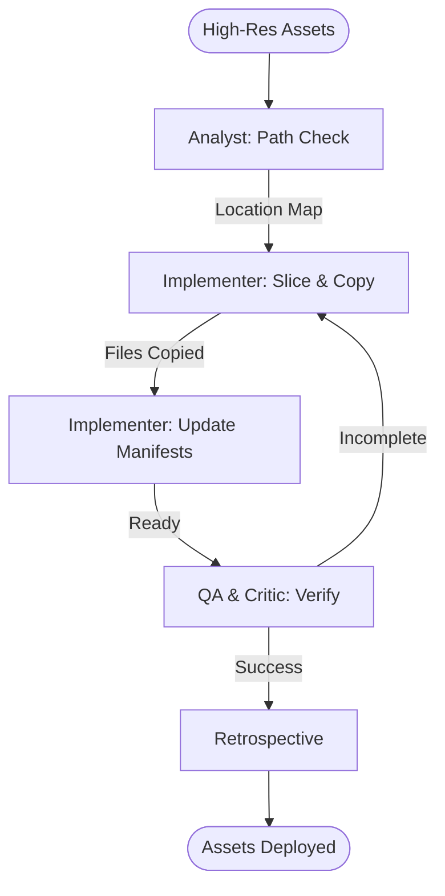

# Multi-Platform Asset Pipeline

This workflow automates the processing and distribution of high-resolution visual assets to Android, iOS, and Web directories.

## Workflow Overview

Managing assets for multiple platforms is prone to manual error. This workflow enforces **Target Analysis -> Image Slicing -> Manifest Updates -> Parity Verification**.

## Workflow Steps

### 1. Platform Path Analysis (Analyst)
- **Agent**: Analyst
- **Goal**: Locate and verify target asset directories for all platforms.
- **Execution**: Use `runSubagent` tool to run the **Analyst** agent.
    - **Task**: "Verify project paths for Android `res/`, iOS `Assets.xcassets`, and React `public/`. Map specific density requirements. Output to `agent-output/analysis/asset-locations.json`."
- **Output**: `agent-output/analysis/asset-locations.json`
- **Handoff**: To Implementer.

### 2. High-Res Processing (Implementer)
- **Agent**: Implementer
- **Goal**: Generate density-scaled assets and deploy to folders.
- **Execution**: Use `runSubagent` tool to run the **Implementer** agent.
    - **Task**: "Process source assets in [Folder]. Generate `@1x`, `@2x`, `@3x` versions. Deploy directly to the paths defined in `asset-locations.json`. Use WebP where possible."
- **Output**: Physical asset files.
- **Handoff**: To Implementer (Step 3).

### 3. Manifest Synchronization (Implementer)
- **Agent**: Implementer
- **Goal**: Update project configurations to recognize new assets.
- **Execution**: "Update `pubspec.yaml` (Flutter), `.csproj` (MAUI), or asset indexes (React). Ensure no broken references."

### 4. Parity & Integrity Verification (QA & Critic)
- **Agent**: QA, Critic
- **Goal**: Ensure all target folders are in sync and naming conventions match.
- **Actions**:
    1.  **QA**: Verify every source asset has a corresponding set of scaled files in all 3 platforms.
    2.  **Critic**: Check if naming conventions follow `custom-agents/instructions/output_standards.md`.
- **Output**: `agent-output/reports/asset-sync-report.md`

### 5. Retrospective (Retrospective)
- **Agent**: Retrospective
- **Input**: All `agent-output/` artifacts.
- **Execution**: Use the `runSubagent` tool to run the **Retrospective** agent.
    - **Task**: "Read `custom-agents/instructions/output_standards.md`. Run Retrospective analysis. Output `agent-output/retrospectives/retrospective-[ID].md`."
- **Output**: `agent-output/retrospectives/retrospective-[ID].md`

## Agent Roles Summary

| Agent | Role | Output Location |
| :--- | :--- | :--- |
| **Analyst** | Path Verification | `agent-output/analysis/` |
| **Implementer** | Slicing & Deployment | Project Directories |
| **QA** | Parity Verification | `agent-output/reports/` |
| **Critic** | Standard Review | `agent-output/reports/` |

## Workflow Diagram

## Governance
- **Standards**: Must adhere to `custom-agents/instructions/output_standards.md`.
- **Rescue**: If high-res source is missing metadata, Implementer must request clarification.
