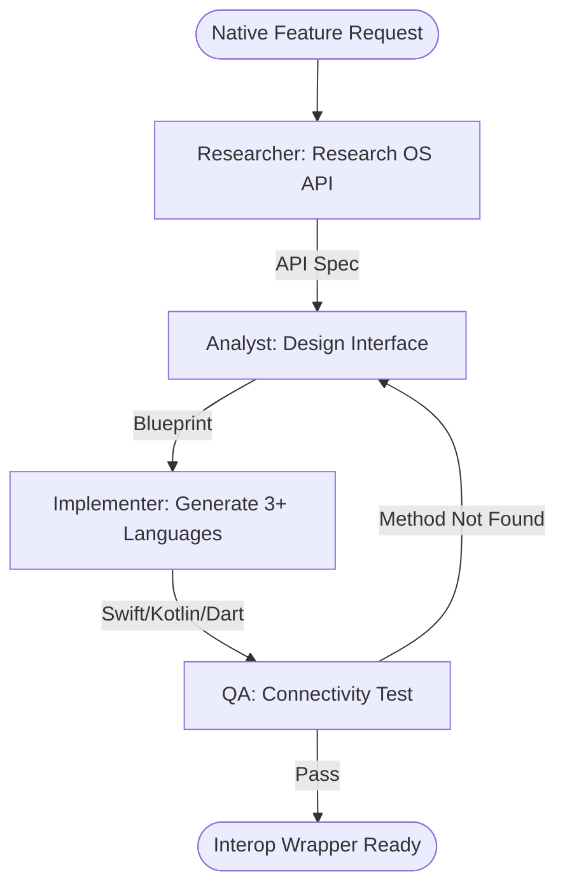

# Native Interop Wrapper Generator Workflow

This workflow automates the creation of strongly-typed bridge code for calling native Android (Kotlin) and iOS (Swift) APIs from shared Flutter or MAUI codebases.

## Workflow Overview

Writing native interop is brittle and manual. This workflow enforces **Platform API Research -> Bridge Plumbing Generation -> Logic Implementation -> Connectivity Verification**.

## Workflow Steps

### 1. Platform Native API Research (Researcher)
- **Agent**: Researcher
- **Goal**: Identify the exact native APIs required for the requested feature.
- **Execution**: Use `runSubagent` tool to run the **Researcher** agent.
    - **Task**: "Identify the Android (`android.*`) and iOS (`Foundation/UIKit`) APIs for [Feature]. Check OS permission requirements. Output a Native API Spec to `agent-output/analysis/native-api-spec.md`."
- **Output**: `agent-output/analysis/native-api-spec.md`
- **Handoff**: To Analyst.

### 2. Bridge Design & Plumbing (Analyst)
- **Agent**: Analyst
- **Goal**: Design the cross-platform interface and method signatures.
- **Execution**: Use `runSubagent` tool to run the **Analyst** agent.
    - **Task**: "Read `native-api-spec.md`. Design the `MethodChannel` interface (Flutter) or `IDependency` interface (MAUI). Map and handle platform-specific data types (e.g. `Map` vs `NSDictionary`). Output `agent-output/analysis/interop-blueprint.md`."
- **Critique Loop**: Use **Critic** agent to verify the error handling for "Platform Not Supported" cases.
- **Output**: `agent-output/analysis/interop-blueprint.md` (APPROVED)
- **Handoff**: To Implementer.

### 3. Interop Implementation (Implementer)
- **Agent**: Implementer
- **Goal**: Generate the Dart/C# bridge and the Kotlin/Swift handlers.
- **Execution**: Use `runSubagent` tool to run the **Implementer** agent.
    - **Task**: "Read `interop-blueprint.md`. Generate the Flutter `MethodChannel` dart code or MAUI `DependencyService` C# code. Write the Kotlin (Android) and Swift (iOS) implementations. Output to `agent-output/generated/interop/`."
- **Output**: Multi-language interop source files.
- **Handoff**: To QA.

### 4. Bridge Connectivity Verification (QA)
- **Agent**: QA
- **Goal**: Verify that the cross-platform call successfully reaches the native handler.
- **Execution**: Use `runSubagent` tool to run the **QA** agent.
    - **Task**: "Deploy to an ios-simulator. Verify the bridge call returns the expected native value (or mock it). Ensure no crashes occur when the bridge is invoked. Output `agent-output/reports/interop-verification.md`."
- **Output**: `agent-output/reports/interop-verification.md`

## Agent Roles Summary

| Agent | Role | Output Location |
| :--- | :--- | :--- |
| **Researcher** | Native API Research | `agent-output/analysis/` |
| **Analyst** | Bridge Design | `agent-output/analysis/` |
| **Implementer** | Multi-Lang Generation| `agent-output/generated/` |
| **QA** | Connectivity Test | `agent-output/reports/` |

## Workflow Diagram

## Governance
- **Standards**: Must adhere to `custom-agents/instructions/output_standards.md`.
- **Naming**: Ensure method names are camelCase in Dart/TS and PascalCase in C#.
破
