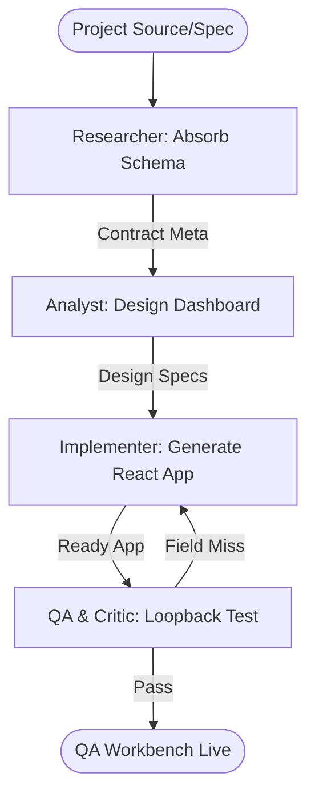

# Dynamic QA Workbench Generator Workflow

This workflow automates the creation of a standalone web-based testing workbench by absorbing API endpoints and data schemas from any source, enabling rapid manual and automated verification.

## Workflow Overview

Static testing tools are too rigid. This workflow enforces **Schema Absorption -> Dynamic Dashboard Generation -> Interactive Form Scaffolding -> Loopback Validation**.

## Workflow Steps

### 1. Schema Absorption & Analysis (Researcher)
- **Agent**: Researcher
- **Goal**: Extract endpoints and payload structures from source code or documentation.
- **Execution**: Use `runSubagent` tool to run the **Researcher** agent.
    - **Task**: "Analyze the project's API layer or OpenAPI spec. Extract all endpoint paths, HTTP methods, and request/response JSON schemas. Output an Indexed Contract to `agent-output/analysis/absorbed-contract.json`."
- **Output**: `agent-output/analysis/absorbed-contract.json`
- **Handoff**: To Analyst.

### 2. Functional Workbench Design (Analyst)
- **Agent**: Analyst
- **Goal**: Layout the QA Dashboard and define input field types.
- **Execution**: Use `runSubagent` tool to run the **Analyst** agent.
    - **Task**: "Read `absorbed-contract.json`. Design a QA Dashboard with endpoint grouping. Map schema types (enum, date, string) to React Formik/Hook-Form inputs. Define a 'Response Observer' with JSON tree-view. Output `agent-output/analysis/workbench-design.md`."
- **Critique Loop**: Use **Critic** agent to verify the design provides clear visual feedback for non-200 status codes.
- **Output**: `agent-output/analysis/workbench-design.md` (APPROVED)
- **Handoff**: To Implementer.

### 3. Workbench Implementation (Implementer)
- **Agent**: Implementer
- **Goal**: Generate the standalone React workbench app.
- **Execution**: Use `runSubagent` tool to run the **Implementer** agent.
    - **Task**: "Read `workbench-design.md`. Generate a standalone React/Vite application. Implement the dynamic form generator based on the absorbed schemas. Wire the forms to the real API endpoints. Output to `agent-output/generated/qa-workbench/`."
- **Output**: React source files for the QA Workbench.
- **Handoff**: To QA.

### 4. Loopback & Field Verification (QA & Critic)
- **Agent**: QA, Critic
- **Goal**: Ensure the workbench correctly represents the absorbed API contract.
- **Actions**:
    1.  **QA**: Use `playwright` to open the generated workbench. Verify every absorbed endpoint is listed and forms render correctly.
    2.  **Critic**: Audit the workbench UI for "Hero" grade aesthetics and ease of use.
- **Output**: `agent-output/reports/workbench-verification.md`

## Agent Roles Summary

| Agent | Role | Output Location |
| :--- | :--- | :--- |
| **Researcher** | Contract Absorption | `agent-output/analysis/` |
| **Analyst** | Dashboard Design | `agent-output/analysis/` |
| **Implementer** | Web App Generation | `agent-output/generated/` |
| **QA** | UI/Contract Test | `agent-output/reports/` |
| **Critic** | UX/Style Review | `agent-output/reports/` |

## Workflow Diagram

## Governance
- **Standards**: Must adhere to `custom-agents/instructions/output_standards.md`.
- **Isolation**: The generated workbench must be a standalone module that does not pollute the primary production codebase.
破
