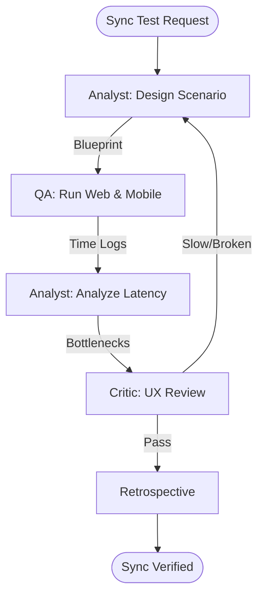

# E2E Mobile-Web Sync Tester Workflow

This workflow validates real-time data consistency by driving a web application and a mobile application simultaneously within a single verified test session.

## Workflow Overview

Sync failures are difficult to reproduce. This workflow enforces **Multi-Platform Scenario Scripting -> Orchestrated Execution -> Latency Analysis -> Final Verification**.

## Workflow Steps

### 1. Cross-Platform Scenario Scripting (Analyst)
- **Agent**: Analyst
- **Goal**: Define a test script that involves data changes on one platform and verification on another.
- **Execution**: Use `runSubagent` tool to run the **Analyst** agent.
    - **Task**: "Define a 'Write-Web/Read-Mobile' scenario (e.g. Update Profile on React, verify on Flutter after sync). Specify expected sync latency (e.g. < 2 seconds). Output a Test Blueprint to `agent-output/analysis/e2e-sync-scenario.md`."
- **Output**: `agent-output/analysis/e2e-sync-scenario.md`
- **Handoff**: To QA.

### 2. Orchestrated Test Execution (QA)
- **Agent**: QA
- **Goal**: Drive both platforms simultaneously using automation tools.
- **Execution**: Use `runSubagent` tool to run the **QA** agent.
    - **Task**: "Read `e2e-sync-scenario.md`. Execute a dual-session test: 1. Launch Playwright (Web), 2. Launch ios-simulator/Appium (Mobile). Perform the web action, then poll the mobile UI for the change. Output `agent-output/reports/sync-e2e-log.md`."
- **Output**: `agent-output/reports/sync-e2e-log.md`
- **Handoff**: To Analyst (Step 3).

### 3. Sync Latency & Bottleneck Analysis (Analyst)
- **Agent**: Analyst
- **Goal**: Analyze the performance of the sync loop.
- **Execution**: "Analyze the timestamps in `sync-e2e-log.md`. Identify if delays are caused by Socket latency, server processing, or client-side polling. Output `agent-output/analysis/sync-bottleneck-report.md`."

### 4. Resilience & UX Review (Critic)
- **Agent**: Critic
- **Goal**: Assess if the sync behavior feels "Hero" grade for the end user.
- **Actions**:
    1.  **Critic**: Review the UI state (e.g. loading spinners) during the sync wait period.
    2.  **Verify**: Ensure the app handles "Stale Data" gracefully if sync is delayed.
- **Output**: `agent-output/reports/sync-ux-sign-off.md`

### 5. Retrospective (Retrospective)
- **Agent**: Retrospective
- **Input**: All `agent-output/` artifacts.
- **Execution**: Use the `runSubagent` tool to run the **Retrospective** agent.
    - **Task**: "Read `custom-agents/instructions/output_standards.md`. Run Retrospective analysis. Output `agent-output/retrospectives/retrospective-[ID].md`."
- **Output**: `agent-output/retrospectives/retrospective-[ID].md`

## Agent Roles Summary

| Agent | Role | Output Location |
| :--- | :--- | :--- |
| **Analyst** | Scenario Design | `agent-output/analysis/` |
| **QA** | Dual-Platform Run | `agent-output/reports/` |
| **Analyst** | Latency Analysis | `agent-output/analysis/` |
| **Critic** | UX Review | `agent-output/reports/` |

## Workflow Diagram

## Governance
- **Standards**: Must adhere to `custom-agents/instructions/output_standards.md`.
- **Pre-requisite**: Both Web and Mobile apps must be in a 'compiling' and 'running' state before triggering.
破
